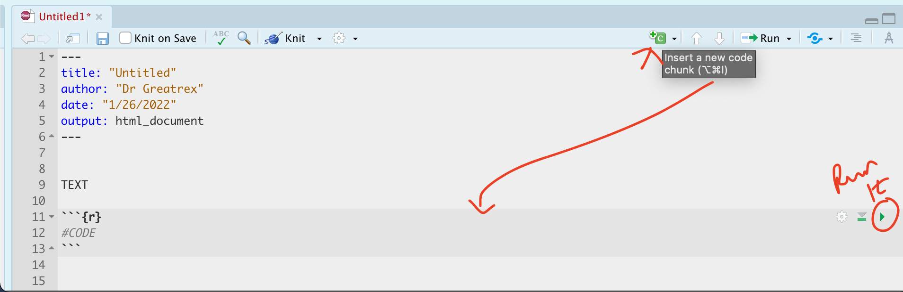

```{r, warning=FALSE, include=FALSE, message=FALSE}
library(tidyverse)
library(kableExtra)
```

The aim of Lab 1 is to get comfortable in R and in R-Markdown and to
make sure that both are installed properly. It is a "one week lab" and
you can find the Canvas page here:
<https://psu.instructure.com/courses/2260204/assignments/15455191>

Instructions are below, linking to relevant tutorials in the tutorials
tab. If I suggest using a tutorial, the answers WILL be there.

Finally, if the labs are causing major problems or you have any other
software issue, talk to Dr Greatrex or Harman. What do I mean by
struggling? More than 15-20 minutes without progress.

<br>

# Lab instructions

## A. Select Lab Groups

We will be doing an in-class exercise to choose lab groups

-   TUESDAY LAB: Please fill in this survey:
    <https://forms.gle/Uf7T5Hh7895Y7G6DA> \
    (Don't touch wed/fri lab)

<br>

## B. Review FAQ

Review [The LAB FAQ](in_G364_Lab0_FAQ.rmd) - you can find it in the Labs
menu at the top of the page. It explains

-   What you need to submit
-   How you are graded and where the rubric is
-   The late policy
-   What counts as cheating

<br>

## C. Learn about R, R-studio and Markdown

Follow [TUTORIAL
1](https://psu-spatial.github.io/Geog364-2023/in_Tutorial01WhatisR.html)
to learn about R, R-studio and Markdown.

<br>

## D. Initial Semester set-up

Follow [TUTORIAL
2](https://psu-spatial.github.io/Geog364-2023/in_Tutorial02SetUp.html)
to install everything needed for the GEOG-364 this semester.

<br>

## E. Lab 1 set-up

I strongly suggest you CLOSELY follow [TUTORIAL
3](https://psu-spatial.github.io/Geog364-2023/in_Tutorial02SetUp.html)
to install everything needed for lab 1. This means you will: <br>

-   Create a GEOG364 folder somewhere easy on your computer

-   Create a project for lab 1, saving it within that GEOG364 folder.

-   Change your global settings as requested in the tutorial.

-   Use the instructions to download/install a package called
    `rmdformats`

-   Create a markdown file using a template of your choice.

-   Save as GEOG364_Lab1_USERID.Rmd e.g. for me,
    GEOG364_Lab1_hlg5155.Rmd

-   Press knit to check it works (you may get a message asking you to
    install more packages)

-   Finally, remove all the 'friendly welcome text' below the YAML code,
    change the title to Lab 1 and press knit .<br>

You should now have a blank file in front of you, other than the YAML
code. If not, ask for help.

<br>

## F. Comprehension questions

1.  Write the word *Introduction* in the main body of the text - make it
    a Header 1 format. Leave a few blank lines above and below it. Press
    knit, check it worked.

2.  Now copy each of the questions below into your report. Make each one
    "Header 3" format.

3.  Underneath each question write your answer. At least 3 or 4
    sentences for each one. <br>

    1.  QUESTION 1: <br>In your own words, explain the course late
        policy<br> *Hint, [Lab
        FAQs](https://psu-spatial.github.io/Geog364-2023/in_G364_Lab0_FAQ.html))*
        <br>

    2.  QUESTION 2: <br>When are Dr G's office hours? Should I email or
        Canvas Message to get help fast? *Hint, see
        [Canvas](https://psu.instructure.com/courses/2260204)* <br>

    3.  QUESTION 3: <br>Are you allowed to copy/paste anyone else's code
        or text in your submission? Explain your answer. *Hint, [Lab
        FAQs](https://psu-spatial.github.io/Geog364-2023/in_G364_Lab0_FAQ.html))*
        <br>

    4.  QUESTION 4: <br>Use something like Spotify (a computer programme
        that plays custom playlists of music) to explain the difference
        between R and R-Studio. *Hint, [Tutorial
        1](https://psu-spatial.github.io/Geog364-2023/in_Tutorial01WhatisR.html))*
        <br>

    5.  QUESTION 5: <br>Explain the range of different formats a
        markdown document can be made into. *Hint, [Tutorial
        1](https://psu-spatial.github.io/Geog364-2023/in_Tutorial01WhatisR.html))*<br>

To help with formatting, you might find it easier to use the markdown
visual text editor. Here's the difference between writing your reports
in 'source' mode (near the top left) vs 'visual' mode.


## F. Code showcase

Now, leave another new blank line and add a new Level 1 Header called
*"Code Showcase"*. Add a blank line afterwards too - the reason for all
the blank lines is that R formatting often gets messed up with not
enough blank lines, but it will ignore excess ones.

Now create a code chunk:

```{r, echo=FALSE}

```

Inside **use R code** to calculate the answers to the following
questions.

You HAVE to show the code! <br><br>

-   103^3^ (e.g `103*103*103`, or `103^3`) <br>\
-   The co-sine of your age (google is your friend, google R function
    for cosine) <br>\
-   Use R code to work out how many characters are in [the longest town
    name in
    Wales](https://www.bbcamerica.com/anglophenia/2015/09/how-to-pronounce-the-longest-place-name-in-the-u-k)
    *Llanfairpwllgwyngyllgogerychwyrndrobwllllantysiliogogogoch*. <br>\
    -   Hint 1, remember you can copy paste this name into your code.
        <br>
    -   Hint 2, the command is available in the tutorials..
    -   Hint 3, you can google any R command, try googling the *"R
        command for number of characters in a word"*.<br><br>

Press "knit" at the top of the screen. If you haven't made a mistake a
pop up should appear with a html file and your answers. If you have a
made a mistake, stop and fix before continuing.

<br>

## H. Submitting your Lab

Remember to save your work throughout and to spell check your writing
(next to the save button). Now, press the knit button again. If you have
not made any mistakes in the code then R should create a html file in
your lab 1 folder which includes your answers. If you look at your lab 1
folder, you should see this there - complete with a very recent
time-stamp.

In that folder, double click on the html file. This will open it in your
web-browser.\
CHECK THAT THIS IS WHAT YOU WANT TO SUBMIT.

If you are on R studio cloud, see Tutorial 1 for how to download your
files

Now go to Canvas and submit BOTH your html and your .Rmd file in Lab 1.

```{r, echo=FALSE}
knitr::include_graphics("./Figures/LabFig_WhatToSubmit.png")
```

<br>

### How am I graded?

Look on Canvas, there will be a SPECIFIC RUBRIC that we use to grade
your lab. USE IT!!! It should allow you to predict your grade. We will
also include comments with our feedback in every lab.

Overall, here is what your lab should correspond to:

```{r, echo=FALSE}
rubric <- readxl::read_excel("in_G364_Lab0Rubric.xlsx")
knitr::kable(rubric) %>%   
  kable_classic_2() %>%
  kable_styling(bootstrap_options = c("striped", "hover", "responsive"))


```
