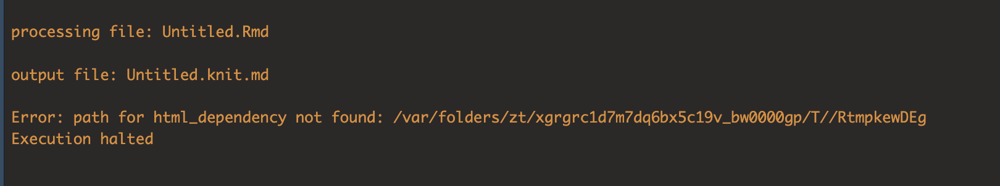
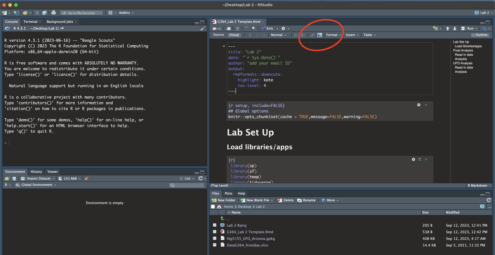
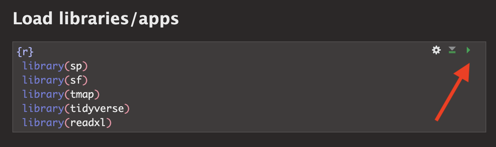
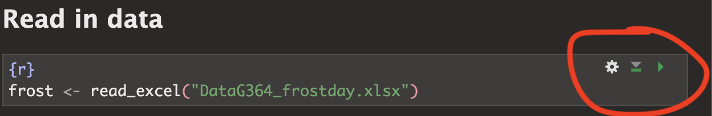
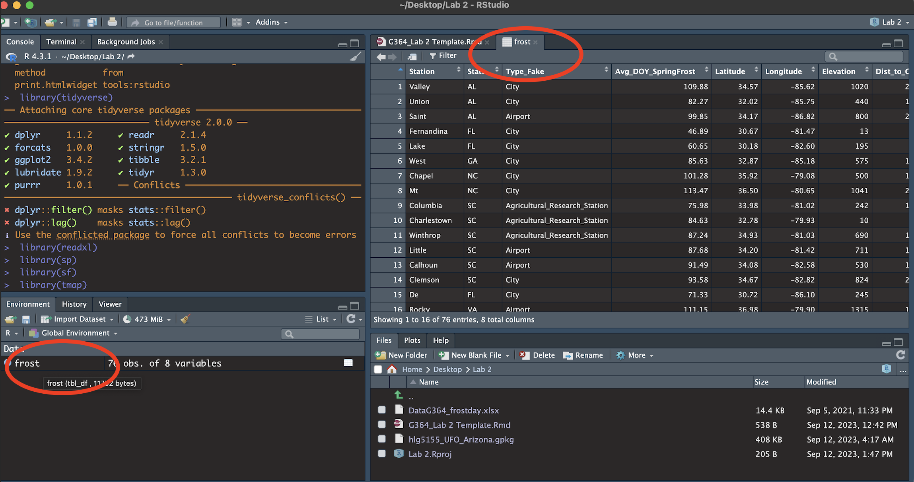
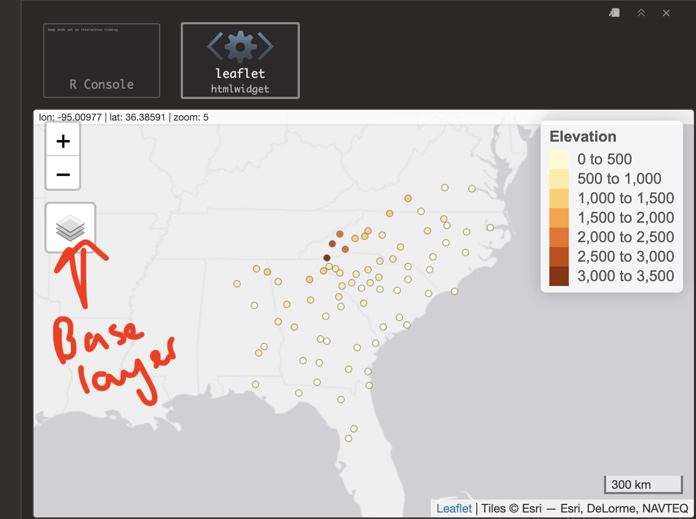

```{=html}
<style>
p.comment {
background-color: #DBDBDB;
padding: 10px;
border: 1px solid black;
margin-left: 0px;
border-radius: 5px;
font-style: normal;
}

h1.title {
  font-weight: bold;
  font-family: Arial;  
}

h2.title {
  font-family: Arial;  
}

</style>
```
```{=html}
<style type="text/css">
#TOC {
  font-size: 12px;
  font-family: Arial;
}

pre code {
  font-size: 13px; /* Adjust the font size as needed */
  white-space: pre-wrap;
}
</style>
```
\

```{r setup, include=FALSE}
knitr::opts_chunk$set(echo = TRUE, warning=FALSE, message = FALSE)
```

```{r,include=FALSE,echo=FALSE}
# invisible data read
library(tidyverse)
library(sp)
library(sf)
library(readxl)
library(skimr)
library(tmap)
library(viridis)
library(kableExtra)

frost <- readxl::read_excel("./Data/DataG364_frostday.xlsx")
ufo <- st_read("./Data/hlg5155_UFO_Wales.gpkg")
```

ANNOUNCEMENT: If you knit twice you might get an error like this. Don't
panic, see canvas announcements and talk to Harman. (essentially you need to clear your cache, or change any plot_mode("view") to plot_mode("plot")

```{r, echo=FALSE}

```

The aim of this lab is to start some spatial data analysis and to recap
what you learned in Lab 1. By the end of this lab you will be able to:

-   Prove to me you can set up the labs

-   Read in data from an excel file and a spatial file

-   Conduct exploratory data analysis

-   Wrangle a table of data

-   Make initial plots and maps for two case studies <br>

See [The Canvas page
here](https://psu.instructure.com/courses/2260204/assignments/15480985),
or go to canvas for assignment guidelines. You can use either the
website base RStudio/Posit Cloud OR R-Desktop for this lab

<br><br><br>

# Data Camp

IMPORTANT, Click this link to be added (for free) to the class datacamp.
You will need to have signed up using your PSU address

-   <https://www.datacamp.com/groups/shared_links/09c662a03e00d0ac23e6716894266ef2f72c4cee048f1b1da99c0f9440584976>
    <br><br>

### Optional but recommended

If you felt lost during week 1, I highly recommend completing chapter 1
of this data camp course. It will help you understand the next bit of
the analysis. It's free if you signed up using the link above.

-   <https://app.datacamp.com/learn/courses/free-introduction-to-r>

I will award 5 participation points for anyone who completes chapter 1.

<br><br><br>

# Getting started

## 2. Create your project

1.  **Create a new project in R for Lab 2 and make sure it's in your
    GEOG 364 folder.**

    -   For R-Desktop, see [Tutorial
        3B](https://psu-spatial.github.io/Geog364-2023/in_Tutorial03LabSetUp.html#Projects_using_Desktop)

    -   For Posit Cloud, see [Tutorial
        3C](https://psu-spatial.github.io/Geog364-2023/in_Tutorial03LabSetUp.html#Projects_using_Rstudioposit_Cloud)
        <br><br>

2.  Take a screenshot of R studio screen that *proves* you have set up
    your project correctly

    -   Hint, [how to check you are in a
        project](https://psu-spatial.github.io/Geog364-2023/in_Tutorial03LabSetUp.html#How_to_check_you_are_in_a_project))
        <br><br> To take a screenshot on a mac: *Press
        **`Shift + Command (⌘) + 4`**. Your cursor will change to a
        crosshair. Click and drag to select the portion of the screen
        you want to capture. Release the mouse button to take the
        screenshot. It will be saved to your desktop. Re-name the file
        and move to your GEOG-364 Lab 2 folder.* <br><br> To take a
        screenshot on a windows machine, try one of these or ask
        around/Harman: *Press \***`Windows key + Shift + S`** . This is
        the [snipping
        tool](https://support.microsoft.com/en-us/windows/use-snipping-tool-to-capture-screenshots-00246869-1843-655f-f220-97299b865f6b).*
        *On older machines, try **`Windows Logo Key + PrtScn.`***
        *Re-name the file and move to your GEOG-364 Lab 2 folder.*

<br>

## 3. Get the files

[Download these three files from
[Canvas](https://psu.instructure.com/courses/2260204/assignments/15480985)
and place them in your lab 2 folder.]{.underline} <br>\
If you are on the cloud, [here is how to upload
files](https://psu-spatial.github.io/Geog364-2023/in_Tutorial03LabSetUp.html#Uploading_files):

-   The lab template

-   The frost data

-   Your PERSONAL UFO dataset <br>\
    (*f this doesn't work or you can't find your file, there's no panic.
    Let Harman know - we will get it fixed by the end of the day*

<br>

## 4. Edit your template

Rather than create a new markdown file, this week I want you to use a
template that I made. You should have just downloaded this from Canvas.
Make sure it's in your Lab 2 folder and you're running your project.
<br>

1.  Go to the file quadrant and click the G364_Lab 2 Template.Rmd
    file.<br><br>

2.  You will hopefully see a little yellow bar asking you to install
    some libraries/package. Say yes. Alternatively, use the [install
    package
    command](https://psu-spatial.github.io/Geog364-2023/in_Tutorial03LabSetUp.html#Downloading_a_new_package)
    you used last week to install the sp, sf, tmap, tidyverse and readxl
    packages.

3.  Click
    "[visual](https://psu-spatial.github.io/Geog364-2023/in_Tutorial03LabSetUp.html#Visual_mode)"
    mode. Your screen should now look like the screenshot below. If not,
    ask for help<br><br>

4.  Click knit. You might have to re-save. Make sure to include your ID
    in the filename. You should see the html appear. <br><br>

5.  Go back to R studio.

    -   In the Set-Up section, explain to me what an R project is in the
        text and include your screenshot, explaining how it proves you
        are running your Lab 2 project.
    -   Hint, to include a picture, click the visual mode picture button
        (see circle in pic above).<br><br>

```{r, echo=FALSE}

```

<br><br>

## 5. Libraries

Last week we downloaded the rmdformats package. In the section above,
hopefully you just downloaded several more (step 3). This is like going
to the app store to get a new banking app.

Even though they are downloaded, we need to load them EVERY TIME we want
to use them (in the way you click on an app on your phone before you can
use it). This is what that library code-chunk does at the start of the
script.

-   Press the green arrow on the right of the code chunk to run the code
    inside it.\<br\>You will see a load of "welcome text" telling your
    details about the packages you just loaded.\<br\>Press the green
    arrow AGAIN. The text should disappear unless there is an error. If
    you get errors, you might [still need to download those
    packages](https://psu-spatial.github.io/Geog364-2023/in_Tutorial03LabSetUp.html#Downloading_a_new_package).

-   \<br\>YOU NEED TO RE-RUN THIS CODE CHUNK EVERY TIME YOU OPEN R.

```{r, echo=FALSE}

```

<br><br><br>

# Frost Analysis

Finally some analysis! We are going to conduct some exploratory data
analysis on average last spring frost dates across the South East USA.

To to this, we are going to follow these steps:

-   Investigate the topic before touching the data
-   Read the excel file containing the data into R
-   Calculate summary statistics and "wrangle" the data
-   Make some initial plots & maps

<br>

## 6: Exploratory Investigations

*Before we touch any data, it's important to start with words. We need
to summarise what we already know about the dataset, the population
under study and any important context.*

The aim of this lab is to analyse the "average last frost dates"
obtained from weather stations across the South Eastern USA. E.g. what
day of year, *on average*, is the final day to get frost. We are using
data obtained from this dissertation to assess the spatial distribution
of average spring frost dates: *Parnell, 2005, "A Climatology of Frost
Extremes Across the Southeast United States, 1950--2009":*<br>
<https://www.proquest.com/openview/d5a7301f0cbe941ead48c96888f791b8/1?pq-origsite=gscholar&cbl=18750&diss=y>

-   Read the abstract of the study above to understand the dataset
    *(click the link and skim read pages iv and v, e.g. the bit before
    the table of contents)*.

-   Write a few sentences in the appropriate section of your lab report
    to explain what we are doing.

<br><br>

## 7: Load the data

I have already provided the command to load the data into R. Press the
green arrow to run.

```{r, echo=FALSE}

```

This loads the data stored in "DataG364_frostday.xlsx" into R, then
temporarily saves the data into a table called 'frost'. That's what the
'arrow' is doing in the command. It does the stuff on the right (loads
the file from excel, then the arrow means 'store this as' frost)

This code will only work if - you have run your library code chunk and
if you have downloaded the readxl library - if your file really is in
your lab 2 folder - If you are running your project

Otherwise you will see an error saying it can't find the command.

You should see the frost data appear in the 'environment tab'. Click the
NAME to take a look (see screenshot below). Each row represents a
weather station.

<br>

```{r, echo=FALSE}

```

<br>

You will see a spreadsheet/table/data.frame with these columns:

-   *Station*: The name of the weather station
-   *State*: The US State that the station resides in
-   *Type_Fake*: A synthetic column I added to put in a "type" of
    station
-   *Latitude*: The latitude of the station (degrees)
-   *Longitude*: The longitude of the station (degrees)
-   *Elevation*: The elevation of the station (m)
-   *Dist_to_Coast*: The distance from the station to the coast (km)
-   *Avg_DOY_SpringFrost*: The Day-Of-Year of the average final spring
    frost date for that station

When I say Day-Of-Year, I mean a number from 1-365 representing the
month/day of the year e.g. Jan-1:1, Jan-2:2... Jan-31:31, Feb-1:32...
Dec-31:365. We use this number instead of the month/day because its
easier to analyse.

NOTE - Dr G got the original units wrong. She thought that the distances
were in ft/inches, not metric. They have been corrected here. If you
used the feet/inches you will not be penalised.

<br><br>

## 8: Intro analysis

This is great, but the joy of R is that it is easy to do more complex
things. Click back to your lab script.Before we were applying commands
to a single word or number e.g. (cos(30)). Now, we can apply commands to
a whole column of data. E.g.

`mean(frost$Elevation)`

tells the computer to apply the mean command to the Elevation column
inside the frost table. (the \$ means "column" and when you type it, it
will bring up a list to choose from).

For each question below, leave a few blank white lines (or R can get
confused) and make a new code chunk for each piece of code.

WRITE YOUR CONCLUSIONS UNDER EACH CODE CHUNK IN A FULL SENTENCE WITH
UNITS!

1.  Calculate the mean of the Dist_To_Coast column. e.g.
    `mean(frost$Dist_To_Coast)`

2.  Use the `max` command to find the maximum Elevation in the dataset.

3.  Google the command for the standard deviation in R. Find the
    standard deviation of the distance of the weather station to the
    coast.

4.  We can also apply commands to non-numeric data. For example, maybe
    we want to count the occurrences of some category in our dataset
    e.g. how many stations are in each US State. To do this, we use the
    table command: `table(frost$State)` Use this to work out how many
    weather stations there are in Alabama in our data?

5.  R includes some fantastic summary commands that we can use on the
    whole dataset. Run `summary(frost)` and explain what is going on.

6.  We can also look at how many rows and columns of data there are.
    There are LOADS of ways of doing this. Have a look at the `dim`
    command, or the `nrow` command or others, to show me how many
    weather stations there are.

7.  *Press knit, check there are no issues with the code*

<br><br>

## 9: Plots and maps

### a) Histograms

It's also very easy to make professional plots and maps in R. This used
to be much harder and there are *many* packages you could use. Today we
are going to focus on the ggplot2 package.

First use this code to make a basic histogram of the Avg_DOY_SpringFrost
column. To understand what is going on, see this great tutorial:
<https://365datascience.com/tutorials/r-tutorials/ggplot2-histogram/>

```{r,eval=FALSE}
ggplot(frost, aes(x=Avg_DOY_SpringFrost)) +
      geom_histogram(bins=8)
```

<br>

To interpret the results, check out this wonderful tutorial -
<https://flowingdata.com/2014/02/27/how-to-read-histograms-and-use-them-in-r/>

We can improve our graph very easily. Try running this code.

```{r,eval=FALSE}
ggplot(frost, aes(x=Avg_DOY_SpringFrost)) + 
       geom_histogram(bins=8,
                  fill="#108A99",
                  color="white") +
       xlab("Average day of year of the last spring frost") +
       ylab("Number of weather stations") 
```

For a WHOLE LOAD of other formatting options, see here:
<http://www.sthda.com/english/wiki/ggplot2-histogram-plot-quick-start-guide-r-software-and-data-visualization>

<br>

1.  **Now make your own histogram of the Latitude column of the frost
    data.** <br> **Go wild, impress us with your formatting!\
    **
2.  *Press knit, check there are no issues with the code*

<br><br>

### b) Quick maps

Finally, we can use the tmap package to have a look at some plots.

First, we loaded our data as a standard old Excel file. So we need to
teach R that it has spatial coordinates. To do this, run this command.
If it works, nothing should outwardly happen, but you should see in your
environment quadrant that a new variable called frost.spatial has turned
up.

```{r}
# In future classes we will break down what this is doing 
frost.spatial <- st_as_sf(frost,
                      coords =c('Longitude', 'Latitude'),
                      crs = 4326)
```

IMPORTANT. <br>

1.  IF YOU GET A WEIRD ERROR TRY RE-TYPING ALL THE QUOTE MARKS AROUND
    LONGITUDE AND LATITUDE. The copy/paste sometimes messes up.\
    <br>
2.  ALSO, if you knit twice you might get an error like this. Don't
    panic, see canvas announcements and talk to Harman.

```{r, echo=FALSE}

```

<br>

Now we can use the QTM (Quick Thematic Map function) to have a look! Try
this code. It should make an interactive map by default and you can turn
on different basemaps through clicking the layer symbol on the map.

```{r,eval=FALSE}
# This sets the mode to an interactive map. 
# If your computer struggles, try changing 'view' to 'plot'
tmap_mode('view')

qtm(frost.spatial,
    dots.col='Elevation')
```

```{r, echo=FALSE}

```

<br>

1.  **Now make your own map of the Avg_DOY_SpringFrost column in the
    frost.spatial dataset. You can see a load more style options here
    <https://www.rdocumentation.org/packages/tmap/versions/3.3-3/topics/qtm>\
    **
2.  *Press knit, check there are no issues with the code*

<br><br>

## 10. Summarize what you found

Finally, write a paragraph summarizing

-   What the study was trying to achieve

-   Details of the dataset (how many weather stations, summary
    statistics etc etc)

-   What spatial patterns do you see in the average last spring frost
    dates in the dataset?

-   From looking at your maps/histograms etc, what factors or processes
    do you think influence those patterns?

In the future & in the UFO section, we will integrate this writing
around your analysis, but for this week, I wanted you to focus on really
understanding the code.

<br><br><br>

# UFO Analysis

Congrats! If you have reached this far, you have at least received a C
for the bare minimum and a B+ for doing it all well. :)

We went through the frost example slowly and in detail. In the UFO
analysis, I want you to use what you learned on a new dataset. Remember
you can copy/paste/edit your code from above.<br><br>

## 11. Reading in the data

You should have downloaded your unique UFO dataset from the Canvas page
into your Lab 2 folder. It should have your e-mail ID in the title. Our
first challenge is that it is not an excel file. Instead it's a 'gpkg'
file, a special type used for storing spatial data. For example, mine is
"hlg5155_UFO_Wales.gpkg"

In your UFO /Reading-In-Data section of your lab report, make a new code
chunk and use this code to load your dataset. For me, it would be
`ufo <- st_read("hlg5155_UFO_Wales.gpkg")`.

```{r, eval=FALSE}
# change to your personal file name.
ufo <- st_read("YOUR_FILENAME.gpkg")
```

When you run the code chunk, it will load the data from the file and
save it into your environment to a spreadsheet we have called ufo.

*Press knit, check there are no issues with the code.*

Click on the name ufo and have a look! I have given each of you data of
reported UFO sightings for either a single US State or a single country.

-   The object of analysis, .e.g each row, is a single UFO sighting

-   Your columns are:

    -   Year - The year of the sighting

    -   Month - The year of the sighting

    -   Day - The year of the sighting

    -   Hour - The hour of the sighting (24hr clock e.g. 23=11pm,
        00=midnight)

    -   Sighting_Type - what type of UFO was seen?

    -   Sighting_Duration - how long was the sighting IN SECONDS

    -   Region - your region/country/state

    -   geom / geometry - a special internal R column containing the
        spatial location of the sighting.

<!-- -->

-   Your dataset came from here:
    <https://github.com/planetsig/ufo-reports> and I split it into
    separate states and countries. The raw data was collected here:
    <https://nuforc.org/>

## 12. Your own analysis

Write a summary of this dataset in the UFO section of your RMarkdown
document, using the code you have learned above (or any other
code/resources). For example, your write up could include: <br>

1.  A summary of where the data came from/how it was collected - and
    your guesses about any spatial patterns. <br>

2.  What country are you focused on, how many sightings are there in
    your database, when did they start/end etc. <br>

3.  The average duration, and a histogram of Sighting_Duration

    -   A-grade Bonus -try making a boxplot of Sighting_Duration (google
        R boxplot)

    -   A\*\* Bonus - try making a boxplot of duration for each month
        e.g. <https://r-graph-gallery.com/boxplot.html> e.g. is the
        duration less in the winter?\
        (*We do not provide support on A\*\* options!)* <br>

4.  A frequency table of the different UFO Sighting_Type:

    -   A-grade Bonus - try a "two way" table crossing the type with
        hour e.g. <https://www.statology.org/two-way-table-in-r/>

    -   A\*\* Bonus - try making a tree map of the different ufo types -
        <https://r-graph-gallery.com/treemap.html> (*We do not provide
        support on A\*\* options!*)<br>

5.  A map of some aspect of your sightings and a paragraph explaining
    BOTH any patterns you see AND any underlying processes that might
    cause your dataset to have that pattern. <br>

6.  Optional - Anything else you want! Show off!

<br><br><br>

# Submitting your Lab

Remember to save your work throughout and to spell check! (next to the
save button). Now, press the knit button one final time.

On R-Desktop

-   If you have not made any mistakes in the code then R should create a
    html file in your lab 2 folder which includes your answers.

-   If you look at your lab 2 folder on your computer, you should see
    this there - complete with a very recent time-stamp. Double click on
    the html file. This will open it in your web-browser.\
    CHECK THAT THIS IS WHAT YOU WANT TO SUBMIT.<br>

On Rstudio cloud,

-   See [TUTORIAL 3 Cloud - LINK
    FIXED](https://psu-spatial.github.io/Geog364-2023/in_Tutorial03LabSetUp.html#Projects_using_Rstudioposit_Cloud)
    for how to download your files <br>

Finally, go to Canvas and submit BOTH your html and your .Rmd file in
Lab 2.

```{r, echo=FALSE}
knitr::include_graphics("./Figures/LabFig_WhatToSubmit.png")
```

<br><br>

## How am I graded?

Look on Canvas, there will be a SPECIFIC RUBRIC that we use to grade
your lab. It should allow you to predict your grade. We will also
include comments with our feedback in every lab.

Overall, here is what your lab should correspond to:

```{r, echo=FALSE}
rubric <- readxl::read_excel("in_G364_Lab0Rubric.xlsx")
knitr::kable(rubric) %>%   
  kable_classic_2() %>%
  kable_styling(bootstrap_options = c("striped", "hover", "responsive"))


```
