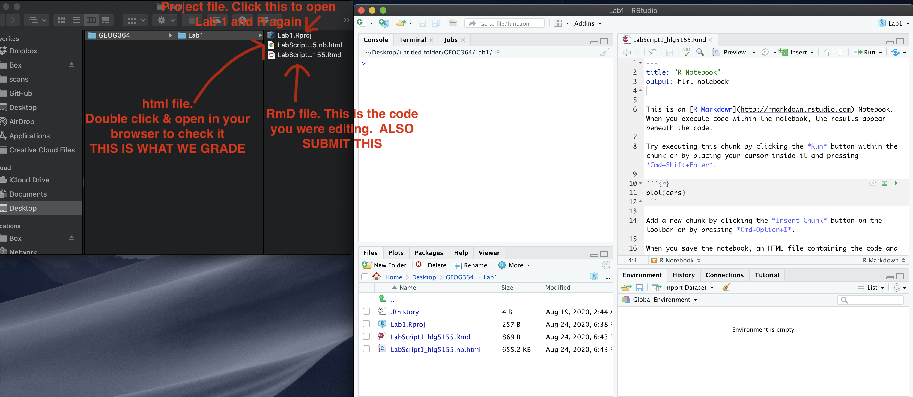

```{=html}
<style>
p.comment {
background-color: #DBDBDB;
padding: 10px;
border: 1px solid black;
margin-left: 0px;
border-radius: 5px;
font-style: normal;
}

h1.title {
  font-weight: bold;
  font-family: Arial;  
}

h2.title {
  font-family: Arial;  
}

</style>
```
```{=html}
<style type="text/css">
#TOC {
  font-size: 12px;
  font-family: Arial;
}
</style>
```
\

```{r setup, include=FALSE}
knitr::opts_chunk$set(echo = TRUE, warning=FALSE, message = FALSE)
```

```{r,include=FALSE,echo=FALSE}
# invisible data read
library(tidyverse)
library(sp)
library(sf)
library(readxl)
library(skimr)
library(tmap)
library(viridis)
library(kableExtra)

frost <- readxl::read_excel("./Data/DataG364_frostday.xlsx")
```

The aim of this lab is to start some spatial data analysis and to recap
what you learned in Lab 1. By the end of this lab you will be able to:

-   Prove to me you can set up the labs

-   Read in data from an excel file and a spatial file

-   Conduct exploratory data analysis

-   Wrangle a table of data

-   Make initial plots and maps for two case studies <br>

See [The Canvas page
here](https://psu.instructure.com/courses/2260204/assignments/15480985),
or go to canvas for assignment guidelines. You can use either the
website base RStudio/Posit Cloud OR R-Desktop for this lab

<br><br><br>

# A. Data Camp

IMPORTANT, Click this link to be added (for free) to the class datacamp.
You will need to have signed up using your PSU address

-   <https://www.datacamp.com/groups/shared_links/09c662a03e00d0ac23e6716894266ef2f72c4cee048f1b1da99c0f9440584976>
    <br><br>

#### Optional but highly recommended for newbies

If you felt lost during week 1, I highly recommend completing chapter 1
of this data camp course. It will help you understand the next bit of
the analysis. It's free if you signed up using the link above.

-   <https://app.datacamp.com/learn/courses/free-introduction-to-r>

I will award 5 participation points for anyone who completes chapter 1.

<br><br><br>

# B. Getting started

## B1. Create your project

1.  **Create a new project in R for Lab 2 and make sure it's in your
    GEOG 364 folder.**

    -   For R-Desktop, see [Tutorial
        3B](https://psu-spatial.github.io/Geog364-2023/in_Tutorial03LabSetUp.html#Projects_using_Desktop)

    -   For Posit Cloud, see [Tutorial
        3C](https://psu-spatial.github.io/Geog364-2023/in_Tutorial03LabSetUp.html#Projects_using_Rstudioposit_Cloud)
        <br><br>

2.  Take a screenshot of R studio screen that *proves* you have set up
    your project correctly

    -   Hint, [how to check you are in a
        project](https://psu-spatial.github.io/Geog364-2023/in_Tutorial03LabSetUp.html#How_to_check_you_are_in_a_project))
        <br><br> To take a screenshot on a mac: *Press
        **`Shift + Command (⌘) + 4`**. Your cursor will change to a
        crosshair. Click and drag to select the portion of the screen
        you want to capture. Release the mouse button to take the
        screenshot. It will be saved to your desktop. Re-name the file
        and move to your GEOG-364 Lab 2 folder.* <br><br> To take a
        screenshot on a windows machine, try one of these or ask
        around/Harman: *Press \***`Windows key + Shift + S`** . This is
        the [snipping
        tool](https://support.microsoft.com/en-us/windows/use-snipping-tool-to-capture-screenshots-00246869-1843-655f-f220-97299b865f6b).*
        *On older machines, try **`Windows Logo Key + PrtScn.`***
        *Re-name the file and move to your GEOG-364 Lab 2 folder.*

<br>

## B2. Get the files 

[Download these three files from
[Canvas](https://psu.instructure.com/courses/2260204/assignments/15480985)
and place them in your lab 2 folder.]{.underline} <br>\
If you are on the cloud, [here is how to upload
files](https://psu-spatial.github.io/Geog364-2023/in_Tutorial03LabSetUp.html#Uploading_files):

-   The lab template

-   The frost data

-   Your PERSONAL UFO dataset <br>\
    (*f this doesn't work or you can't find your file, there's no panic.
    Let Harman know - we will get it fixed by the end of the day*

<br>

## B3. Edit your template

Rather than create a new markdown file, this week I want you to use a
template that I made. You should have just downloaded this from Canvas.
Make sure it's in your Lab 2 folder and you're running your project.
<br>

1.  Go to the file quadrant and click the G364_Lab 2 Template.Rmd
    file.<br><br>

2.  You will hopefully see a little yellow bar asking you to install
    some libraries/package. Say yes. Alternatively, use the [install
    package
    command](https://psu-spatial.github.io/Geog364-2023/in_Tutorial03LabSetUp.html#Downloading_a_new_package)
    you used last week to install the sp,
    sf, tmap, tidyverse and readxl packages.

3.  Click
    "[visual](https://psu-spatial.github.io/Geog364-2023/in_Tutorial03LabSetUp.html#Visual_mode)"
    mode. Your screen should now look like the screenshot below. If not,
    ask for help<br><br>

4.  Click knit. You might have to re-save. Make sure to include your ID
    in the filename. You should see the html appear. <br><br>

5.  Go back to R studio.

    -   In the Set-Up section, explain to me what an R project is in the
        text and include your screenshot, explaining how it proves you
        are running your Lab 2 project.
    -   Hint, to include a picture, click the visual mode picture button
        (see circle in pic above).<br><br>

```{r, echo=FALSE}
knitr::include_graphics("./Figures/Lab2Fig1_SetUp.png")
```

<br><br><br>

## C. Frost Analysis

To be added in the next 10 mins. Refresh the page!

<br><br><br>

## D. UFO Analysis

To be added in the next 10 mins. Refresh the page!

<br><br><br>

## E. Submitting your Lab

Remember to save your work throughout and to spell check! (next to the
save button). Now, press the knit button one final time.

On R-Desktop

-   If you have not made any mistakes in the code then R should create a
    html file in your lab 2 folder which includes your answers.

-   If you look at your lab 2 folder on your computer, you should see
    this there - complete with a very recent time-stamp. Double click on
    the html file. This will open it in your web-browser.\
    CHECK THAT THIS IS WHAT YOU WANT TO SUBMIT.<br>

On Rstudio cloud,

-   See [TUTORIAL 3 Cloud - LINK
    FIXED](https://psu-spatial.github.io/Geog364-2023/in_Tutorial03LabSetUp.html#Projects_using_Rstudioposit_Cloud)
    for how to download your files <br>

Finally, go to Canvas and submit BOTH your html and your .Rmd file in
Lab 2.

```{r, echo=FALSE}

```

<br><br>

## E1. How am I graded?

Look on Canvas, there will be a SPECIFIC RUBRIC that we use to grade
your lab. It should allow you to predict your grade. We will also
include comments with our feedback in every lab.

Overall, here is what your lab should correspond to:

```{r, echo=FALSE}
rubric <- readxl::read_excel("in_G364_Lab0Rubric.xlsx")
knitr::kable(rubric) %>%   
  kable_classic_2() %>%
  kable_styling(bootstrap_options = c("striped", "hover", "responsive"))


```
