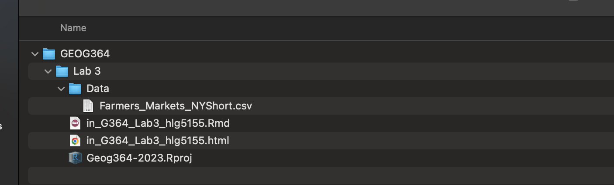
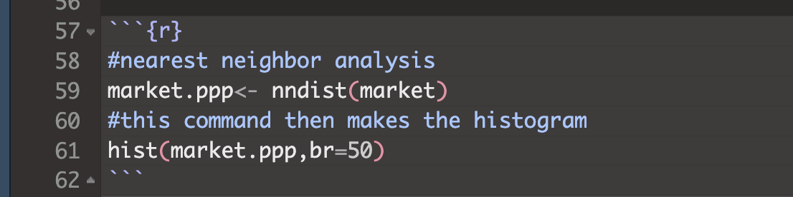

```{=html}
<style>
p.comment {
background-color: #DBDBDB;
padding: 10px;
border: 1px solid black;
margin-left: 0px;
border-radius: 5px;
font-style: normal;
}

h1.title {
  font-weight: bold;
  font-family: Arial;  
}

h2.title {
  font-family: Arial;  
}

</style>
```
```{=html}
<style type="text/css">
#TOC {
  font-size: 12px;
  font-family: Arial;
}

pre code {
  font-size: 13px; /* Adjust the font size as needed */
  white-space: pre-wrap;
}
</style>
```
\

```{r, include=FALSE}
knitr::opts_chunk$set(echo = TRUE, warning=FALSE, message = FALSE)
```


```{r,include=FALSE,echo=FALSE}
# invisible data read
library(tidyverse)
library(sp)
library(sf)
library(readxl)
library(skimr)
library(tmap)
library(viridis)
library(kableExtra)
library(spatstat)
library(spatstat.data)
library(car)

data(longleaf)
market    <- read_csv("./Data/Farmers_Markets_NYShort.csv")
market.sp <- st_as_sf(market,coords=c("Longitude","Latitude"),crs=4326)

```

# LAB IS COMPLETE

# Overview

Welcome to Lab 3B on Point Pattern Analysis. The goal of Lab 3B is to
learn some introductory spatial statistical approaches for
characterizing distance based properties of a point pattern. We will be
focusing on nearest neighbour analysis and the F, G, K and L functions.
This builds on density based approaches in Lab 3A.

-   **You need to submit everything on this page AND lab 3A under Lab 3
    on canvas**

-   **See the rubric on canvas (this is up!) for how it will be graded
    and the checklist at the end for what you need for 100%.**

See [The Canvas page
here](https://psu.instructure.com/courses/2260204/assignments/15455241),
or go to canvas for assignment guidelines. You can use either the
website base RStudio/Posit Cloud OR R-Desktop for this lab.

Getting stuck? Look at the [canvas
page](https://psu.instructure.com/courses/2260204/assignments/15455241)
for the McGrew Chapter 14 - it has a great overview.

<br><br><br>

# 1. What are we doing?

Density-based (Lab 3a) and distance-based (lab 3b) point pattern
approaches are two different ways to analyze the spatial distribution of
points or events in a dataset. They serve different purposes and provide
distinct insights into the data:

-   density-based approaches are concerned with estimating point density
    and identifying areas of concentration or sparsity,

-   distance-based approaches focus on quantifying distances between
    points and using this to analyze their spatial relationships.

Each of these could capture both 1st order (changes in underlying
environment) or 2nd autocorrelation (points impacting each other). In
general, density tends to be more useful for situations where the
underlying environment or movement of points is relatively static.
Distance based approaches tend to be more useful in situations where
points might move around or for 2nd order autocorrelation in general.

But choice between these approaches depends on the specific research
question and the type of spatial pattern you are interested in studying.

<br><br>

# 2. Open Lab 3A

**We are continuing from lab 3A with new data**

Open your project for Lab 3A. Quickly reread your work and make sure
that it all make sense and knits neatly. We will be continuing Lab 3B IN
THE SAME DOCUMENT (e.g. you are submitting one single Lab 3 to canvas
which includes both 3A and 3B).

<br><br>

# 3. Add new libraries

[**e.g. EDIT your existing library code chunk**]{.underline}

We need some additional packages in lab 3B and it is good form to keep
all your "library commands" at the top of your script (easier to find
package related errors). Scroll up to your library code chunk at the top
of your script, and add in these additional packages.

-   `library(elevatr)`
-   `library(tidyverse)`

You might need to install the packages first. If so, the easiest way is
to add the library command to the code chunk, press knit/save and a
[little yellow
banner](https://psu-spatial.github.io/Geog364-2023/in_Tutorial03LabSetUp.html#Little_yellow_banner)
will pop up asking if you want to install them. If it doesn't pop-up,
simply follow the instructions in [Lab
3A](https://psu-spatial.github.io/Geog364-2023/in_G364_Lab3_PointPattern.html#2_Install_new_packages)
and [Tutorial
3D](https://psu-spatial.github.io/Geog364-2023/in_Tutorial03LabSetUp.html#Downloading_a_new_package)
for installing packages.

REMEMBER DO NOT LEAVE *INSTALL.PACKAGE()* COMMANDS IN YOUR CODE CHUNKS.
The knit button does not understand 'go to the app store' style
commands.

Run the code chunk a few times to check for errors. Now click the Knit
Button and make sure everything looks correct.

<br><br><br>

# 3. Read in the market data

A second element of this lab is to know how to read data into the
spatstat format. This means instead of bei, you will be studying farmers
markets in New York. Here I will support you directly, so you can
directly copy/paste the commands into your report.

**Go to the Canvas page for Lab 3 and download the file
`Farmers_Markets_NYShort.csv`**

1st, create a new heading in your report called Lab 3B farmers markets.

2nd, this first command reads in a .csv file (a basic spreadsheet - the
numeric equivalent of a .txt file) and saves it as the variable market.

```{r}
market     <- read.csv("./Data/Farmers_Markets_NYShort.csv")
# read.csv also works as a command. read_csv is from the tidyverse package
```

<br>

<details>

<summary>[**It doesn't work! or There is ./Data in there I have never
seen before! Do I need it???? Click here for the
answer**]{.underline}</summary>

```{r}
market     <- read_csv("./Data/Farmers_Markets_NYShort.csv")
```

You can see in my command I have a "./Data" at the front of my address.
That is because I saved my market-data inside a sub-folder called Data.

```{r, echo=FALSE}

```

For those who have been taught setwd(), this is similar but rather than
hard-wiring the location to a specific place on your computer, you are
navigating within the project folder.

-   The "." means "the location of the current folder" (should be your
    project lab folder)

-   The "/Data" means look inside the data sub-folder,

-   Then I type its EXACT name (case sensitive) including the extension.

So if your data is just in your main project folder for Lab 2, you can
use its normal name as we have done before.

```{r,eval=FALSE}
market     <- read_csv("Farmers_Markets_NYShort.csv")
```

</details>

<br><br><br>

# 4. Make spatial and utm

Here is how I make the data spatial (in sf format) and change the map
projection.

```{r}
# You can see how I try to keep everything neat with my variable names
market.sf  <- st_as_sf(market,coords=c("Longitude","Latitude"),crs=4326)

# change the map projection
market.utm <- st_transform(market.sf,crs=26918)
```

-   The first line creates an 'sf' version of the dataset that we can
    use to make maps. The coordinate column names in my data were
    Longitude and Latitude and the current map projection is
    longitude/latitude.

-   The second line *changes* the map projection from long/lat to "UTM"
    for the New York area.

*Note, I googled the map projection I wanted to find the number (more in
lab 3). I did this because the units of UTM are metres rather than
degrees, a quirk that makes the spatstat package happy.*

```{r}
# You can see how I try to keep everything neat with my variable names
market.sf  <- st_as_sf(market,coords=c("Longitude","Latitude"),crs=4326)

# change the map projection
market.utm <- st_transform(market.sf,crs=26918)
```

Finally, I make a quick map of the market data to take a look:

```{r}
#change to plot before knitting if you get the error 
# & restarting R annoys you
tmap_mode("view") 
qtm(market.utm)
```

<br><br><br>

# 5. Convert to ppp format

Same as last week, we will to analyse the data using commands from the
spatstat package.

Just as .kml files are proprietary to Google Earth, the owners spatstat
package require us to convert the data into a special format called ppp.

```{r}

 # This reads the data into a ppp format, and sets the study area to the box surrounding the points.
 market.ppp <- as.ppp(market.utm)
 plot(market.ppp,use.marks = F,cex = 1, pch = 4)

```

Copy the code above into a new code chunk and make sure it runs. You
might get errors about *Discarded datum Unknown based on GRS80 ellipsoid
in CRS definition*, or *only first attribute column is used for marks*.
Ignore them.

<br><br><br>

# CHALLENGE 8

[You can find challenge 1-7 in Lab
3A!](https://psu-spatial.github.io/Geog364-2023/in_G364_Lab3_PointPattern.html)

1.  Exactly follow steps 1-5 above.<br><br>

2.  The data is obtained and subset from here.
    <https://agriculture.ny.gov/farmersmarkets> . Look at this page and
    use it to understand the column names in your market dataset.
    <br><br>

3.  Use your knowledge to write a few sentences introducing farmers
    markets in new york (mentioning this website as the data source),
    what the data contains and what the column names mean. <br><br>

4.  Using the map you made and your general knowledge, write a short
    paragraph about the spatial patterns you see in this dataset and any
    1st and 2nd order autocorrelation processes that might be behind
    them.

<br><br><br>

# IMPORTANT - DATA NAMES

From now onward, I will continue with the longleaf data from Lab 3A.

MY `longleaf` example data was loaded straight from the spatstat
package. It's ALREADY a special ppp type of data.

```{r}
class(longleaf)
```

But, when I read the market data into R I loaded it in as a standard
table from a .csv spreadsheet.

```{r}
class(market)
```

To convert it to spatial, we made sf-longlat, sf-utm and ppp versions of
the market data (in order to do specific things in those packages). I
wanted a way to keep track. So I edited the names to include a .ppp, a
.sf and a .utm e.g. I decided the name of my ppp market data would be
market.ppp

But I COULD have called them anything

```{r}
# These are EXACTLY the same, I just saved them as different names
 market.ppp  <- as.ppp(market.utm)
 catsarecool <- as.ppp(market.utm)
 
 class(market.ppp)
 class(catsarecool)
```

So in your next section, I will use "longleaf" as my
[**input**]{.underline}. You will use market.ppp as your
[**input**]{.underline} E.g.

```{r}
# Again, I can name the OUTPUT whatever I want! 
# But the input needs to have already been created 
# and be the correct variable type

mysummarylooooongleaf   <- summary(longleaf)
mysummarymarket         <- summary(market.ppp)
```

If you accidentally put market.ppp as your *output* e.g.

```{r}
market.ppp <- 5
```

Then you will overwrite it! It will no longer be a special ppp table, it
will be the number 5. Then the rest of your code won't work.

<br><br><br>

# 6. Nearest neighbour plots

The `nndist` command calculates the distance of the nearest neighbour
for every point. Going back to my longleaf data from Lab 3A, here is
what I would type:

```{r}
# Nearest neighbour analysis
# Hint, your ppp variable for the INPUT is called *market.ppp*.  
# Mine is called longleaf. 
# The command is nndist
# I saved my output as a custom name, longleaf_nnd 
# e.g. longleaf nearest neighbour. You can call yours anything you like
 
longleaf_nnd <- nndist(longleaf)

#now I make a histogram of nearest neighbours
 hist(longleaf_nnd,br=50)
```

In the first line, - the COMMAND is `nndist` (so if I wanted I could
look at its help file), - I apply the command to my *longleaf*
variable - and I save the answer to a new variable called *longleaf.nnd
(e.g. the longleaf nearest neighbour distances)*

<br><br><br>

# 7. Average nearest neighbour

We can now easily calculate the average nearest neighbor distance using
the mean command. Here is how I stack commands to make a prettier
output, using paste and "c" to stick things together.

```{r}
# Mean nearest neighbour
#-------------------------------------
 paste( c("The average nearest neighbour of my longleaf data is:"),
        round(mean(longleaf_nnd),3),"m away")
```

This is exactly the same as

```{r}
# find single observed average distance for the whole field.
longleaf.obs_mean_nnd  <- mean(longleaf_nnd) 
# round the answer to 3 decimal places
round.longleaf.obs_mean_nnd <-  round(longleaf.obs_mean_nnd,3)

# make my answer
print("The average nearest neighbour of my longleaf data is:")
round.longleaf.obs_mean_nnd
print("m away")
```

<br><br><br>

# 8. Clarke-Evans Ratio, R

This ratio is named after the people who invented it, Clarke & Evans.
Type `?clarkevans` into the help file for more details and look at the
textbook/google point pattern clarke evans ratio for more information.

I can create these and print them out using the following commands,
again I am making my code look neater.

```{r,eval=FALSE}
# R ratio applied to the ppp variable itself, yours is called market.ppp
#----------------------------------
 longleaf.obs.RRatio <- clarkevans(longleaf)
 longleaf.obs.RRatio

```

The output of the R.Ratio likely gives you two values, naive and cdf.
CDF is simply a mathematical way of taking into account edge effects,
more details here: <https://www.jstor.org/stable/20146996>

So in this case, R= 0.832 - showing slightly clustered data.

<br><br>

<details>

<summary>[**It doesn't work! I get an error! Click here for the
answer**]{.underline}</summary>

<br><br>

If your error is this,

<br>

```{r, echo=FALSE}

```

<br>

then look upwards in your code for the last time you typed market.ppp.

Did you accidentally save it as an OUTPUT (e.g. market.ppp \<- .....)?

If so, go back and re-read that "IMPORTANT DATA NAME SECTION" because
probably you have overwritten it with something else! It might be
*called* .ppp, but its contents are no longer a ppp type. For example,
this line will run without error in its own right, but in running it,
you overwrote your ppp answer with a list of nearest neighbour
distances. So now, nothing in the future that needs the actual ppp data
will work.

```{r, eval=FALSE}
# you applied the command nndist to the variable market, then overwrote your existing ppp variable with the answer 
market.ppp<- nndist(market)

```

Go back, change it and re-run all your code chunks!

<br><br><br>

<\details>

.

<br><br><br>

# 9. Clarke-Evans hypothesis test

Finally, we can conduct a hypothesis test on the ratio output:

```{r}
clarkevans.test(longleaf)

```

If we look at the help file (?clarkevans.test), we can see

-   H0: The pattern shows complete spatial randomness caused by an
    independent random process. R=1. E.g. If we simulated 100 random
    point patterns and calculated the Clarke Evans ratio for each, we
    would get a histogram with a mean of 1.

-   H1: The pattern is unusually DIFFERENT (e.g. strangely clustered OR
    strangely uniform) compared to what we would expect in H0. E.g. R
    would be high or low.

From the R output, the observed R was 0.83. A randomly created H0
pattern would only expect to see something like this once every
1000,000,000,000,000 times. It's a very unusual result (e.g. the
probability of seeing it is tiny).

Therefore I personally have enough evidence to reject the null
hypothesis and say a random independent process probably isn't causing
the autocorrelation pattern of longleaf trees in my study area.

<br><br><br>

# CHALLENGE 9

1.  Create a new heading called nearest neighbour \*(spelled either the
    American or British way..)\*<br><br>

2.  Get the code in tutorials 6-9 working for your market data<br><br>

    -   IF YOU GET ERRORS RE-READ THE IMPORTANT DATA NAME & "I GOT AN
        ERROR" BITS

3.  Explain what the output of the code is showing you for the nearest
    neighbour and Clarke Evans Ratio for farmers markets in New York.
    What units are the distances in? (hint, google the units of your new
    map projection)<br>

    1.  Bonus - add another layer in my fancy stacked code to convert to
        km using basic maths.<br><br>

4.  Now write your interpretation of the output.<br>\#

    -   What would the clarke evens ratio, R, be for very disperse
        data?<br>
    -   What would the clarke evens ratio, R, be for very clustered
        data?<br>
    -   Does this show whether NY farmers markets are clustered, random
        or dispersed?<br><br>

5.  Conduct a ONE-SIDED clarke evans hypothesis test on whether your
    market data is more CLUSTERED than you expect and interpret the
    result (hint go back to the Canvas page for the textbook chapter 14
    and the clarkeevans.text help file for modifying the code). <br><br>

6.  Write a short paragraph for each of the following<br>

    1.  What are edge effects in point pattern data? Are they going be
        an issue for this SPECIFIC dataset/analysis and why?<br>

    2.  What is the locational fallacy? Is it going going be an issue
        for this SPECIFIC dataset/analysis and why?<br>

    3.  What is MAUP? Is it going be an issue for this SPECIFIC
        dataset/analysis and why?<br><br>

# 10. Ripley's L-Function

We will now conduct an L-Function analysis on the data. This is a
version of Ripley's K that is easier to interpret. This code won't show
any output if it runs correctly because I've saved all the outputs to
variables.

Note, my variable names are long in this class to stay informative

```{r}
# Calculate the L function. Your data is market.ppp
longleaf.lest <- Lest(longleaf,correction = "Ripley")

# Create an ensemble (collection) of simulated point patterns 
# that is based on our data data, 
# but the points have been rearranged using an independent random process. 
# For each one, calculate the L function, lest
# 
longleaf.lest.IRPsimulation <- envelope(longleaf, 
                              Lest, correction = "Ripley", 
                              verbose = F,
                              nsim=100, nrank=1, 
                              savepatterns = FALSE, savefuns = FALSE)
```

Now we can plot the data. This command is horrible, just copy/paste
changing longleaf to your market data. I will look for a better one!

```{r}
#Find the max and min values
L.EST.Max<-(max(longleaf.lest$iso-longleaf.lest$r))
L.EST.Min <- 0-L.EST.Max

#The dots are weirdly important here. Copy/paste
plot(longleaf.lest,. - r ~ r, ylim=c(L.EST.Min,L.EST.Max))

# Add IRP simulated Lestimates (so many, they merge into a grey cloud)
plot(longleaf.lest.IRPsimulation, . - r ~ r,add=TRUE)
```

We will talk about the interpretation in class. But simply, the data is
unusually clustered (above the grey cloud) at all scales.

<br><br><br>

# CHALLENGE 10

1.  Get the L-function code working on your market data. You will find
    that the grey cloud does not show up! <br><br>\

2.  Play with the number of simulations (nsim) and re-run the two code
    chunks. (e.g. set it to 10 and re-run, set it to 1000 and rerun) Why
    does the grey cloud get larger as the number of simulations
    increases? <br><br>\

3.  Interpret the output of your L-Function in the text. Because H0: CSR
    is a boring comparison, this will be pretty clear. In class I will
    show you how to get more complex. <br><br>

4.  Look at the help file for the [**Kest**]{.underline} command (easier
    to read) and explain what the "correction" option is doing. What are
    some of the other options available?

<br><br><br>

# LAB IS COMPLETE

<br><br><br>

# Submitting your work

Remember to save your work throughout and to spell check! (next to the
save button). Now, press the knit button one final time.

On R-Desktop

-   If you have not made any mistakes in the code then R should create a
    html file in your lab 3 folder which includes your answers.

-   If you look at your lab 3 folder on your computer, you should see
    the html there - complete with a very recent time-stamp. Double
    click on the html file. This will open it in your web-browser.\
    CHECK THAT THIS IS WHAT YOU WANT TO SUBMIT.<br>

On Rstudio cloud,

-   See [TUTORIAL 3 Cloud - LINK
    FIXED](https://psu-spatial.github.io/Geog364-2023/in_Tutorial03LabSetUp.html#Projects_using_Rstudioposit_Cloud)
    for how to download your files <br>

Finally, go to Canvas and submit BOTH your html and your .Rmd file in
Lab 3.

```{r, echo=FALSE}
knitr::include_graphics("./Figures/LabFig_WhatToSubmit.png")
```

<br><br>

## How am I graded?

Overall, here is what your lab should correspond to:

```{r, echo=FALSE}
rubric <- readxl::read_excel("in_G364_Lab0Rubric.xlsx")
knitr::kable(rubric) %>%   
  kable_classic_2() %>%
  kable_styling(bootstrap_options = c("striped", "hover", "responsive"))


```
