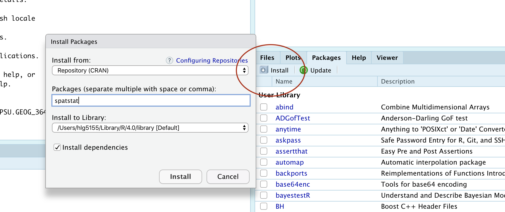
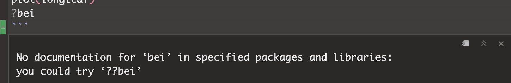
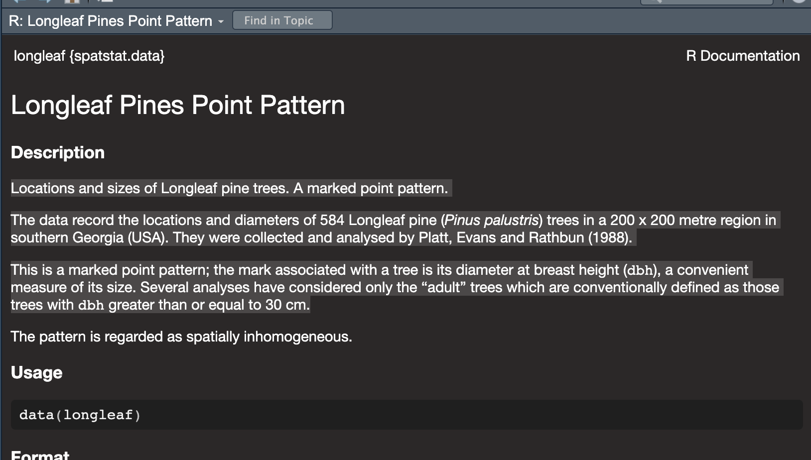

```{=html}
<style>
p.comment {
background-color: #DBDBDB;
padding: 10px;
border: 1px solid black;
margin-left: 0px;
border-radius: 5px;
font-style: normal;
}

h1.title {
  font-weight: bold;
  font-family: Arial;  
}

h2.title {
  font-family: Arial;  
}

</style>
```
```{=html}
<style type="text/css">
#TOC {
  font-size: 12px;
  font-family: Arial;
}

pre code {
  font-size: 13px; /* Adjust the font size as needed */
  white-space: pre-wrap;
}
</style>
```
\

```{r setup, include=FALSE}
knitr::opts_chunk$set(echo = TRUE, warning=FALSE, message = FALSE)
```

```{r,include=FALSE,echo=FALSE}
# invisible data read
library(tidyverse)
library(sp)
library(sf)
library(readxl)
library(skimr)
library(tmap)
library(viridis)
library(kableExtra)
library(spatstat)
library(spatstat.data)
library(car)

data(longleaf)

```

Welcome to Lab 3 on Point Pattern Analysis. A point pattern dataset is
comprised of events or objects occurring in a defined study region.
These events could represent anything with a specific measurable point
location.

**Objective:** The goal of Lab 3 is to learn some introductory spatial
statistical approaches for characterizing the spatial properties of a
point pattern.

-   **This week:** We will be focusing on quadrat analysis, kernel
    analysis and standard ellipses. (Oct 2-6) e.g. Point pattern density

    RECOMMENDED: You can optionally submit this week's lab to get graded
    up to the first 50 points - If you submit before Monday 9th, we will
    provide feedback, so you can improve your grade when you (re)submit
    the entire lab.\

-   **Next week (Oct 9-12):** a new set of tutorials will be released on
    point pattern distance. You will (re)-submit everything from 3A and
    3B. 

    See the rubric on canvas (this is up!) for how it will be graded and
    the checklist at the end for what you need for 100%.

See [The Canvas page
here](https://psu.instructure.com/courses/2260204/assignments/15455241),
or go to canvas for assignment guidelines. You can use either the
website base RStudio/Posit Cloud OR R-Desktop for this lab.

Getting stuck? Look at the Canvas page for the McGrew Chapter 14 - it
has a great overview.

<br><br><br>

# Getting started

## 1. Create your project

1.  In Desktop R, select your 364 directory, create a new project, then
    name the project Lab 3. If you are stuck on this process, see the
    start of Lab 1 and Lab 2 or these tutorials

    -   For R-Desktop, see [Tutorial
        3B](https://psu-spatial.github.io/Geog364-2023/in_Tutorial03LabSetUp.html#Projects_using_Desktop)

    -   For Posit Cloud, see [Tutorial
        3C](https://psu-spatial.github.io/Geog364-2023/in_Tutorial03LabSetUp.html#Projects_using_Rstudioposit_Cloud)
        <br><br>

You can check this has worked by looking on the file explorer on your
computer, then selecting your GEOG364 folder and checking that a Lab 3
folder has appeared with your Lab3.Proj file inside it.

<br><br><br>

## 2. Install new packages

There are two specialist packages called "spatstat" and "car" which
focus on point pattern analysis. Please install these - either keep
reading for a summary or see [this
tutorial](https://psu-spatial.github.io/Geog364-2023/in_Tutorial03LabSetUp.html#Downloading_a_new_package)
for details (or what the little yellow bar is).

*If you are a Windows user, you might see a message at the beginning of
the install process saying that you need to install R-Tools. IGNORE
THIS - You probably don't need to install R-Tools*

<br><br>

#### Reminders on installing packages

Although it works in the console, please do not include the
`install.packages()` command in your .Rmd file .If you include
install.packages in your code chunks, then when you press knit, you are
asking a computer to independently visit an app store (which it can't
do) - which often causes errors.

Instead, install spatstat and car by clicking the "install button" in
the packages menu. Click on the install button, then start typing
spatstat, select it and press install.

```{r, installbutton3, echo=FALSE, fig.cap = "Click the button and  type the name if the package you want to install"}

```

Now, repeat the process for the `car` package. This might take a while
to download. If this doesn't work, TALK TO AN INSTRUCTOR (it can be
buggy).

<br><br><br>

## 3. Create your .RmD file

In Lab 1, you created your own template for your labs. In Lab 2, you
used an .RmD template that Dr G created. In this lab, you can choose
what you want to do. Either

-   Follow the instructions in [Tutorial
    3E.](https://psu-spatial.github.io/Geog364-2023/in_Tutorial03LabSetUp.html#Creating_a_Markdown_document)
    Remember to remove any "friendly text" below your YAML code!

-   Or follow the [instructions in Lab
    2](https://psu-spatial.github.io/Geog364-2023/in_G364_Lab2_Basics.html#4_Edit_your_template),
    but change the text in the template to match Lab 3.

<br>

Your file should look professional with a template when you press knit.
Note, if you are using R Studio CLOUD, you might need to re-install the
`rmdformats` or `prettydocs` package to make the templates appear. Want
to try a new template? Try these packages:

-   `prettydocs` (easy) or
    <https://github.com/hrbrmstr/markdowntemplates> (I have never tried
    this but they seem interesting)

KNIT TO CHECK IT WORKS. IF YOU ARE STRUGGLING WITH THIS, PLEASE TALK TO
AN INSTRUCTOR.

<br><br><br>

## 4. Add your library code chunk

Add a new code chunk. Inside add the following code and run it.

The reason we are adding this just after typing it into your console is
that these library commands need to be run every time you open R. So we
put them in a code chunk right at the top of your file.

Note if later on you install new packages, please add them to this list
and re-run not randomly throughout your code! I guarantee that 'future
you' will thank you.

```{r, message=FALSE,warning=FALSE}
library(spatstat)
library(sp)
library(sf)
library(tmap)
library(car)
```

Now click the Knit Button and make sure everything looks correct.

<br><br><br>

# Point Pattern Analysis

## 1. Loading the data

In this walk-through, we will use two data-sets that are already built
into the spatstat package. The advantage of this is that we don't have
to worry about file formats or map projections.

-   All of the examples in this tutorial are based on a dataset called
    `longleaf`
-   You will be conducting your analysis on a dataset called `bei`

But first, we need to load them into R studio. Make a new code chunk.
Inside add:

```{r}
# This loads the internal dataset from R.
data(longleaf)
data(bei)
```

Run the code chunk and you should see the longleaf and bei data-sets
appear in your environment quadrant on the screen. They might appear as
grey-ed out "promises", but as soon as you do something else, they will
load fully.

<br><br><br>

## 2. IMPORTANT

From now onward, you don't *have* to run longleaf examples because you
can see the output in this lab script, but I suggest copying them into
your lab script, getting them working, then in the challenges, tweaking
and editing them to replace the longleaf names with bei as required.

[**You are graded on the lab challenges.**]{.underline}

<br><br><br>

## 3. Data background (help-files)

Every R command AND R-dataset has its own help file. For a more detailed
explanation of how I combine these with google searches, see [this
tutorial](https://psu-spatial.github.io/Geog364-2023/in_Tutorial04ConsoleBasics.html#Getting_help).
In general, you have two options to see a help file.

1.  Go to the Help quadrant (next to packages) and use the top right
    search bar. <br>
2.  IN THE CONSOLE (NOT IN A CODE CHUNK), type `?` then the name of your
    command, function or dataset. e.g. to see the help file for the
    quick thematic map, I would type `?qtm` IN THE CONSOLE.

<br>

<details>

<summary>**If you get an error/It doesn't work, click here to expand!**
</summary>

Just like you can't see the instagram help files without first installing instagram, then tapping the instagram icon,for this to work you must have BOTH [installed](https://psu-spatial.github.io/Geog364-2023/in_G364_Lab3_PointPattern.html#2_Install_new_packages)  (from the 'app' store) AND [loaded](https://psu-spatial.github.io/Geog364-2023/in_G364_Lab3_PointPattern.html#4_Add_your_library_code_chunk)) the library containing the command or dataset.   

For example, If you see this error, you either haven't loaded the spatstat library or run the library code chunk (e.g. see [getting
started](https://psu-spatial.github.io/Geog364-2023/in_G364_Lab3_PointPattern.html#4_Add_your_library_code_chunk))

```{r, Lab3Fig3, echo=FALSE}

```

<br><br>

</details>


<br> To see the help file for the longleaf data, I would type this in the
console.

```{r, eval=FALSE}
?longleaf  
```

It brings up this page. Scrolling down will give more details and worked
examples that I can run.

```{r, Lab3Fig2, echo=FALSE}

```

<br>

We can see a lot of information from this file, [often in the notes
section.]{.underline} 

<br>

<details>

<summary>[**Click here to expand & see what I found out about
longleaf**]{.underline}</summary>

-   My data is a point pattern dataset containing locations and diameter
    measurements of longleaf pint trees in a US forest in Georgia <br>
-   There are 586 pine trees in the dataset <br>
-   The data was collected and analysed by Platt, Evans and Rathbun in
    1988 <br>
-   The data is *marked*. So it is not just locations, but it also
    contains additional information about the diameter of each tree
    trunk (in cm). <br>
-   The data is stored as a "ppp" object (which is a point pattern file
    type) <br>
-   The ppp object also contains information on the region (i.e.,
    window) that was chosen for the study. In this case it is a
    rectangle with an X coordinate range of 0-200 and a Y coordinate
    range of 0-200, with units in meters. <br><br>

</details>


<br><br><br>

## 4. Summary analysis/Plots

Our data has been loaded in a special "spatstat" spatial format called
ppp. This means we get different information when using commands like
"plot", "head" (which normally prints the first few lines) or "summary".

It's actually quite old fashioned in that it's a harder to read format -
so I bet there will be a new package along soon to replace it..

```{r}
summary(longleaf)
```

```{r}
head(longleaf)
```

I then made a quick plot of the longleaf data. Because the data is
marked, the size of the circle automatically corresponds to the marks,
the diameter of the tree trunk (which I worked out from the help file).

```{r, fig.cap="It automatically understands the data is spatial and that the trunk diameter is a mark"}
plot(longleaf)
```

<br><br><br>

## Challenge A

1.  Google the "spatstat" R package. Tell me a little about it and what
    it does.

2.  Make sure you have run code chunk that loads the packages (the one
    with the `library` command), AND one that loads the longleaf and bei
    data using the `data` commend. If not, go back and reread the
    section.

3.  In a new code chunk, use the instructions above to load the help
    file for the `bei` data. In your own words, neatly summarise
    everything you can find about the `bei` dataset from the help file.

```{=html}
<!-- -->
```
4.  Create a new code chunk and make a plot of the `bei` data. Comment
    underneath the plot about whether you see any spatial
    autocorrelation (positive/negative/zero), plus which spatial
    fallacies might cause problems in this lab.

5.  Look at the summary of the `bei` data. Can you catch where someone
    made a mistake in the help file? (try not to cheat on this one -
    it'll help you learn R)

<br><br><br>

## 5. Mean Centre and Standard Ellipse

Now, let's look at some summary point statistics. The easiest thing to
consider is the spatial mean, where we take the mean of all the x values
vs all the y values.

```{r}
x.mean.longleaf <- mean(longleaf$x) 
y.mean.longleaf <- mean(longleaf$y)

print(x.mean.longleaf)
print(y.mean.longleaf)
```

We can also add a standard ellipse using the dataEllipse command in the
`car` package. Here is a basic version and a fancy version

```{r, eval=FALSE}
#Basic
dataEllipse(longleaf$x, longleaf$y, levels=0.68)

```

```{r}
#Fancy look at the par help file for more options
dataEllipse(longleaf$x, longleaf$y, levels=0.68, 
            fill=TRUE, fill.alpha=0.1,
            col= c( rgb(red=1, green=0, blue=0, alpha = 0.5),
                    "blue"),    
            pch=16, cex=.5,    
            xlab="x (m)",ylab="y (m)") 

```

<details>


<br> 

<summary>[**Want to know what the options mean? Click to
expand**]{.underline}</summary>

Here's what it all means. The \# in a code chunk means ignore the text

```{r, eval=FALSE}
# look at the par and dataEllipse help files for more options
# 
dataEllipse(longleaf$x, longleaf$y, levels=0.68, 
            fill=TRUE,      # Fill the ellipse
            fill.alpha=0.1, # Fill the ellipse with transparent color
            
            # In the first part of col, I make my dots a slightly transparent red, 
            # in the second I make the ellipse blue 
            col= c ( rgb(red=1, green=0, blue=0, alpha = 0.5),"blue"),  
            
            pch=16, cex=.5,    # filled dots (pch) and small size (cex)
            xlab="x (m)",ylab="y (m)") #labels


```

</details>


<br><br><br>

## Challenge B

1.  Make a new heading called Standard Ellipse

2.  Make a new code chunk and find the spatial mean of the `bei` data

3.  Create a new code chunk and plot the standard ellipse of the `bei`
    data - that is formatted uniquely to you. Instead of including only
    the first standard deviation of the data, I want you to include TWO
    standard deviations. (Think about levels and your lecture notes, or
    google normal distribution 68% for a hint).

<br><br><br>

## 6. Density autocorrelation analysis

In the rest of this Lab, we will study the variation of the
observations' *density* across a study area, which tell us about the
underlying non-uniformity of the background environment and how it might
influence the pattern we see.

<br><br>

### 6A. Global intensity

The first way to look at this is to examine the overall density of
points over the entire field, known as the global intensity. This is
simply the average number of points per unit area.

**We say it's "global" because we only calculate a single number for the
entire study area.**

Mathematically, the overall intensity of a point process can be
calculated via the following equation, where n is the number of points
within our region and A is the overall area of the region.

$$\lambda=\frac{n}{A}$$

In R, we can do this simply by looking at the summary command. Scroll
back up and look at it. We can see that the global intensity of the
pattern is 0.0146 trees per square meter (note the units).

*(We can also see that the thinnest tree trunk has a diameter 2cm and
the largest, 75.9cm. Finally it tells us the shape and area of our
boundary box containing all our points is 200x200m. Note, this bounding
box doesn't [have]{.underline} to be rectangular.)*

<br><br>

### 6B. Local Quadrat analysis

Moving beyond of a single 'global' number, we can examine how the
'local' density varies across the study area. The simplest way to do
this is by a technique called *quadrat analysis*. See this week's
lectures and canvas.

This can be done in R using the quadratcount command from the spatstat
package. Here, I "saved" my answer as the variable Q, so I can use it
again below.

```{r}
Q <- quadratcount(longleaf, nx = 4, ny = 4)
print(Q)
```

This command divides the longleaf dataset in 16 equally sized square
grid-cells, or quadrats - 4 quadrats in the x direction and 4 in the y
direction. It then returns the number of points in each box as well as
the size of each box. We can see that the area is 50\*50 = 2500m.

To standardize and compare patterns, we can divide each count by 2500.
The intensity command does this automatically, showing the proportion of
points per unit area in each quadrat:

```{r}
# Print the density for each quadrat
# This is literally the counts in each box divided by the area of the whole area, 2500m^2
intensity(Q)
```

We can also plot this to make it easier to interpret. I can quickly see
that there are 15 points in the bottom right quadrat compared to 34 in
the top left.

```{r}
# I didn't want it to plot the different circle sizes so i turned off marks

plot(longleaf,       
     use.marks = F,  
     cex = 0.5, pch = 4, # point size and shape    
     main="Longleaf quadrat count") # plot title

plot(Q, add = TRUE, cex = 2)  # Now I add Q on top.
```

Alternatively, we can plot the intensity, because the colours make it
simpler to see patterns. This time, I added the points on top.

```{r}
# Plot the intensity
plot(intensity(Q, image=TRUE), main="Point intensity", las=1)  # Plot intensity raster 
plot(longleaf, pch=20, cex=0.6,  add=TRUE)                     # Add points
```

<br><br>

### 6C. Quadrat Variance Mean Ratio

Finally, I am going to calculate the Variance Mean Ratio, which gives an
assessment about whether the data is clustered, uniform or random (AKA
levels of spatial autocorrelation). Overall, I suspect this data is
clustered. See the lecture for more.

```{r}
# we use the as vector command to convert the data from a spatial ppp object back to a normal number
longleaf.variance <- var(as.vector(Q)) 
longleaf.mean <- mean(as.vector(Q))

longleaf.VMR <- longleaf.variance / longleaf.mean
print(longleaf.VMR)

```

<br><br>

### 6D. Quadrat Hypothesis test

We can now examine whether our pattern might look similar to those
generated by different underlying scenarios. The easiest one to start
with is "does the pattern look 'unusual' compared to one generated by an
Independent Random Process.

By different I mean unusually clustered or uniform/regular.

-   H0: Our Longleaf pattern was caused by an Independent Random
    Process. Any clustering/dispersion is just random chance. AKA
    there's an equal probability of seeing a point occur anywhere in the
    study area AKA The pattern is an example of Complete Spatial
    Randomness.

-   H1: Our longleaf is unusually DIFFERENT to one caused by an
    Independent Random Process.

<details>

<summary>[**Click to expand to read what the test is doing & how to
run/interpret the output**]{.underline}</summary>

#### Creating Independent Random Point Processes:

To assess the significance of a spatial pattern, we start by creating
multiple simulated data-sets that represent what we would expect under
our H0 scenario, in this case, complete spatial randomness. We generate
these simulated data-sets using a Poisson distribution. The Poisson
distribution is a mathematical model that describes the distribution of
rare events occurring in a fixed interval of time or space. In our case,
it's used to simulate random point patterns.

#### Variance-to-Mean Ratio (VMR):

Next, for each of these simulated data-sets, we calculate the VMR. ON
AVERAGE, it would be 1.Some will be slightly clustered and some more
uniform just by chance - so imagine a histogram of VMR values from our
simulation.

So, lets update our hypotheses:

-   H0: Our Longleaf pattern was caused by an Independent Random
    Process. Any clustering/dispersion is just luck. The VMR = 1

-   H1: Our longleaf is unusually DIFFERENT to one caused by an
    Independent Random Process. The VMR is likely to be unusually high
    OR unusually low.

#### Chi-Squared Test:

We want to know if the VMR from our actual longleaf data is "unusual"
compared to the set from our simulated data-sets. So we we compare the
VMR we observed in our actual data to this distribution of VMR from the
simulations using a statistical test called the chi-squared test.

#### P-Value:

The chi-squared test provides a p-value, which represents the likelihood
of encountering a VMR as extreme as what we observed in our simulated
processes. For instance, a p-value of 0.051 means that 5.1% of
artificially generated Poisson processes would exhibit a more extreme
level of clustering or uniformity.

#### Interpreting the p-value:

The smaller the p-value, the more unusual our result, and the stronger
the evidence that we can "reject H0." In other words, we have reason to
believe that something beyond random chance is responsible for our
observed pattern.

Whether this is considered "significant" depends on your risk tolerance
and the consequences of your decision. For instance, if a catastrophic
outcome hinged on our decision, we might need a higher level of
confidence than 5%.. (the old threshold of 0.05 = "significant" came
from the days of pre-calculators where all this maths was done by hand).

#### Example in R.

Of course you don't need to write all that all the time. This is enough.

-   H0: Our Longleaf pattern was caused by an Independent Random
    Process. Any clustering/dispersion is random chance. On average, the
    VMR = 1

-   H1: Our longleaf is unusually DIFFERENT to one caused by an
    Independent Random Process. The VMR is likely to be unusually high
    OR unusually low.

```{r}
quadrat.test(longleaf)
```

Here our p-value is TINY! 2.2 x 10^-16^. Let's use xkcd to put that into
context ([link
here](https://www.explainxkcd.com/wiki/index.php/2379:_Probability_Comparisons)).
This is how likely it is..

|                                                                                                                                                                      |
|------------------------------------------------------------------------|
| *You pick up a phone, dial a random 10-digit number, and say 'Hello President Obama, there's just been a magnitude 8 earthquake in California" and you are correct!* |

: So this data is VERY unusual if it was caused by an IRP.

We have enough evidence to reject H0 and say that our scenario of an
"independent random process" is unlikely to have caused this pattern.

</details>


<br><br><br>

## Challenge C

If none of that made sense, also try working through this online
example:
<https://mgimond.github.io/Spatial/point-pattern-analysis-in-r.html>

1.  Create a new subheading called quadrat analysis

2.  In your own words, explain what 1st and 2nd spatial autocorrelation
    are. What 1st and second order processes do you think might
    influence your bei dataset?

3.  Create a new code chunk and calculate out the global intensity of
    trees in the bei dataset

4.  Conduct a quadrat analysis on the bei dataset, including

    -   A table of counts

    -   A table of intensities

    -   A plot of counts

    -   A plot of intensities

5.  Calculate the Variance Mean Ratio for the bei data. Explain from
    this if you think the data is clustered, randomly distributed or
    uniformly distributed.

6.  Conduct a chi-square hypothesis test to assess if your data really
    is randomly distributed

<br><br><br>

## 6E. Issues with quadrat analysis

Like many things in statistics, we don't want individual items to skew
our results. So I suggest if possible to keep the numbers IN EACH
QUADRAT to be at least 30. Otherwise you have an even higher likelihood
of seeing patterns just by random chance.

Quadrat analysis is susceptible to some major spatial fallacies and
problems. [As described in this textbook
section](https://mgimond.github.io/Spatial/chp11_0.html#density-based-analysis):

*The choice of quadrat shape and size will influence the measure of
local density and must be chosen with care. If very small quadrat sizes
are used you risk having many quadrats with no points which may prove
uninformative. If very large quadrat sizes are used, you risk missing
subtle changes in spatial density distributions."*

Here is how I made some plots that explores this issue.

```{r, echo=TRUE}
# First, I will set up my different experiments
Q.2_2.Boxes  <- quadratcount(longleaf, nx = 2, ny = 2) 
Q.4_4.Boxes  <- quadratcount(longleaf, nx = 4, ny = 4) 
Q.12_3.Boxes <- quadratcount(longleaf, nx = 12, ny = 3)      

# Now set up three subplots in a row - and change the plot margin
# Type ?par in the console for more options
par(mfrow=c(row=1,col=3),mar=c(1,1,1,3)) 

# Plot 1
# Plot intensity, then add longleaf points, then add numbers
plot(intensity(Q.2_2.Boxes, image=TRUE), main="", las=1)                
plot(longleaf, pch=20, cex=0.6, col=rgb(0,0,0,.5), add=TRUE)    
plot(Q.2_2.Boxes, add = TRUE, cex = 2,col="white",font=2)               

# Plot 2
# Repeat but for the 4x4 boxes.
plot(intensity(Q.4_4.Boxes, image=TRUE), main="", las=1)                
plot(longleaf, pch=20, cex=0.6, col=rgb(0,0,0,.5), add=TRUE)    
plot(Q.4_4.Boxes, add = TRUE, cex = 2,col="white",font=2)               

# Plot 3
# Repeat but for the 12x3 boxes.
plot(intensity(Q.12_3.Boxes, image=TRUE), main="", las=1)                
plot(longleaf, pch=20, cex=0.6, col=rgb(0,0,0,.5), add=TRUE)    
plot(Q.12_3.Boxes, add = TRUE, cex = 2,col="white",font=2)               
```

<br><br><br>

## Challenge D

1.  Create a new code chunk, then copy and paste the code above into it.
    Replace all the longleafs with bei (there are 6 instances) and run
    to check it works

2.  Now, modify the code chunk to:

-   Make your subplots in 1 column but in 3 rows (e.g. arranged
    vertically)
-   plot quadrat counts for
    -   4 quadrats (2 in the x direction and 2 in the y direction),
    -   20 quadrats (5 in the x direction and 4 in the y direction),
    -   100 quadrats (10x10)

3.  Below the code chunk, write about the features you observe when
    modifying the number of quadrats for the bei data.

4.  This is a classic example of a spatial fallacy. Explain which one
    and what is going on.

<br><br><br>

## 7. Kernel Density Estimation (KDE)

### 7A. What is this?

Kernel Density Estimation is another method that we can use to explore
point pattern densities. As described in
<https://sites.warnercnr.colostate.edu/wtinkham/courses-taught/nr-512-spatial-statistical-modeling/nr-512-exercise-descriptions/nr-512-exercise-3/>.

*"Quadrat counting is useful for characterizing the intensity of an
in-homogeneous point process, however there are limitations including:*

-- *The choice of origin, quadrat orientation, and quadrat size affects
the observed frequency distribution.* -- *A significant amount of
spatial data is lost.*

*KDE algorithms use a moving window approach to characterize intensity.
This approach tends to preserve a greater amount of spatial detail and
does not suffer as much from choices of origin, quadrat orientation, and
quadrat size as compared to quadrat counting."*

"Conceptually, a smoothly curved surface is fitted over each point. The
surface value is highest at the location of the point and diminishes
with increasing distance from the point."

<br><br>

<details>

<summary>[**Tell me in simple language. Click here to
expand**]{.underline}</summary>

This is how ChatGPT explains it:

Kernel density smoothing is a statistical technique used to estimate the
density or concentration of something in a specific area, like the
density of longleaf trees in a forest. Let's break it down using an
example with the longleaf tree data from the R spatstat package:

The Data: Imagine you're a student studying longleaf trees in a forest.
You've collected data on the locations of some longleaf trees in the
forest.

The Question: You want to know if there are areas in the forest where
longleaf trees are more concentrated than in others. In other words, you
want to create a map that shows where longleaf trees are more common.

Kernel Density Smoothing: This technique helps you create that map. It
works by placing a little "hill" or "bump" on the map for each known
longleaf tree location.

Bandwidth: The size of each "hill" (or the width of the bump) is
determined by something called the bandwidth. A smaller bandwidth makes
the map more detailed and wiggly, while a larger bandwidth makes it
smoother.

Combining Information: By adding up all these little "hills" from each
known longleaf tree, you get a smooth map. The map shows where the
concentration of longleaf trees is higher or lower in the forest. Areas
with taller "hills" on the map have more longleaf trees, while areas
with shorter "hills" have fewer.

So, in simple terms, kernel density smoothing takes your data on
longleaf tree locations and turns it into a map that gives you a sense
of where these trees are more densely packed in the forest. It helps you
identify the hot-spots of longleaf tree concentration, which can be
valuable information for ecological studies or conservation efforts.

</details>

<br><br>

<details>

<summary>[**I want all the details! Click here to
expand**]{.underline}</summary>

See here :)
<https://pro.arcgis.com/en/pro-app/latest/tool-reference/spatial-analyst/how-kernel-density-works.htm>

Or this set of videos is great:
<https://www.youtube.com/watch?v=ge4Oh-h1Of8>

</details>


<br><br>

To apply it in R, we simply use the density command. For example, for
the longleaf data, I would create a new code chunk and type.

```{r}
PointDensity <- density(longleaf)
plot(PointDensity)

# Individual events can be added to the plot by adding our original points to the plot.
 plot(longleaf, add = TRUE,
      use.marks = F, cex = 0.5,pch=16) 

```

So you can see that instead of quadrats, we now have a smooth surface.

<br><br>

### 7B. Modifying the bandwidth

In the density command above, the "bandwidth" (e.g. the size & shape) of
the smoothing window/hill/'bump' defaults to 0.9 times the minimum of
the standard deviation and the interquartile range divided by 1.34 times
the sample size to the negative one-fifth power.

However, the bandwidth can be scaled via the sigma parameter within the
density command:

```{r}
# set up 3 subplots in a row
par(mfrow=c(row=1,col=3),mar=c(1,1,1,1)) 

# change bandwidth by altering the value assigned to sigma
plot (density(longleaf, sigma = 5),main="Bandwidth=5")
plot(longleaf, add = TRUE,use.marks = F, cex = 0.5,pch=16)

plot (density(longleaf, sigma = 20),main="Bandwidth=20")
plot(longleaf, add = TRUE,use.marks = F, cex = 0.5,pch=16)

plot (density(longleaf, sigma = 100),main="Bandwidth=100")
plot(longleaf, add = TRUE,use.marks = F, cex = 0.5,pch=16)
```

<br><br>

### 7C. Calculating an "optimal" bandwidth

Different statisticians have come up with different ways to
automatically calculate the "optimal" bandwidth. For example

1.  `bw.diggle()` - minimizes the mean-square error criterion defined by
    Diggle (1985)
2.  `bw.frac()` - uses a quantile of the distance between two
    independent random points in the window 3. 3. 3. `bw.stoyan()` -
    sets the standard deviation of the kernel

You can look at the R help to understand in more detail how they work
(e.g. type ?bw.diggle into your console)

Here I will apply the diggle() function to estimate a bandwidth for the
data. As you can see, the result is interesting.

```{r}
# Report the value of the bandwidth
optimal_diggle <- bw.diggle(longleaf)

# use the diggle function to automatically guess bandwidth
# I made a fancy title that automatically prints it.
plot (density(longleaf,sigma = optimal_diggle), 
      main=paste("Diggle Bandwidth Estimation = ",round(optimal_diggle,3)))

plot(longleaf, add = TRUE,use.marks = F, cex = 0.5,pch=16)

```

<br><br><br>

## Challenge E

Apply the code above to your script to calculate and plot an "optimal"
bandwidth for the bei data.

Finally, reflect on the lab and look back at the outputs you have made.
If someone asks you about the spatial distribution of trees in the area,
what would you tell them and which plots and analyses would you use (or
not use!) to provide evidence. Write your thoughts below the code chunk.

<br><br><br>

# Submitting your work

Remember to save your work throughout and to spell check! (next to the
save button). Now, press the knit button one final time.

On R-Desktop

-   If you have not made any mistakes in the code then R should create a
    html file in your lab 3 folder which includes your answers.

-   If you look at your lab 3 folder on your computer, you should see
    the html there - complete with a very recent time-stamp. Double
    click on the html file. This will open it in your web-browser.\
    CHECK THAT THIS IS WHAT YOU WANT TO SUBMIT.<br>

On Rstudio cloud,

-   See [TUTORIAL 3 Cloud - LINK
    FIXED](https://psu-spatial.github.io/Geog364-2023/in_Tutorial03LabSetUp.html#Projects_using_Rstudioposit_Cloud)
    for how to download your files <br>

Finally, go to Canvas and submit BOTH your html and your .Rmd file in
Lab 3.

```{r, echo=FALSE}
knitr::include_graphics("./Figures/LabFig_WhatToSubmit.png")
```

<br><br>

## How am I graded?

Overall, here is what your lab should correspond to:

```{r, echo=FALSE}
rubric <- readxl::read_excel("in_G364_Lab0Rubric.xlsx")
knitr::kable(rubric) %>%   
  kable_classic_2() %>%
  kable_styling(bootstrap_options = c("striped", "hover", "responsive"))


```
