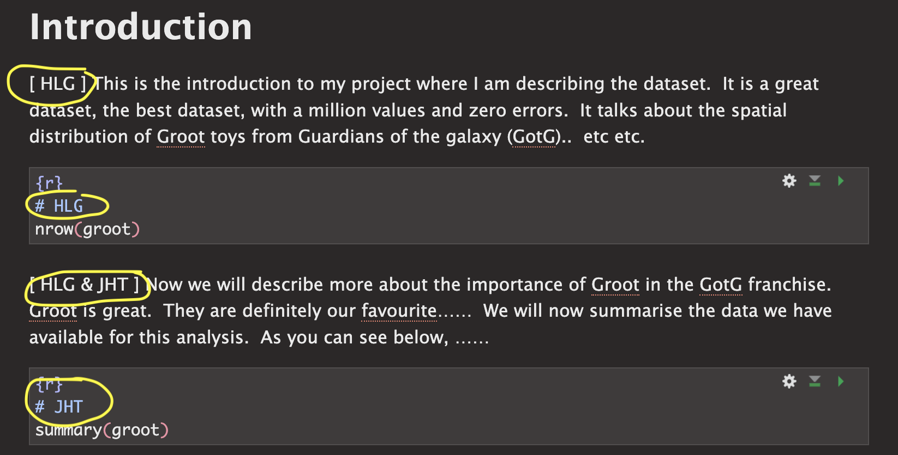
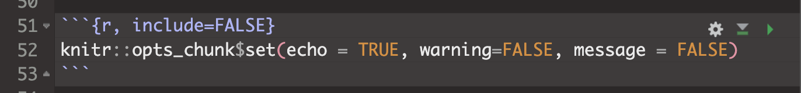
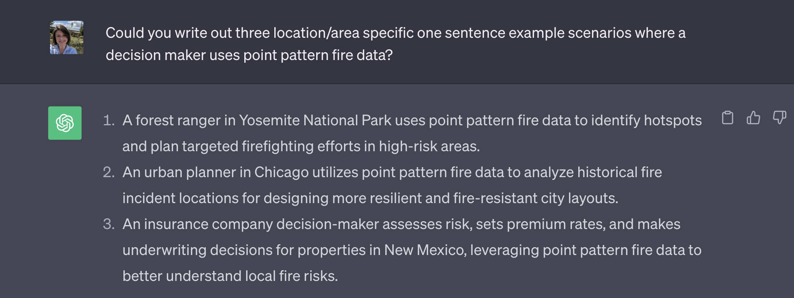

Welcome to part 2 of your projects!

The aim of this week is to continue to work on your reports (following
the guidelines below), get your data read into R if you haven't already,
make it 'spatial' and to do some point pattern analysis.

<br><br>

# Step 1\| Reflect on feedback

<br>


{width="700"}

<br>

Go to the assignment page on Canvas and take a look at your feedback for
Lab 1. See the screenshot above for where to click.
<https://psu.instructure.com/courses/2260204/assignments/15503679>

<br>

<details>

<summary>[**Click to read some common issues in Project
1**]{.underline}</summary>

<br>

[**ISSUE 1: I couldn't read in my data:**]{.underline}

I've tried to provide custom feedback here to get your dataset working
in R. See the comments. If it still doesn't work, talk to a teacher/TA.
<br>

------------------------------------------------------------------------

[**ISSUE 2: I lost marks on style because I didn't use a
template:**]{.underline}

Templates let you easily make a variety of professional documents. They
also do things like automatically generate a table of contents. Please
see this tutorial on how to make one:
<https://psu-spatial.github.io/Geog364-2023/in_Tutorial03LabSetUp.html#Templates>
<br>

------------------------------------------------------------------------

[**ISSUE 3: I didn't provide enough background:**]{.underline}

Here I was looking to see details (minimum) on:

-   The background of the topic

-   The source of the data 

-   How it was collected

-   What the columns mean (& units).

So if you only added a few sentences then you didn't get full marks
(although often still gained an A overall). More guidance in this week's
lab below as to how to improve. <br>

------------------------------------------------------------------------

[**ISSUE 4: My data was inappropriate:**]{.underline}

The main issue I saw was that a few people chose global data-sets where
the clustering didn't look like something that could be used in a point
pattern analysis. This isn't the end of the world, as I requested either
a single country or to have at least 50 points within a single
country/region, but check your comments as it's important that we subset
to a more appropriate area. Look at my individual comments here. <br>

------------------------------------------------------------------------

[**ISSUE 5: It wasn't clear who did what**]{.underline}

There were two big issues here. The first wasn't stating clearly at the
top of your report if there were one or two people working on this (and
either your names or email-ID). This made grading hard when I had to
spend time working out if you were working solo or not.

The second was that for some of you, it wasn't clear within your
write-up who did what. As described in your initial quizzes, I'm looking
for something like this: <br>

```{r, echo=FALSE}

```

<br><br>

</details>

<br><br>

# Step 2\| Improve report readability

<br>

## 2A. Load your report

We are using the same report as for Project 1. So open your Project 1
folder/.Rproj and open your report. Scroll to the top!

<br>

## 2B. Add your names/email ID to the top

**At the top of your report in italic, add your scenario - and make sure
to add your names/email ID if you are working as a pair. Otherwise it's
really hard to match them on Canvas.**

You can also add an author line in your YAML code at the top

<br>

## 2C. Add Code chunk options

First, let's get rid of all of the 'library loading text' that happens
when you press knit. Underneath your YAML code and at the top of your
report, copy/paste this EXACT code chunk. If something like it already
exists, replace it with my version.

```{r, eval=FALSE}
knitr::opts_chunk$set(echo = TRUE, warning=FALSE, message = FALSE)
```

Now edit the top of the code chunk itself. Change {r} to {r,
include=FALSE}. For example:



Press knit. That code chunk should will disappear, but it will force all
the other code chunks to show no warnings or messages. If your report
before was printing out all of the library outcomes, then it should now
look more tidy.

There are a lot of other code chunk options out there, from pre-defining
the size of figures, to changing colors. See this tutorial for more:
<https://yihui.org/knitr/options/>

<br>

## 2D. Tidy up your report & code

Now work through any code you already have and tidy up:

-   Remove any code that uses interactive commands like
    "install.packages()" or "View()" or "file.choose()"

-   Remove any code that prints out entire datasets. (replace them with
    `head(dataset)` to see the first 6 lines)

-   Move all your library() commands to the library code chunk at the
    top.

-   Generally tidy up. Need any more/better headings/sub-headings? Done
    a spell check? Does it look good when you knit?

<br><br>

# Step 3\| Choosing an audience

I want these reports to be something you could show on Github or to a
future employer/grad-school. This means that (although I know it's not a
writing course), of you need to add more details about your topic.

**The easiest way to do this is to write your report up for some
imaginary senior person or imagine you're writing a blog for a data
science website.**

For example:

-   You might analyse sports stadium data for a new billionaire who
    wants to build a new stadium in a new town but hasn't decided where.

-   You might analyse forest fire data in the Black Hills for a new
    leader of the [Crazy Horse National Monument and
    University](https://crazyhorsememorial.org/story/the-university).

-   The 2002 class of University of California is suing the college
    because of high air pollution - and you are the independent analyst
    called in to arbitrate. Or maybe you're exploring data to go into a
    newspaper expose.

-   You're writing an article for a newspaper of your choice, or
    [www.flowingdata.com](www.flowingdata.com)

-   Your stories can be imaginary, outlandish and ridiculous! Maybe
    you're a writing a report for aliens from Mars about how to avoid
    UFO sightings. Or you're writing a report for President Obama in
    planning a new initiative, or a report for your grandma
    [Tegwyn](https://www.youtube.com/watch?app=desktop&v=rsEzaqSMZCQ)[^1]
    in deciding where to retire\... I really don't care :) What I'm
    looking for is a good reason for you to look at your dataset and to
    define a 'useful' spatial and temporal extent.

[^1]: (my auntie's name)

**This approach is also useful because it forces you to choose a useful
study area.** <br> In the California pollution example, the story makes
sense that you would choose data from 2002 and an area covering the
California campuses.

**Imagine your person is new to the job. or imagine your report will be
published online.. so you need to explain the topic to them from
scratch. They're not going to know any background information or
jargon.**

Finally, in each case you don't have to answer a specific research
question. *"Spatially exploring dataset YY to provide information
on...... "* is enough.

If you want to write in a different language with an English translation
below, then that is also fine.

<br>

#### HELP! I can't think of anyone..

If you are stuck, ask around in the lab! Or ask chat GPT.....



<br>

### 3.1 Your challenge

1.  Choose a potential person/reason for writing your report, following
    the guidelines above. <br>\
2.  Now consider [why]{.underline} that person might care about this,
    make up a scenario. Consider what language would be professional and
    how you can introduce the dataset to them. <br> <br>

**Now include more information in your introduction/background.**

-   [For individual projects:]{.underline}

    -   I'm looking for at least 200 words in your
        introduction/background (before you read in the data) including
        at least one image and one cited & relevant research
        paper/report. To find relevant research papers/reports typing
        your subject into <https://scholar.google.com/> (e.g. building
        stadiums, fire impact in New Zealand..)

        -   This should include background about the topic itself (for
            style/level, imagine you are writing a blog)

        -   You should also include a paragraph on the limitations of
            this dataset for solving their issues. For example, maybe
            you only have one year of data (or your data was collected
            during COVID), or the locational fallacy/non-uniformity of
            space is going to impact your analysis. <br>

    -   I also want a bullet point list of the columns in your dataset,
        for each one explaining what it is, what its name is and units.
        If your data is really messy or has lots of columns you don't
        need, come back to this after you have tidied up in Step 4. <br>
        <br>

-   [If you're working with a lab partner]{.underline}

    -   I'm looking for at least 350 words in your
        introduction/background (before you read in the data) including
        at least TWO images and TWO cited & relevant research
        papers/report. To find relevant research papers/reports typing
        your subject into <https://scholar.google.com/> (e.g. building
        stadiums, fire impact in New Zealand..)

        -   This should include background about the topic itself (for
            style/level, imagine you are writing a blog).

        -   You should also include a paragraph on the limitations of
            this dataset for solving their issues. For example, maybe
            you only have one year of data (or your data was collected
            during COVID), or the locational fallacy/non-uniformity of
            space is going to impact your analysis. <br>

    -   I also want a bullet point list of the columns in your dataset,
        for each one explaining what it is, what its name is and units.
        If your data is really messy or has lots of columns you don't
        need, come back to this after you have tidied up in Step 4.

<br><br>

# Step 4\| Reading in your data

Most of you have now managed this. Just in case, here is a new tutorial
that should go through all the possible data types. [Tutorial 5 -
reading in
data](https://psu-spatial.github.io/Geog364-2023/in_Tutorial05ReadingInData.html).

Also, if you talked about issues in your project 1, I am custom
answering each person - so check canvas!

If yours isn't in the tutorial or STILL doesn't work, try googling or
'chatGPT'ing' a query like "read .asds data into R" and you'll probably
find a tutorial.

<br><br>

# Step 5\| Data wrangling (important)

DO NOT SKIP THIS

Even if you have started to do some analysis, I want you to first look
at this section. There are certain things that you can do to make your
data more manageable. These include removing missing values, renaming
columns, sub-setting the columns you want, looking at a smaller spatial
area etc etc.

**Using [Tutorial
6](https://psu-spatial.github.io/Geog364-2023/in_Tutorial06DataWrangling.html)
and [Tutorial
7](https://psu-spatial.github.io/Geog364-2023/in_Tutorial07DataSummaries.html),
I want you to make a heading called Data Wrangling, complete each of
these tasks and write up a paragraph where you tell me what you did.**

1.  Decide on which columns you need. e.g. you want your locations and a
    few good columns with variables in, but you don't need all the
    "notes" columns etc

    1.  Tutorial 7 will help you explore your data

    2.  Now use Tutorial 6B to subset to ONLY those columns and rename
        them to something sensible. Summarise in your paragraph what you
        removed.

    3.  Go back to your write-up at the top and edit your bullet point
        list to talk about each column and its units.

2.  Remove rows where there are missing coordinates (e.g. long and lat)
    using tutorial 7.\

3.  Look for values that clearly aren't real using the summaries and
    things like histograms. Set those values to NA using tutorial 6A.
    Tell me what you did.\

4.  Decide if you want to subset huge datasets to individual
    countries/regions and use Tutorial 6C and 6D to help you do it. Or
    think through what your report reader might like

<br><br>

# Step 6\| Spatial wrangling

Have a look at TUTORIAL 9. You need to:

 - Get your data into sf format. 
 - Choose an appropriate map projection (as appropriate)
 - Make some initial maps.

<br><br>

# Step 7\| Exploratory analysis

Now your data is better organised, start to do some exploratory
analysis. Imagine giving a presentation to your report reader on the
data. What are its features, what's the range, make some maps.
Interesting patterns?  Relate it all back to your report reader.

Your write up should (including code as relevant)

 - Include a clear picture of the dataset's population e.g. what is the object of analysis (what does each row refer to?), what is the space-time range of the data.  What columns are there (or refer the reader to higher up), how much data is there
 
 - What are its key features and patterns?  Any outliers? Interesting issues.  Try making histograms/boxplots/ridgeline plots of interesting variables.  Or you can make interactive scatterplots to look at the relationship between them. See TUTORIAL 8 for more and look at R graph gallery online for cool summary plots.

<br><br>

# Step 8\| Point Pattern Analysis

You are not being graded on this until Project 3, but try some of the
techniques you learned in Lab 3. For example, you could conduct a
quadrat analysis, a nearest neighbour analysis, make some Kernel
smoothed plots, conduct a Ripley's K analysis.

To see an excellent example of how to integrate these into your write
up, see Wartman's analysis of earthquake damage.

<https://psu.instructure.com/courses/2260204/files/folder/4_General%20Readings?preview=155077626>

You don't need to write this much! But see how they talk about the
output from different techniques..
