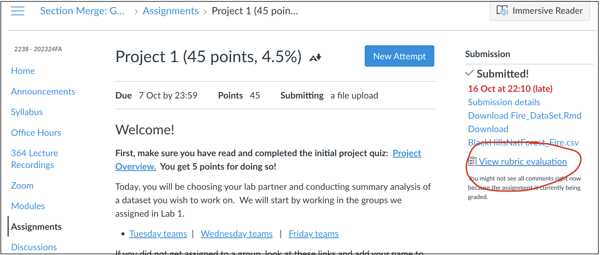

Welcome to part 2 of your projects!

The aim of this week is to continue to work on your reports (following
the guidelines below), get your data read into R if you haven't already,
make it 'spatial' and to do some point pattern analysis.

<br><br>

# Step 1\| Reflect on feedback

<br>

{width="700"}

<br>

Go to the assignment page on Canvas -
<https://psu.instructure.com/courses/2260204/assignments/15503679> - and
take a look at your feedback for Lab 1. See the screenshot above for
where to click.

<details>

<summary>[**Now, click to read some common issues in Project
1**]{.underline}</summary>

<br>

[**ISSUE 1: I couldn't read in my data:**]{.underline}

I've tried to provide custom feedback here to get your dataset working
in R. See the comments. If it still doesn't work, talk to a teacher/TA.
<br>

------------------------------------------------------------------------

[**ISSUE 2: I lost marks on style because I didn't use a
template:**]{.underline}

Templates let you easily make a variety of professional documents. They
also do things like automatically generate a table of contents. Please
see this tutorial on how to make one:
<https://psu-spatial.github.io/Geog364-2023/in_Tutorial03LabSetUp.html#Templates>
<br>

------------------------------------------------------------------------

[**ISSUE 3: I didn't provide enough background:**]{.underline}

Here I was looking to see details (minimum) on:

-   The background of the topic

-   The source of the data 

-   How it was collected

-   What the columns mean (& units).

So if you only added a few sentences then you didn't get full marks
(although often still gained an A overall). More guidance in this week's
lab below as to how to improve. <br>

------------------------------------------------------------------------

[**ISSUE 4: My data was inappropriate:**]{.underline}

The main issue I saw was that a few people chose global data-sets where
the clustering didn't look like something that could be used in a point
pattern analysis. This isn't the end of the world, as I requested either
a single country or to have at least 50 points within a single
country/region, but check your comments as it's important that we subset
to a more appropriate area. Look at my individual comments here. <br>

------------------------------------------------------------------------

[**ISSUE 5: It wasn't clear who did what**]{.underline}

There were two big issues here. The first wasn't stating clearly at the
top of your report if there were one or two people working on this (and
either your names or email-ID). This made grading hard when I had to
spend time working out if you were working solo or not.

The second was that for some of you, it wasn't clear within your
write-up who did what. As described in your initial quizzes, I'm looking
for something like this: <br>

```{r, echo=FALSE}
knitr::include_graphics("./Figures/Proj_Fig2_LabPartner.png")
```

<br><br>

</details>

<br><br>

# Step 2\| Improve report readability

## Load your report

We are using the same report as for Project 1. So open your Project 1
folder/.Rproj and open your report. Scroll to the top!

## 2A. Code chunk options

First, let's get rid of all of the 'library loading text' that happens
when you press knit. Underneath your YAML code and at the top of your
report, copy/paste this EXACT code chunk. If something like it already
exists, replace it with my version.

```{r, eval=FALSE}
knitr::opts_chunk$set(echo = TRUE, warning=FALSE, message = FALSE)
```

Now edit the top of the code chunk itself. Change {r} to {r,
include=FALSE}. For example:


Press knit. That code chunk should will disappear, but it will force all
the other code chunks to show no warnings or messages. If your report
before was printing out all of the library outcomes, then it should now
look more tidy.

There are a lot of other code chunk options out there, from pre-defining
the size of figures, to changing colors. See this tutorial for more:
<https://yihui.org/knitr/options/>

<br><br>

## 2B. Choosing an audience

I want these reports to be something you could show on Github or to a
future employer/grad-school. This means that (although I know it's not a
writing course), many of you do need to add in more details about your
topic.

The easiest way to do this is to write your report up for some imaginary
senior person. For example:

-   You might analyse sports stadium data for a new billionaire who
    wants to build a new stadium in a new town but hasn't decided where.

-   You might analyse forest fire data in the Black Hills for a new
    leader of the [Crazy Horse National Monument and
    University](https://crazyhorsememorial.org/story/the-university).

-   The 2002 class of University of California is suing the college
    because of high air pollution - and you are the independent analyst
    called in to arbitrate. Or maybe you're exploring data to go into a
    newspaper expose.

Note,I have said someone who is "new". This is so you can imagine
explaining the topic to them from scratch. They're not going to know any
background information or jargon.

This approach is also useful because it forces you to choose a 'useful'
study area. In the California pollution example, the story makes sense
that you would choose data from 2002 and an area covering the California
campuses.

Your stories can be imaginary, outlandish and ridiculous! Maybe you're a
writing a report for aliens from Mars about which areas to avoid UFO
sightings. Or you're writing a report for President Obama in planning a
new initiative, or your great Aunt
[Tegwyn](https://www.youtube.com/watch?app=desktop&v=rsEzaqSMZCQ)[^1] in
deciding where to retire\... I really don't care :)

[^1]: (my auntie's name)

What I'm looking for is a good reason for you to look at your dataset
and to define a 'useful' spatial and temporal extent.

Finally, in each case you don't have to answer a specific question.
"Spatially exploring dataset YY to allow..." is enough.

<br>

### YOUR CHALLENGE

Decide on a potential audience for your work that follows the guidelines
above. If you are stuck, ask around in the lab! Or ask chat GPT.....


**At the top of your report in italic, add your scenario - and make sure
to add your names/email ID if you are working as a pair.**

For the rest of your project, you are writing a report to this person!
Think about what language would be professional, how you can introduce
the dataset to them. Can you include relevant (cited) photos/pictures?
And/Or talk about a relevant underlying issue? (say food deserts...), or
cite related research.

Even before you read in the data, from what you know, you can write
about what limitations might the data have in being useful (for example
COVID data = locational fallacy).

**Now include more information in your introduction/background.**

-   For individual labs, I'm looking for at least 200 words in your
    introduction/background (before you read in the data) including at
    least one image and one cited & relevant research paper/report

-   If you're working with a lab partner, I'm looking for at least 350
    words in your introduction/background (before you read in the data)
    including at least TWO images and TWO cited & relevant research
    papers/report

To find relevant research papers/reports typing your subject into
<https://scholar.google.com/> (e.g. building stadiums, fire impact in
New Zeoland..)

<br><br>

## 2C. Tidy up your code

Now work through the code you already have and tidy up. For example,
remove any code that uses interactive commands like "install.packages()" or "View()".

Also remove any lines that print out entire datasets. (replace them with `head(dataset)` to see the first 6 lines.

And just generally tidy up. Need any more/better headings/sub-headings? Done a spell check?  Does it look good when you knit?

# Step 3 Reading in your data

To add last night's tutorial

# Step 4 Data wrangling
- NA Omit
- Subset in size
- Dates

# Step 5 Making it spatial
Get from 2022

# Step 6 Making maps
Get from 2022


# Step 7 Point Pattern Analysis
1 global, 1 local


