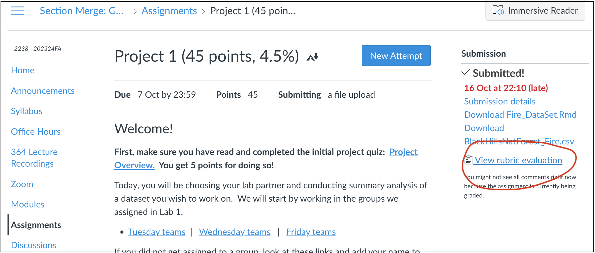

```{=html}
<style>
p.comment {
background-color: #DBDBDB;
padding: 10px;
border: 1px solid black;
margin-left: 0px;
border-radius: 5px;
font-style: normal;
}

h1.title {
  font-weight: bold;
  font-family: Arial;  
}

h2.title {
  font-family: Arial;  
}

</style>
```
```{=html}
<style type="text/css">
#TOC {
  font-size: 12px;
  font-family: Arial;
}

pre code {
  font-size: 13px; /* Adjust the font size as needed */
  white-space: pre-wrap;
}
</style>
```
\

```{r, include=FALSE}
knitr::opts_chunk$set(echo = TRUE, warning=FALSE, message = FALSE)
```

```{r,include=FALSE,echo=FALSE}
# invisible data read
library(tidyverse)
library(sf)
library(readxl)
library(skimr)
library(tmap)
library(viridis)
library(kableExtra)
library(spatstat)
library(spatstat.data)
library(car)
library(tigris)
library(elevatr)
```

Welcome to part 3 of your projects!

The aim of this week is to continue to work on your reports (following
the guidelines below), to do some point pattern analysis if you haven't
already, and add in additional datasets.

<br><br>

# Step 0\| IMPORTANT

You might find that if you have updated R, it can't find a few packages
such as sp. Remove these lines from your library code chunk - it should
then run. If we get errors, Harman and I will help you through them.

The reason for this is the big R update.

<br><br>

# Step 1\| Getting started

<br>

You will be continuing with the same project folder/write up as before.
So open up your project in R studio, making sure to open it by double
clicking the .Rprog file on your computer (or open R studio go to "Open
Project" and find your .Rproj file.

It should say your project name at the top of the screen (remember Lab 2
for how to check you are in a project).

To quickly make sure that everything is working well, go to the Session
menu at the top, then click Restart R and run all chunks. This is
essentially what you will do when you press knit.

<br><br>

# Step 2\| (FEEDBACK IS UP!) Reflect on feedback

<br>

{width="700"}

<br>

Hi all, I'm very sorry that only a few of you got feedback for
project 1. Know that I'm grading project stages now as they come in, so
if you are running slower because of technical challenges then that is
OK. If you canvas messaged me, I'm working on replying to you all.

<br>

[**If you submitted project 2, then I have given you
feedback.**]{.underline} Go to the assignment page on Canvas and take a
look at your feedback for Lab 2. See the screenshot above for where to
click.
<https://psu.instructure.com/courses/2260204/assignments/15455259>.

The most common feedback was

-   To keep tweaking the format e.g. put it on view mode and put in
    things like bullet points

-   To actually write your report to a person or organisation (see
    project 2 instructions)

-   To crop/filter your data to a smaller area. e.g. a single US state
    or X-Y box. To do this, see this tutorial
    <https://psu-spatial.github.io/Geog364-2023/in_Tutorial06DataWrangling.html>

<br><br>

# Step 3\| Check your report has everything

<br>

I have made a detailed rubric for your final report which includes
everything from project 1 and 2. This is in the project menu underneath
project 3.

Go and re-read your report so far and check against this rubric to make
sure it has everything.

<br><br>

# Step 4\| Point Pattern Analysis

<br>

If you haven't already, you will now conduct a point pattern analysis of
your data similar to Lab 3B.

1.  Make sure you have a UTM map projection version of your data. If
    you're not sure what I mean, see here:
    <https://psu-spatial.github.io/Geog364-2023/in_Tutorial09Spatial.html#Step_5_Assign_a_new_map_projection_>
    (and scroll to the top of that tutorial to read about UTM and
    finding your own EPSG code)

    <br>

2.  Convert the utm version of your data to the ppp format.
    (<https://psu-spatial.github.io/Geog364-2023/in_G364_Lab3B_PointPatternDist.html#5_Convert_to_ppp_format>)

    <br>

3.  Conduct the following analyses on your dataset, where you both carry
    out the R code AND talk about the results in your text. If you want
    to see an excellent example of what I mean, see this paper on
    earthquake damage -
    <https://psu.instructure.com/courses/2260204/pages/reading-wartman>.
    You don't need to write this much! But see how they talk about the
    output from different techniques.. <br>

    -   

        A)  A quadrat analysis, talking about MAUP.\
            <br>

    -   

        B)  Kernel density smoothing - at one or more bandwidths THAT
            MAKE SENSE FOR YOUR STORY e.g. are you looking for "more in
            the west rather than the east?" choose a large bandwidth.
            Are you looking for individual hotspots? Choose a small
            bandwidth\
            <br>

    -   

        C)  A nearest neighbour analysis including a hypothesis test
            neatly written up in the text including your H0, your H1,
            the test statistic, the p-value and your interpretation (see
            the McGrew textbook chapter 14, link in the point pattern
            lecture/lab 3A)\
            <br>

    -   

        D)  An L-Function analysis, explained in the text

        <br>

<br><br>

# Step 4\| Merging with new datasets

<br>

If you skipped here because you already did the point pattern analysis,
have a look at this document -
<https://psu.instructure.com/courses/2260204/pages/reading-wartman> .
See if there are things you can add to your write up.

<br>

In the next part of the course, we will be looking at polygons and
raster files. Equally R has MANY built in datasets, so I want you to be
able to merge your data with new information.

<br>

## Step 4A - Initial prep

<br>

### Check your sf data

We will be working with the **sf** version of your data. To check that
this hasn't been corrupted:.

-   First, go to the **Session** menu at the very top, and click restart
    R and clear output. Then re-run all your code chunks.

-   Then, in the console, type qtm(XXXXX) where XXXXX is the sf version
    of your data. If it doesn't make a map, then you have accidentally
    overwritten it. Ask Harman for help.

<br>

### Subset to a smaller area

IF YOU HAVEN'T ALREADY, FILTER YOUR DATA TO ONE INDIVIDUAL STATE/OR X-Y
BOX. You get to choose which one. You can always tweak your report
reader so that they really care about one individual place..

-   You can do this using
    <https://psu-spatial.github.io/Geog364-2023/in_Tutorial06DataWrangling.html>.

-   Or if you want to crop to an X-Y box or to directly crop your sf
    data, see here:
    <https://psu-spatial.github.io/Geog364-2021/364Data_TutorialWranglePoint.html#Cropping_datazooming_in>

<br><br>

## Step 4B - Reading in/merging new data

<br>

IMPORTANT - I'M TRYING TO CHECK THESE ALL FOR THE BIG SF/SP SHIFT I WAS
TALKING ABOUT.

If you get weird errors, check once with Harman that it's not a typo,
send me a canvas message INCLUDING YOUR RMD FILE AND DATA, and move onto
a new dataset.

<br><br>

When I say reading in/merging data, I mean that we will be adding
information to your dataset from other sources. For example, this might
be the ocean depth/temperature, the population density, the census
poverty levels. You get to choose what makes sense for you.

Uou will create two things for each new dataset. The first will be a
polygon or raster file for your area of interest with that new data.
Secondly, you will extract the values of those fields at each of our
point locations (e.g. your dataset will have a load of new columns for
elevation, poverty etc). All the code tutorials below for many options,
but you are also welcome to add in your own data within reason. Get
these easier one working before adding in your weird custom data. We
won't help you on custom data before you have done this- as it's just a
class report (maybe your report reader has weird ideas that nuclear
power plants should only be on mountain tops..).

<br>

-   [**For projects based in the USA,**]{.underline} I want you to
    read-in/merge at least TWO other datasets.

-   [**For projects based outside the USA on land,**]{.underline} I want
    you to try and read in two, but if elevation is the only one we can
    make work then that's OK

-   [**For projects based in the ocean,**]{.underline} scroll down to
    the ocean options

-   [**For any team looking within a sports-field**]{.underline}, I am
    going to try and work on other things you can merge in, but it might
    be that you also read in a dataset of stadium locations for this
    part.

<br><br>

### [**Idea 1: Elevation**]{.underline}

<br>

-   Suitable for any dataset on land.

-   Requires the `elevatr` and `sf` packages. Make sure they are in your
    library code chunk that that it has run successfully

<br>

#### **Code to read in the data**

Follow this tutorial for getting it read into R. HINT, just like in Lab
4, make sure to put echo=FALSE and include=FALSE in your code chunk
options when reading in this dataset. Otherwise when you press knit,
your report will fill up with "downloading" output.

<https://psu-spatial.github.io/Geog364-2021/364Data_TutorialDownload.html#Elevation_data>
*note this link takes you to the 2021 lab tutorial, it will be updated
ASAP, but remember come back to the 2023 page for instructions*

<br>

#### Code to merge the data with your point data

Follow this tutorial for merging with your point data, if you haven't
already

<https://psu-spatial.github.io/Geog364-2021/364Data_TutorialWranglePoint.html#Extracting_point_values_from_rastersfields>
*note this link takes you to the 2021 lab tutorial, it will be updated
ASAP, but remember come back to the 2023 page for instructions*

<br>

#### Update your report

-   Make some plots and maps! You can see my examples in the tutorial.
    Write about the patterns you see. You could also do things like make
    scatterplots between two of your variables (using plotly if you want
    to go interactive).

<br><br>

### [**Idea 2: SOVI (from Lab 4)**]{.underline}

-   Suitable for any dataset in the USA which has been filtered to a
    single state

-   Requires the `elevatr`, `sf`, `tigris` and `tidyverse` packages.
    Make sure they are in your library code chunk that that it has run
    successfully.

<br>

#### **Code to read in the data**

This is fancy code that will get the SOVI data directly from the
internet at census tract and county level. All you need to do is to
change California to the US State of your choice and at the end, change
to the map projection that matches YOUR data. You can read/talk about
where the data comes from from Lab 4.

For A\* candidates, see if you can understand what each line is doing
and why I'm doing it.

<br>

```{r, echo=FALSE, eval=FALSE}
# CHANGE TO THE STATE OF YOUR CHOICE - e.g. CA is CALIFORNIA
county.border <- counties("CA", cb = TRUE, resolution = "20m")
tract.border  <- tracts  ("CA", cb = TRUE)

# Change the web address, the dest file and the read csv to the state of your choice
download.file("https://svi.cdc.gov/Documents/Data/2020/csv/states/California.csv",
              destfile="SOVI2020_CA_Tract.csv")

tract.sovi <- read.csv("SOVI2020_CA_Tract.csv")

# Change the web address, the dest file and the read csv to the state of your choice
download.file("https://svi.cdc.gov/Documents/Data/2020/csv/states_counties/California_county.csv",
              destfile="SOVI2020_CA_County.csv")

county.sovi <- read.csv("SOVI2020_CA_County.csv")

#-----------------------------------------
# Don't touch. I'm just tidying up
# IGNORE THE WARNING! Merge the sovi data and the census tract borders
tract.border <- tract.border[,which(names(tract.border) %in%  c("GEOID","geometry"))]
tract.sovi$FIPS <- paste("0",tract.sovi$FIPS,sep="")
names(tract.sovi)[which(names(tract.sovi) %in% "FIPS")] <- "GEOID"
tract.sovi <- tract.sovi[,-grep("M_",names(tract.sovi))]
tract.sovi <- tract.sovi[,-grep("MP_",names(tract.sovi))]
tract.sovi <- tract.sovi[,-grep("SPL_",names(tract.sovi))]
tract.sovi <- tract.sovi[,-grep("EPL_",names(tract.sovi))]
tract.sovi <- tract.sovi[,c(1:49,69)]
tract.sovi <- tract.sovi %>% mutate_all(~ ifelse(. == -999, NA, .))
tract.sovi.sf  <- geo_join(tract.border ,tract.sovi ,by="GEOID")

county.border <- county.border[,which(names(county.border) %in%  c("GEOID","geometry"))]
county.sovi$FIPS <- paste("0",county.sovi$FIPS,sep="")
names(county.sovi)[which(names(county.sovi) %in% "FIPS")] <- "GEOID"
county.sovi <- county.sovi[,-grep("M_",names(county.sovi))]
county.sovi <- county.sovi[,-grep("MP_",names(county.sovi))]
county.sovi <- county.sovi[,-grep("SPL_",names(county.sovi))]
county.sovi <- county.sovi[,-grep("EPL_",names(county.sovi))]
county.sovi <- county.sovi[,c(1:48,69)]
county.sovi <- county.sovi %>% mutate_all(~ ifelse(. == -999, NA, .))
county.sovi.sf <- geo_join(county.border,county.sovi,by="GEOID")

#-----------------------------------------

# CHANGE TO THE MAP PROJECTION THAT YOU USED IN YOUR PROJECT E.G YOUR UTM ONE
tract.sovi.sf  <- st_transform(tract.sovi.sf,3310)
county.sovi.sf <- st_transform(county.sovi.sf,3310)
```

<br>

#### **Code to merge the data with your point data**

Follow this tutorial to merge your SOVI polygon data with your UTM point
data.
<https://psu-spatial.github.io/Geog364-2021/364Data_TutorialWranglePoint.html#Extracting_point_values_from_polygons>
.Or look up internet tutorials on the st_join command. Its important
that you are trying to join data in the same map projection.

<br>

#### **Update your report**

Make some plots and maps! You can see my examples in the tutorial. Write
about the patterns you see. You could also do things like make
scatterplots between two of your variables (using plotly if you want to
go interactive).

### [**Idea 3:**]{.underline}

<br>

-   Suitable for

-   Requires the and packages. Make sure they are in your library code
    chunk that that it has run successfully

<br>

#### Code to read in the data

Follow this tutorial for getting it read into R. XXX

<br>

#### Code to merge the data with your point data

Follow this tutorial for merging with your point data,

<br>

#### Update your report

-   Make some plots and maps! You can see my examples in the tutorial.
    Write about the patterns you see. You could also do things like make
    scatterplots between two of your variables (using plotly if you want
    to go interactive).

<br><br>
