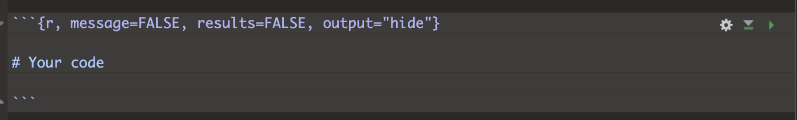

```{=html}
<style>
p.comment {
background-color: #DBDBDB;
padding: 10px;
border: 1px solid black;
margin-left: 0px;
border-radius: 5px;
font-style: normal;
}

h1.title {
  font-weight: bold;
  font-family: Arial;  
}

h2.title {
  font-family: Arial;  
}

</style>
```
```{=html}
<style type="text/css">
#TOC {
  font-size: 12px;
  font-family: Arial;
}

pre code {
  font-size: 13px; /* Adjust the font size as needed */
  white-space: pre-wrap;
}
</style>
```
\

```{r, include=FALSE}
knitr::opts_chunk$set(echo = TRUE, warning=FALSE, message = FALSE)
```

```{r,include=FALSE,echo=FALSE}
# invisible data read
library(tidyverse)
library(sf)
library(readxl)
library(skimr)
library(tmap)
library(viridis)
library(kableExtra)
library(spatstat)
library(spatstat.data)
library(car)
library(tigris)
library(elevatr)
```

Welcome to the final part of your projects. The aim of this week is to
tidy your reports (following the guidelines below), do one final
analysis and finish up. This is due WEDNESDAY of exams week (see
Canvas).

<br><br>

# Step 0\| TROUBLESHOOTING

<br>

## My library code chunk doesn't run

You might find that if you have updated R, it can't find a few packages
such as sp. Remove these lines from your library code chunk - it should
then run. If we get errors, Harman and I will help you through them. The
reason for this is the big R update.

<br>

## My code is timing out or crashing

Especially an issue on the cloud. Follow these steps.

1.  Go to the Files tab or to your folder on your computer. Your folder
    should have your .RProj file, your .RmD report, your data, and any
    photos/pictures, but no random sub-files. Delete any cache files,
    the html file, .md files or random subfolders. <br>

2.  In RStudio in the the Environment tab, click the broom AND/OR type
    this into the console rm(list=ls()). This will clear your variables.
    <br>

3.  The next step depends on what you are trying to do <br>

    1.  If you're trying to knit: <br>

        1.  Go go to the Session menu at the very top of the screen.<br>

        2.  Click Restart R and Clear output. <br>

        3.  Wait for it to finish running. Then press knit.<br>

        4.  If it still doesn't work, talk to a teacher/TA<br><br>\

    2.  If you're trying to write/run code,: <br>

        1.  Go to the session menu at the very top. <br>

        2.  Click Restart R and run all code chunks. <br>

        3.  Wait for it to run, then continue. If it gets stuck on a
            code chunk, carefully read/respond to that error.<br>

<br><br>

# Step 1 \| Tidying up (DON'T SKIP)

<br>

## 1.1 \| Clear your workspace

<br>

First, let's clear your workspace & headspace<br>

-   Make sure all is saved. Close Rstudio.<br>
-   Go into your project folder, and open the R-Studio project (the
    .RProj file NOT the RmD).<br>
-   In the environment tab, click the broom. AND/OR type this into the
    console `rm(list=ls())`<br>
-   Go to the session menu at the very top. Click Restart R and run all
    code chunks.<br>

This should clear your workspace and run everything in your project.
<br>

Click knit. If this knitted before, it should knit now! If it doesn't
knit, then run all the code chunks and see where the error is. Often
it's because you imported some data without actually writing the command
in your code. <br>

Click "Run All" code chunks.

<br><br>

## 1.2 \| What should you have?

Make sure you have followed step 1.1 and run your code. Now go to your
environment tab.

-   Find the variable containing your sf data (e.g. your spatial point
    data). Ideally choose the utm one, but either this or the sf
    long/lat one is OK. e.g. market.sf.utm <br>

-   In your Environment Tab, click on the text of the NAME ITSELF of
    your data in the environment tab (not the little arrow) to open the
    data in a new tab. OR in the CONSOLE, type View(XXXX) where XXXX is
    your variable name.

-   <br>

Look at your data. You should have at least one of these scenarios: <br>

#### [**Scenario A\|**]{.underline}You have a point OR polygon dataset with *multiple* numeric columns of marks.

What do I mean?

-   A column of numbers with actual meaning for each point. E.g.
    Elevation, Age, Length, Percentage in Poverty, average
    temperature... <br>

-   DO NOT COUNT THESE TYPES OF COLUMNS

    -   dates, spatial-coordinates, "descriptive numeric columns" (e.g.
        zip codes, or unique-keys), or categorical data (e.g. year of
        school), ocean depth... <br>

If you have more than 1 numeric column in a point or polygon dataset, go
straight to Step 2.

<br><br>

#### [**Scenario B\|**]{.underline}You have a point OR polygon dataset but you only have ONE numeric column.

For now, send Dr G a Canvas message,

-   OR try adding the average weather conditions (Follow the actual
    tutorial in this link e.g. scroll down and use my code, don't click
    on the outside tutorial links
    <https://psu-spatial.github.io/Geog364-2021/364Data_TutorialDownload.html#Weather_data>)

-   OR if you are on land and you don't have elevation, add that.

<br><br>

# Step 2 \| Relationships between marks

Create a new Heading at the end of your report called Regression.

<br>

## 2.1. Choose your columns

Choose two numeric columns/marks/variables that you think might be
related in your dataset. E.g. Percentage BroadbandAccess and Poverty
Level. Make a note of the exact spelling of the column names.

Ideally these will be linked somehow to the aim of your report, but if
you end up looking at 'nonsense variables' like the elevation vs UFO
"length of sighting" that's OK, you won't lose marks.

<br>

## 2.2. Designate a Predictor and Response

We want to assess whether one mark 'causes' the other one. E.g. "I think
*percent*\_*poverty* 'causes' lower *percent*\_*broadband_access* for
zip codes in Florida", or "I think *Elevation* causes changes in
*Sighting_Length* for point-based UFO sightings".

-   So in your report text, assign one variable/column to be your
    "predictor" e.g. in this case, I would choose *percent*\_*poverty*,
    or *Elevation*

-   And assign the other one as your "response" e.g. my report might be
    about *percent*\_*broadband_access* access, or *Sighting_Length*.

Now see if you can come up with some story about WHY one might cause the
other.

For example - "higher elevations mean clearer skies and longer UFO
sightings". Or "poorer neighbourhoods are less likely to have
infrastructure spending and so less likely to have good internet
speeds". Write both your choices and the story you think links them into
your report. Below, we will explore these variables.

<br>

## 2.3. Make some histograms

<br>

Make good looking histograms of EACH of your response and predictor
variables. I suggest either the ggplot version or the gghistostats
version at the end of this tutorial.

<https://psu-spatial.github.io/Geog364-2023/in_Tutorial08Plots.html#Histograms>

In your report, describe the distribution of each of your variables e.g.
describe the shape of the histograms. You ideally want this to look
*roughly* like a normal distribution. It's OK if it's super-skewed[^1],
but don't have things that are super weird (e.g. all 1s and 0s or all
the same number).

[^1]: *Optional advanced for A\* students if it is super skewed: You can
    make a log column of the data and use that*

We are going to use the ggplotly package. Follow THIS TUTORIAL to make a
scatterplot comparing your two variables.
<https://psu-spatial.github.io/Geog364-2023/in_Tutorial08Plots.html#Interactive>.
Remember:

-   You will need library(plotly)

-   Your response is the y variable (vertical axis)

-   Your predictor is the x variable (horizontal axis)

<br>

## 2.4. Make some maps

Make a good looking QTM/tmap map of each of your variables. Here's
example code for both options (you will have one type or the other).

-   If you have point data, the option dots.col="COLNAME", allows you to
    color in the points to show your variable.

-   If you have polygon data, the option col="COLNAME" allows you to
    color in each polygon to show your variables.

```{r,echo=FALSE}
knitr::include_graphics("./Figures/Report_Fig4D_MapCode.png")
```

<br>

In the text, describe the relationship two maps within the context of
your report/topic. e.g. does it look like both your response and
predictor are higher in the North? By some major cities? Do they "go
together" e.g. areas where one is high the other is high?. Any
differences across your map?

Now update your story/prediction about the relationship between the two
variables. E.g. from this exploratory analysis I NOW believe that....

<br><br>

# Step 3 \| Regression

## 3.1. Scatterplots

Now we will formally look at the relationship between the two variables.
Go to your library code chunk at the top and add/run. You might need to
install them.

-   `library(ggplot2)`
-   `library(hrbrthemes)`

Go back to the end of your code. To make a nice scatterplot, use this
code but update the TABLENAME to the variable name of your sf data (e.g.
market.sf), and RESPONSE / PREDICTOR to the column names of your
response and predictor columns.

```{r, include=FALSE,echo=FALSE}
library(ggplot2)

```

```{r, eval=FALSE}

# Move these to your library code chunk at the top.
ggplot(TABLENAME, aes(x=PREDICTOR, y=RESPONSE)) +
  geom_point() +
  theme_ipsum()

```

Does the relationship between your predictor and your response match
your story/prediction? Any odd outliers? Is the relationship roughly
linear? Or does it look more like the datasaurus we talked about in the
regression data. For ideas on wording, see here:
<https://www.khanacademy.org/math/ap-statistics/bivariate-data-ap/scatterplots-correlation/a/describing-scatterplots-form-direction-strength-outliers>

<br><br>

## 3.2. Linear regression/line of best fit

We will now fit a linear regression model to the data. Use this code,
but update the TABLENAME to the variable name of your sf data (e.g.
market.sf), and RESPONSE / PREDICTOR to the column names of your
response and predictor columns.

```{r, eval=FALSE}

LinearFit <- lm(RESPONSE ~ PREDICTOR, data = TABLENAME, na.action="na.exclude")

TABLENAME$ModelledOutput   <- predict(LinearFit)
TABLENAME$Linear.Residuals <- residuals(LinearFit)

# with linear trend
ggplot(TABLENAME, aes(x=PREDICTOR, y=RESPONSE)) +
  geom_point() +
  geom_smooth(method=lm , color="red", se=FALSE) +
  theme_ipsum()

```

<br>

Given your visual inspection, write whether you you happy with your
linear model. For example, does it seem to do a good job of capturing
the relationship between your variables?[^2]

[^2]: If it doesn't, don't panic - this is the entire topic of STAT462,
    STAT501 and much of GEOG464! So you don't need to fix this here. For
    those not doing those courses, here's the notes for future
    reference. <https://online.stat.psu.edu/stat501/>

<br>

We can have a look at the line of best fit by simply typing/running the
linear fit name. `summary(LinearFit)` gives a load more statistics. This
will give you the intercept and the gradient.

```{r, eval=FALSE}
LinearFit
```

Use these notes to write out the equation for the line of best fit in
your report.

<https://online.stat.psu.edu/stat200/lesson/12/12.3#paragraph--2822>

You can either do this manually, or use insert Equation. (hint, the
little hat means *estimated/modelled* weight*).*

<br><br>

## 3.3. Understanding/mapping your output

Finally, we can look at maps of the ACTUAL response, the MODELLED
response (line of best fit), and the "residuals". Remind yourself on what is going on here:
<https://www.khanacademy.org/math/ap-statistics/bivariate-data-ap/xfb5d8e68:residuals/v/residual-plots> and in the plot below. 

A positive residual means that the actual value was HIGHER than
predicted. A negative residual means the actual value was LOWER than
predicted.


<br>

```{r,echo=FALSE}

```


<br>

The maps below will only work if you used the sf version of your data in
the regression code, not the raw data (e.g. use the .sf or .utm one).
Again change TABLENAME and RESPONSE to match your data:

 - If you have point data, edit this code

```{r, eval=FALSE}
# your actual response variable observations
qtm(TABLENAME,dots.col = "RESPONSE" , fill.palette="Blues") + 
  tm_layout(legend.outside = TRUE)

# the value of your model at each location e.g. what does the line of best fit suggest 
qtm(TABLENAME,dots.cot = "ModelledOutput",fill.palette="Blues") + 
  tm_layout(legend.outside = TRUE)

# the residuals 
qtm(TABLENAME,dots.cot = "Linear.Residuals",fill.palette="-RdBu") + 
  tm_layout(legend.outside = TRUE)
```

<br>

 - If you have polygon data, edit this code

```{r, eval=FALSE}

# your ACTUAL response data
qtm(TABLENAME,"RESPONSE",fill.palette="Blues") + tm_layout(legend.outside = TRUE)

# the value of your line of best fit at each location
qtm(TABLENAME,"ModelledOutput",fill.palette="Blues") + tm_layout(legend.outside = TRUE)

# the residuals 
qtm(TABLENAME,"Linear.Residuals",fill.palette="-RdBu") + 
  tm_layout(legend.outside = TRUE)

```

<br>

In your report, describe what you see. Are there places where the model
does a better job (small residuals), or places where it
over/underestimates? Any clear outliers? For an example of what I mean,
see my analysis here on Chicago broadband:
<https://psu-spatial.github.io/Geog364-2021/pg_364Lab7_Regression_2021.html#Plotting_the_results>
<br>

Then update your 'story". E.g. I NOW believe that...

<br><br>

## 3.4 Autocorrelation of residuals

<br>

In your pre-req, you learned that statistics is meant to be based on
data that is random, independent and representative. A big problem in
spatial data is that it's not independent (see Lecture 3) <br>

If our regression model is truly independent, then our *regression
residuals* (what is left over) should not have any influence or
knowledge of each other. Using the maps above, write whether you think
that there is a spatial pattern in your residuals. <br>

Now write how you would use a moran's I and a moran's scatterplot/test
to assess whether this is true or not. For an example of what I mean
where I did to the analysis, see here:
<https://psu-spatial.github.io/Geog364-2021/pg_364Lab7_Regression_2021.html#Looking_for_Spatial_autocorrelation_in_residuals>
<br>

[**YOU DO NOT HAVE TO ACTUALLY DO THIS**]{.underline}. But use that
example and your lab 5 to explain what you *would* do in the text and
how you would make sure any pattern wasn't simply random chance and your
imagination. <br>

<br><br>

# Step 4 \| Report conclusions

Write a conclusion paragraph to your report under a new heading. In this
summarise, what you found out for your report reader. You do not have to
have answered your initial questions! But summarise what you did and any
interesting results.

<br><br>

# Step 5 \| Check your final html report.

<br>

This is what I will be grading! Press knit. Look at the resulting html
file. *Really read it.*\
Here are ten hints to get full marks in the professional report section
of the rubric.

<br>

-   A. Make sure all photographs are there in the html file.

    -   Sometimes they're not appearing in the final report I grade.
        <br>
    -   If they're not appearing, they might be in a different folder.
        <br>
    -   Or try the `knitr::include_graphics()` command inside a code
        chunk<br>

```{r,echo=FALSE}

```

<br>

-   B. If you quote any numbers in your report, make sure they are to a
    reasonable amount of decimal places!

    -   It doesn't make sense to have a nearest neighbour distance to
        the nearest mm if your object of analysis represents a
        building...

<br>

-   C. [CAREFULLY]{.underline} do a spell check.

    -   The spell check button is next to the save button, but it's not
        great -- so it will also flag things like website urls as
        errors.

<br>

-   D. If you have output you don't really need (see list below), then
    tidy up/delete that code. What do I mean by this?

    -   Things where you print out an entire column or a table of many
        hundred values.<br>

    -   Or where you were copy/pasting my code from labs, but you don't
        actually refer to it in your report. Things like where I showed
        how to subset to different columns.<br>

    -   If you're not sure if it's important, don't touch it.<br>

<br>

-   E. If you have long package loading outputs or dataset loading
    outputs in your report, use code chunk options to suppress those.

    -   Click Source View so that you can see the code chunks
        themselves. <br>\

-   Instead of this: <br>

```{r,echo=FALSE}

```

-   Change any problematic output code chunks into this,\

```{r,echo=FALSE}

```

-   Press knit and see if it makes the problematic output go away. If
    it's STILL there (elevatr is sometimes a problem), add
    `include=FALSE`.

<br><br>

-   **F. Check your white-space**

    -   If you find your text is appearing next to photos and plots, go
        back into your code and put loads of blank lines between your
        paragraphs, code-chunks, photos/headings etc. R-studio will
        ignore too many blank lines. It messes up if things are too
        close together!

<br>

-   **F. Check your column headings**

    -   Make sure that you are using Header 1, Header 2, Header 3
        styles, for your headings. Click the outline button on the
        right - it should be possible to navigate through your report
        through the headings and sub-headings.

<br>

-   **G. Add a floating table of contents**

    -   If you don't have a table of contents, try adding toc: TRUE and
        toc_float: TRUE into your YAML code at the top. Something like
        this, although yours might have a fancy theme rather than html
        doc. SPACING MATTERS!

    -   If it doesn't work (some themes don't have them), or it crashes,
        press undo (control-Z) and go back to what you had before

```{r,echo=FALSE}
knitr::include_graphics("./Figures/Report_Fig4C_YAMLOptions.png")
```

<br>

-   **H. Add citations**

    -   In the visual view, you can add your citations/references as
        "insert footnote", like we did in Lab 4.

<br>

-   **I. Check the rubric!**

    -   On canvas you will see my rubric of how I will grade your final
        report. Go look at it!
    -   Work through the rubric and make sure you have everything, there
        are also more suggestions here:
        <https://psu-spatial.github.io/Geog364-2023/in_G364_Project_FINALRUBRIC.html>

<br>

<br>

# Submitting your report

For project three you will be graded on progress. For example, have you
gotten your report closer to the final rubric, have you downloaded and
merged in additional data files?
