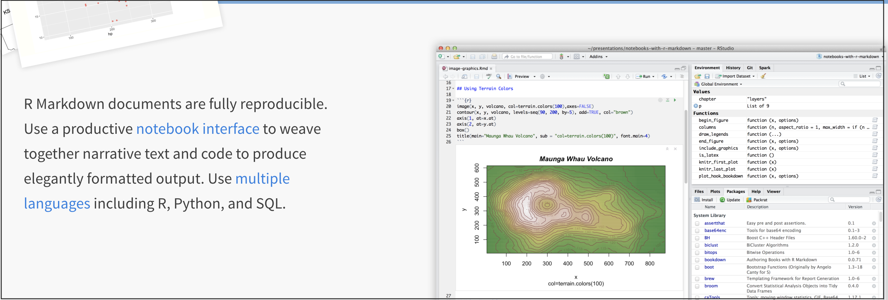

```{r setup, include=FALSE}
# OPTIONS -----------------------------------------------
knitr::opts_chunk$set(echo = TRUE, 
                      warning=FALSE, 
                      message = FALSE)
```

```{r, include=FALSE}

# PACKAGES-----------------------------------------------
# Tutorial packages
library(vembedr)
library(skimr)
library(yarrr)
library(RColorBrewer)
library(GGally) 
library(tidyverse)
library(plotly)
library(readxl)
library(rvest)
library(biscale)
library(tidycensus)
library(cowplot)
library(units)

# FUNCTIONS -----------------------------------------------
# Get R version
GetRLatest <- function(Website="https://cran.r-project.org/banner.shtml"){
   require(rvest)
   
   #scrape the text from the website
   RWebsite <- read_html("https://cran.r-project.org/banner.shtml") %>%
            html_nodes("li") %>%
            html_text()
   
   # get the line that includes latest release and get rid of the stuff after
   RLatest <- base::strsplit(RWebsite[grep("latest release",
                                     tolower(RWebsite))],"\n")[[1]][1]
   return(RLatest)
}

```

<br><br>

# 1. What is R??

#### **R IS A LANGUAGE SPOKEN BY YOUR COMPUTER** 

**R** is a free, open source statistical programming language. It contains millions of words/commands that are useful for dataset cleaning, analysis, and visualization.

By a "programming language", I mean it is a collection of commands that you can type into the computer in order to analyse and visualize data. The easiest way I find to think about R is that it is literally a language, like Spanish, English or Hindi. Or like a set of magic commands in a fantasy novel.

Learning R means learning vocabulary and grammar in order to communicate. It also means it gets easier with experience and practice..

<br>

If you open "R" on your computer (DON'T DO THIS), you will see a simple window with a cursor ready to hear commands. There is no help or support. This is how I learned to programme in R. It's not fun!

```{r, Tut_Fig1, echo=FALSE, fig.cap = "*Basic R*",fig.align='center'}
knitr::include_graphics('./Figures/fig1_RConsole.png')
```

<br><br>

# 2. What is R-Studio/POSIT?

<br>

#### **R-STUDIO/POSIT is a Software Application like Word, Chrome or Spotify** 

<br>

**R-studio** is a *software program/app*, like Microsoft Word, or the Chrome Web-browser. It's has recently been re-branded to Posit because it can also now "speak" other computer languages. For GIS folks, it's a competitor to Google Collab.

It's a program that's designed to make it easy to write R-commands. RStudio has many useful features. For example, you can easily see help files, run code, see your results and create professional graphics. R-Studio also allows us to make interactive documents called R-Markdown files.

<br>

There is a version you can download onto your own computer called R-Studio/Posit Desktop, and a version that runs on a website called 'R-Studio Cloud'.

```{r, Tut_Fig2, echo=FALSE, fig.cap = "*R-studio is much more sophisticated*",fig.align='center'}
knitr::include_graphics('./Figures/fig2_RStudioIntro.png')
```

<br>

Watch this 5 min video on the newest version of R studio. More here: <https://posit.co/blog/announcing-rstudio-1-4/>

```{r,echo=FALSE,fig.align='center'}
embed_url("https://www.youtube.com/watch?v=SdMPh5uphO0")
```

<br><br>

# What is R-Markdown?

<br>

#### Markdown is a way of writing documents with computer code embedded into them. 

#### R-Markdown is a markdown file that uses R code

<br>

```{r, Tut_Fig6, echo=FALSE, fig.align='center'}

```

<br>
