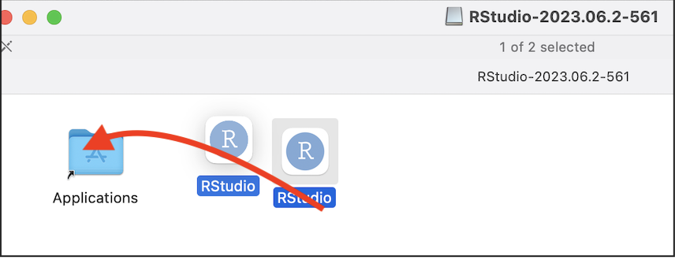

```{r setup, include=FALSE}
# OPTIONS -----------------------------------------------
knitr::opts_chunk$set(echo = TRUE, 
                      warning=FALSE, 
                      message = FALSE)
```

```{r, include=FALSE}

# PACKAGES-----------------------------------------------
# Tutorial packages
library(vembedr)
library(skimr)
library(yarrr)
library(RColorBrewer)
library(GGally) 
library(tidyverse)
library(plotly)
library(readxl)
library(rvest)
library(biscale)
library(tidycensus)
library(cowplot)
library(units)

# FUNCTIONS -----------------------------------------------
# Get R version
GetRLatest <- function(Website="https://cran.r-project.org/banner.shtml"){
   require(rvest)
   
   #scrape the text from the website
   RWebsite <- read_html("https://cran.r-project.org/banner.shtml") %>%
            html_nodes("li") %>%
            html_text()
   
   # get the line that includes latest release and get rid of the stuff after
   RLatest <- base::strsplit(RWebsite[grep("latest release",
                                     tolower(RWebsite))],"\n")[[1]][1]
   return(RLatest)
}

```


# Other internet accounts

## GitHub

We will likely be using github for downloading labs. Please make an account here: <https://github.com/>.

-   This might be something you keep for your career, so choose a professional username. For example, mine is hgreatrex: <https://github.com/hgreatrex>.

-   *As a sidenote, you can easily make a quick website/CV using github! Here's one of many examples and we will do this together later in the semester: <https://github.com/EmilyMarkowitz-NOAA/template_website_cv>)*

<br> 

## DataCamp

I will get you free access to coding support in DataCamp.  For now, please sign up here using your PSU ADDRESS : <https://www.datacamp.com/>

<br>

## Khan Academy

We will also use Khan Academy for code support.  Please make an account here, again using your PSU address. https://www.khanacademy.org/signup 

<br> <br> 

# Getting set up in R & R studio 

There are two ways to do the labs, either on your own computer or on the R studio Cloud website. You can switch between them easily as you need.

-   DESKTOP: Means do this if you are using your own computer or laptop
-   CLOUD: Means do this if you are using the website

PSU computers are so out of date that we will NOT be using the versions of R installed on the PSU computers (instead you will use the website/cloud)


<br> 

## Posit/R-Studio Cloud - EVERYONE DO THIS

This is an website based version of R-Studio. and I believe it's free for the first 25hrs each month. If you need more time, you can make a new account, or pay for one month, or move to your desktop.

-   Advantages:
    -   It's always up to date
    -   You can do your labs anywhere you have access to a webpage <br>
-   Disadvantages:
    -   It's not as powerful, you won't be able to play will millions of data points
    -   You have to be online; bad internet connections make it harder
    -   It's weirdly 'buggy'. Things like you will need to install packages every lab

**EVERYONE SHOULD SIGN UP FOR AN ACCOUNT HERE: <https://posit.cloud/>** Sadly there is no student pricing right now.

<br><br> 

## RStudio Desktop - DO THIS EVEN IF YOU ALREADY HAVE RSTUDIO

If you wish to use your own computer, we need to do two things. First, teach the computer to 'speak R'. Secondly download the RStudio software.

IT IS VERY IMPORTANT THAT EVERYONE IS RUNNING THE MOST UP-TO-DATE VERSION OF R AND RStudio. The easiest way to update is to re install. You will not lose access to old work.

**So follow these instructions: even if you already have R/Rstudio on your computer.**

1.  Go here: <https://posit.co/download/rstudio-desktop/>
2.  First, click the Install R button

```{r, Tut_Fig3, echo=FALSE, fig.cap = "Click here!",fig.align='center'}
knitr::include_graphics('./Figures/fig3_InstallR.png')
```

3.  Click the link and you will go to a terrifying website called CRAN R.

```{r, Tut_Fig4a, echo=FALSE, fig.cap = "*Choose your computer type*",fig.align='center'}
knitr::include_graphics('./Figures/fig4_CranR.png')
```

a)  If you are on a WINDOWS/PC computer, click this link and follow through to install R. Harman is an R Windows user. Now, move to part 4 to install R studio.

```{r, Tut_Fig4b, echo=FALSE, fig.cap = "*Choose your computer type*",fig.align='center'}
knitr::include_graphics('./Figures/fig4a_InstallR MAC.png')
```

b) If you are a Mac user, you will need EITHER one of these two files. (if your computer is new, try the first one, if it's older try the second - the wrong one simply won't work).

   i. Click the filename to download
   ii. Open the download and follow the instructions.
   iii. Now, move to part 4 to install R studio.
   
4. Go back here: <https://posit.co/download/rstudio-desktop/>.  Click the Install R-Studio button
   
```{r, Tut_Fig5, echo=FALSE, fig.cap = "*Will look different for windows*",fig.align='center'}
knitr::include_graphics('./Figures/fig5_InstallRstudio.png')
```   
a) If you are on a windows computer, install the same way you install any new software

b) If you are on a MAC, download the file, click to open, then DRAG it over to applications. If it asks to overwrite, say yes.

```{r, Tut_Fig5b, echo=FALSE, fig.cap = "*Will look different for windows*",fig.align='center'}

```   

