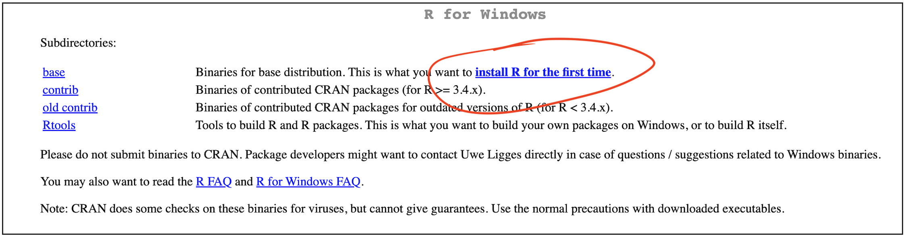

```{r setup, include=FALSE}
# OPTIONS -----------------------------------------------
knitr::opts_chunk$set(echo = TRUE, 
                      warning=FALSE, 
                      message = FALSE)
```

```{r, include=FALSE}

# PACKAGES-----------------------------------------------
# Tutorial packages
library(vembedr)
library(skimr)
library(yarrr)
library(RColorBrewer)
library(GGally) 
library(tidyverse)
library(plotly)
library(readxl)
library(rvest)
library(biscale)
library(tidycensus)
library(cowplot)
library(units)

# FUNCTIONS -----------------------------------------------
# Get R version
GetRLatest <- function(Website="https://cran.r-project.org/banner.shtml"){
   require(rvest)
   
   #scrape the text from the website
   RWebsite <- read_html("https://cran.r-project.org/banner.shtml") %>%
            html_nodes("li") %>%
            html_text()
   
   # get the line that includes latest release and get rid of the stuff after
   RLatest <- base::strsplit(RWebsite[grep("latest release",
                                     tolower(RWebsite))],"\n")[[1]][1]
   return(RLatest)
}

```

# Overview

There are a number of software and internet accounts you will need. This tutorial takes you through them. DO NOT SKIP

<br>

# GitHub

We will likely be using github for downloading labs. Please make an account here: <https://github.com/>.

-   This might be something you keep for your career, so choose a professional username. For example, mine is hgreatrex: <https://github.com/hgreatrex>.

-   *As a sidenote, you can easily make a quick website/CV using github! Here's one of many examples and we will do this together later in the semester: <https://github.com/EmilyMarkowitz-NOAA/template_website_cv>)*

<br><br>

# DataCamp

I will get you free access to coding support in DataCamp. For now, please sign up here using your PSU ADDRESS : <https://www.datacamp.com/>

<br><br>

# Khan Academy

We will also use Khan Academy for code support. Please make an account here, again using your PSU address. <https://www.khanacademy.org/signup>

<br> <br>

# R and R-Studio

There are two ways to do the labs, either on your own computer or on the R studio Cloud website. You can switch between them easily as you need.

-   DESKTOP: Means do this if you are using your own computer or laptop
-   CLOUD: Means do this if you are using the website

PSU computers are so out of date that we will NOT be using the versions of R installed on the PSU computers (instead you will use the website/cloud)

**EVERYONE SHOULD MAKE A CLOUD ACCOUNT (see below)**

<br>

#### ["I already have R and R studio on my laptop"]{.underline}

-   IT IS VERY IMPORTANT THAT EVERYONE IS RUNNING THE MOST UP-TO-DATE VERSION OF R AND RStudio. <br>

-   The easiest way to update is to re install. You will not lose access to old work. Follow these instructions verbatim.

<br><br>

## Posit/R-Studio Cloud Website

This is an website based version of R-Studio. <br><br>

#### [EVERYONE]{.underline} SHOULD SIGN UP FOR AN ACCOUNT HERE:  <https://posit.cloud/>

I believe it's free for the first 25hrs each month then a few dollars a month. Sadly there is no student pricing right now. If you run out of free time, you can make a new account, or pay for one month, or move to your desktop.

-   Advantages:
    -   It's always up to date
    -   You can do your labs anywhere you have access to a webpage <br>
-   Disadvantages:
    -   It's not as powerful, you won't be able to play will millions of data points
    -   You have to be online; bad internet connections make it harder
    -   It's weirdly 'buggy'. Things like you will need to install packages every lab

<br><br>

## RStudio Desktop 

Here need to do two things. <br>

-   First, teach the computer to 'speak R'.

-   Secondly download the RStudio software.<br><br>

**The version number matters.**

**Follow these instructions exactly, even if you already have R/Rstudio on your computer.**<br><br>

### 1. Installing R.

First, we teach the computer to 'speak R'.

Go here: <https://posit.co/download/rstudio-desktop/>. Click the Install R button <br>

```{r, Tut_Fig3, echo=FALSE, fig.cap = "Click here!",fig.align='center'}
knitr::include_graphics('./Figures/fig3_InstallR.png')
```

<br><br>

Click the link and you will go to a terrifying website called CRAN R.

```{r, Tut_Fig4, echo=FALSE, fig.cap = "*Choose your computer type*",fig.align='center'}
knitr::include_graphics('./Figures/fig4_CranR.png')
```

<br><br>

#### If you are on a WINDOWS/PC computer

```{r, Tut_Fig4a, echo=FALSE, fig.cap = "*Choose your computer type*",fig.align='center'}

```

Click the "install for the first time" link and follow through to install R - EVEN IF YOU ALREADY HAVE R AND R STUDIO INSTALLED. <br><br>

Say yes to all the default options. Harman is an R Windows user if you need help. <br> **Now, move to part 4 to install R studio.**

<br> <br>

#### If you are on a MAC/AppleMac

If you are a MAC user, you will need [EITHER]{.underline} one of these two files. If your computer is new, try the top one, if it's older try the second - the wrong one simply won't work.

```{r, Tut_Fig4b, echo=FALSE, fig.cap = "*Choose your computer type*",fig.align='center'}
knitr::include_graphics('./Figures/fig4b_InstallR MAC.png')
```

1.  Click the filename to download <br><br>
2.  MOVE THE DOWNLOAD OUTSIDE YOUR DOWNLOAD FOLDER (they have a weird bug.) Put it on your desktop <br><br>
3.  Open the download and follow the instructions. <br><br>
4.  **Now, move to part 4 to install R studio.**

<br> <br>

### 2. Installing R studio

Go back here: <https://posit.co/download/rstudio-desktop/>. Click the Install R-Studio button

```{r, Tut_Fig5, echo=FALSE, fig.align='center'}
knitr::include_graphics('./Figures/fig5_InstallRstudio.png')
```

<br> <br>

**If you are on a WINDOWS computer**, install the same way you install any new software

<br> <br>

If you are on a MAC:

-   Download the dmg file, click to open, then DRAG it over to applications.

-   If it asks to overwrite, say yes.

-   It might get angry at this stage if your mac is very out of date.

```{r, Tut_Fig5b, echo=FALSE, fig.cap = "*Will look different for windows*",fig.align='center'}
knitr::include_graphics('./Figures/fig5b_RstudioMacinstall.png')
```

### Congrats!  You have all the software needed
