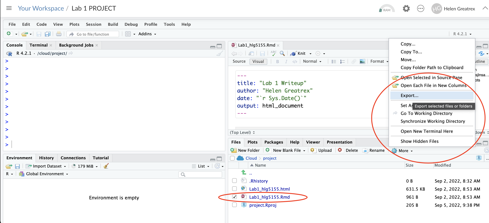
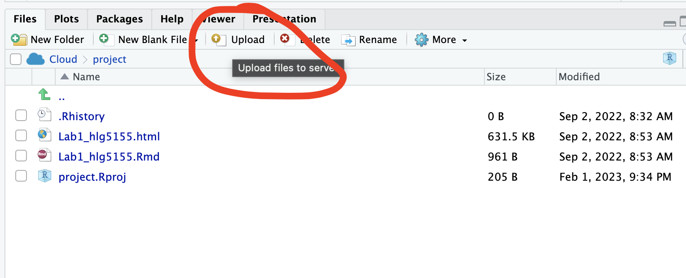
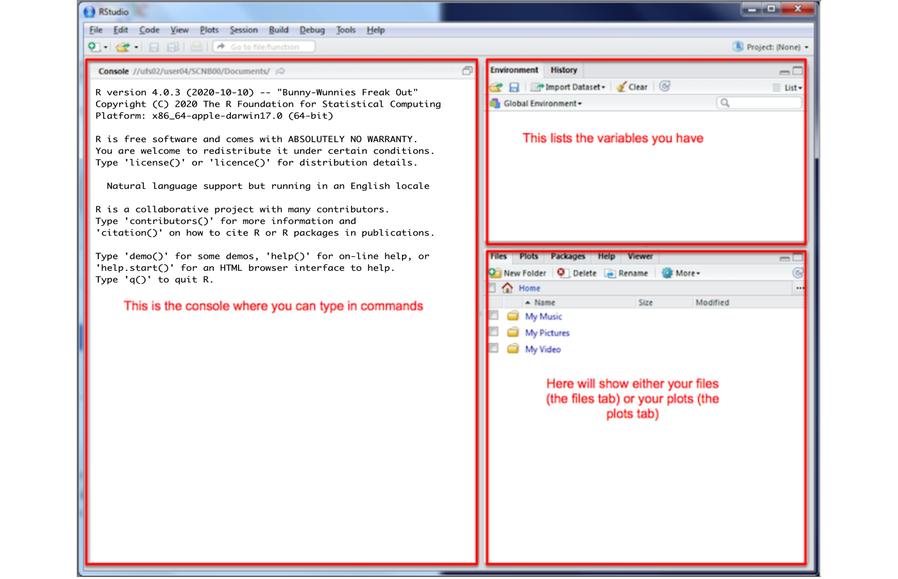
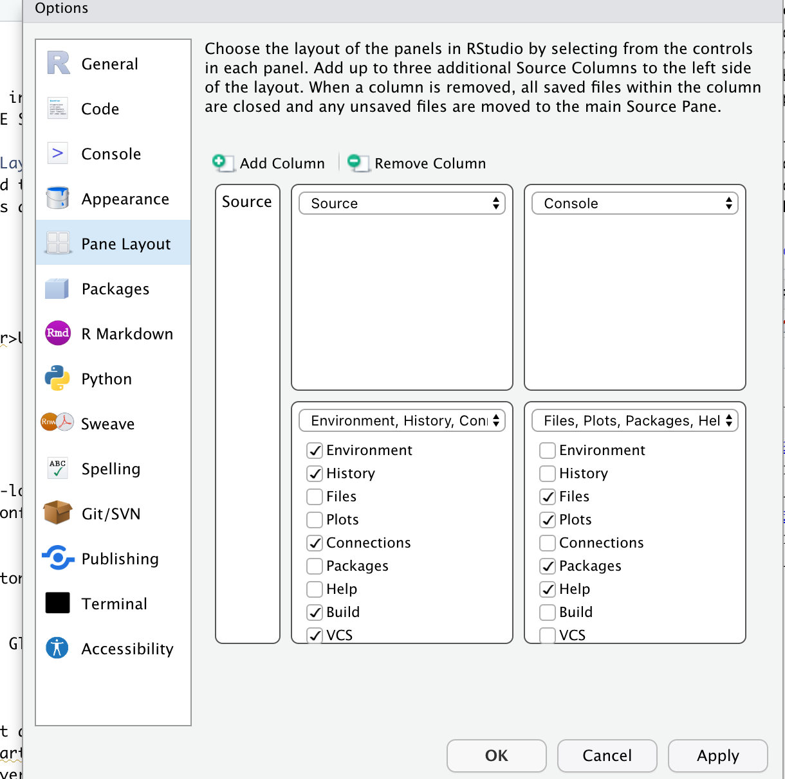

```{r setup, include=FALSE}
# OPTIONS -----------------------------------------------
knitr::opts_chunk$set(echo = TRUE, 
                      warning=FALSE, 
                      message = FALSE)
```

```{r, include=FALSE}

# PACKAGES-----------------------------------------------
# Tutorial packages
library(vembedr)
library(skimr)
library(yarrr)
library(RColorBrewer)
library(GGally) 
library(tidyverse)
library(plotly)
library(readxl)
library(rvest)
library(biscale)
library(tidycensus)
library(cowplot)
library(units)


```

In this tutorial we are going to cover setting up each lab. This involves making projects, packages and R Markdown documents.

# Projects

In this class, we will be using R-Projects:

-   On Rstudio cloud, this is how you set up each lab.
-   On the desktop, this is a folder that will store everything to do with each lab in one place on your computer. Each lab will be its own project.

This is incredibly useful - it means that if you switch from R-Cloud, to the lab computers, to your laptop, all you have to do is to move the folder and everything will just work. Equally, its easy to compare labs.

Learn more here.

[](https://www.linkedin.com/learning/learning-the-r-tidyverse/why-should-you-use-projects-in-rstudio?u=76811570)

We will cover how to make projects for R studio cloud and desktop in the set up below.

# Lab Set-Up: Projects

## Using desktop

Everything should now be installed. If not, go back to Tutorial 2.

```{r,Tut_Fig10, echo=FALSE, out.width="80%",fig.align='center'}
knitr::include_graphics('./Figures/fig10_Startup_Logos.png')
```

1.  IMPORTANT! If you haven't already, on an easy to access place on your computer, make a folder called GEOG364. This is where ALL your labs are going to live. <br>

2.  Now everything is installed, open R-studio (NOT R!). <br>

Steps 3-7 are shown graphically in the figure below.

3.  Go to the Main File menu at the [very top left]{.underline} and click `New Project` <br>\
4.  Select `New Directory`, then `New Project`<br>\
5.  Name your project *GEOG364-Lab1-PROJECT* (or whatever lab it us) <br>\
6.  Under "create project as a subdirectory of", hit the browse button and find your GEOG364 folder (you just need to be in the folder, you don't need to have selected anything). Press open <br>\
7.  Finally, press `Create Project`<br>

```{r, Tut_Fig11, echo=FALSE}
knitr::include_graphics('./Figures/fig11_projectcreation.png')
```

#### How to check you are in a project {.unnumbered}

R will change slightly. If you look at the top of the screen in the title bar, it should say something like *GEOG364-Lab1-PROJECT - R Studio*.

The Files tab should have gone to your project folder. Essentially, R-Studio is now "looking" inside your Lab 1 folder, making it easier to find your data and output your results.

```{r, Tut_Fig12, echo=FALSE, fig.cap="How to check you are in a project"}
knitr::include_graphics('./Figures/fig12_projectcheck.png')
```

<br>

If you want one, final check, try typing this into the console (INCLUDING THE EMPTY PARANTHESES/BRACKETS), press enter and see if it prints out the location of Lab 1 on your computer. If not, talk to an instructor.

```{r, eval=FALSE}
getwd()
```

<br><br>

#### Returning to your lab project

OK, let's imagine that you get halfway through your lab and your computer dies. How do you get back to your Lab work? Try this now. Close down R-Studio.

To reopen a lab:

1.  **DO NOT RE-OPEN R-STUDIO!**

2.  Instead navigate on your computer to your *GEOG364/GEOG364-Lab1-PROJECT* folder.

3.  Double click on the *GEOG364-Lab1-PROJECT*.RProj file.

This will reopen R for that specific lab, so you can continue where you left off. It means you can also open several versions of R studio for multiple labs, which can be very useful in staying sane

```{r, Tut_Fig13, echo=FALSE}
knitr::include_graphics('./Figures/fig13_projectopen.png')
```

<br><br>

## Using R-Studio Cloud

Go to this webpage. <https://login.posit.cloud/login> You can get here from any web-browser, You do not need a special computer.

When you log in, you should see a dashboard like this.

```{r, Tut_Fig14, echo=FALSE, fig.cap = "*The Cloud dashboard*",fig.align='center'}
knitr::include_graphics('./Figures/fig14_clouddash.png')
```

YOU SHOULD MAKE A NEW PROJECT FOR EACH LAB.

You make a new project by clicking the button on the top right. You can open different projects in different tabs on your browser. You can also go back to the work-space at any time.

### Returning to your lab project

On the cloud this is very easy, just go back to <https://posit.cloud/content/yours>

### Downloading files or switching to desktop

Let's say you want to switch to the desktop but save your progress. Or you want to submit your work to Canvas!

To switch to desktop, download/install the desktop version using the tutorials here. Then make a new project using the instructions above.

Either way:

1.  On the R-Studio Cloud website; inside your project, go to the files tab (next to Projects/Help in one quadrant. You will see a list of files, one with the file type .Rmd (your code) and one with .html(the website you made when you pressed knit). Look at the red circle in the pic below

2.  Click the check-box to the left of the .RmD file

3.  Look just above at the Files quadrant settings menu. Click the blue "more" cogwheel icon. (see diagram). You might need to make R-Studio full screen to see it, it cuts off if the window is too small.

4.  Now click Export This will download the file

5.  REPEAT FOR THE HTML (you can do them together but it exports as a zip)

6.  Submit both files on Canvas or put them in your project file.

```{r, Tut_Fig15, echo=FALSE, fig.cap = "*Downloading the files*",fig.align='center'}

```

### Uploading files {.unnumbered}

Sometimes you want to put your code into R-Studio Cloud, for example if for one week you don't want to bring your laptop.

Make a project for the lab on the cloud as above, then click the `upload` button inside your project in the files tab and upload your files. You will only need the .RmD file and any data files.

```{r, Tut_Fig16, echo=FALSE, fig.cap = "This is zoomed in to your files quadrant",fig.align='center'}

```

# What is the R screen showing me?

Want to understand more about what the screens do, or change the appearance?

## The screen

You will be greeted by three panels:

-   The interactive R console (entire left)
-   Environment/History (tabbed in upper right)
-   Files/Plots/Packages/Help/Viewer (tabbed in lower right)

```{r, Tut_Fig17, echo=FALSE, fig.align='center'}

```

If you wish to learn more about what these windows do, have a look at this resource, from the Pirates Guide to R: <https://bookdown.org/ndphillips/YaRrr/the-four-rstudio-windows.html>.

If you have used R before, you might see that there are variables and plots etc already loaded. It is always good to clear these before you start a new analysis. To do this, click the little broom symbol in your environment tab


# Lab Set-Up: Global options

## Accessing global settings

Some of the default R settings are worth changing to make life smoother. We do this in global settings. There are two places you might find this menu

1.  Click on the tools menu button on the top right of the screen,-\> Global Options OR
2.  Click on the R-studio menu button on the top left of the screen, then click Preferences.

## Changing annoying options

I suggest:

-   UNCLICK "Restore most recently opened project at startup"

-   UNCLICK "Restore .RData into workspace on startup"

-   Set "Save workspace to .RData on" exit to Never

-   UNCLICK "Restore previously open source documents on startup"

## Changing the appearance

You can also click the appearances menu item to change how the screen looks. For example, maybe you concentrate better with a dark background.

## Moving the windows around

Like me, you might find you like the different quadrants in a different order. To change this, look at the Panes layout menu item (you can also get here via the `View` menu,then `/Panes/Pane Layout`)

I tend to like the console to be top left and scripts to be top right, with the plots and environment on the bottom - but this is personal choice.

```{r, Tut_Fig18, echo=FALSE, fig.cap = "My preferred set up",fig.align='center'}

```


First watch this 5 min video below for some pointers. We will also go through the video more slowly below:

```{r,echo=FALSE,fig.align='center'}
embed_url("https://youtu.be/SWxoJqTqo08?t=41")
```

<br>
