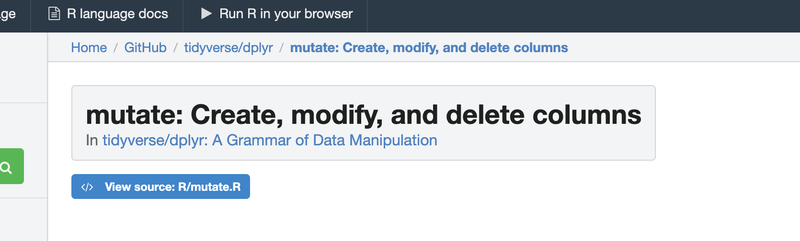
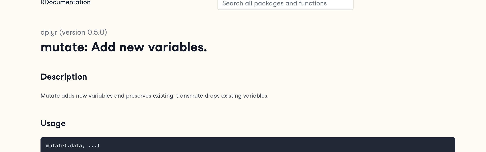
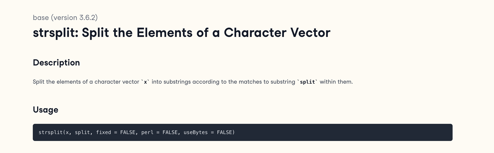

```{r setup, include=FALSE}
# OPTIONS -----------------------------------------------
knitr::opts_chunk$set(echo = TRUE, 
                      warning=FALSE, 
                      message = FALSE)
```

```{r, include=FALSE}

# PACKAGES-----------------------------------------------
# Tutorial packages
library(vembedr)
library(skimr)
library(yarrr)
library(RColorBrewer)
library(GGally) 
library(tidyverse)
library(plotly)
library(readxl)
library(rvest)
library(biscale)
library(tidycensus)
library(cowplot)
library(units)


```


# Getting started

First watch this 5 min video above for some pointers. We will also go through the video more slowly below:

```{r,echo=FALSE,fig.align='center'}
embed_url("https://youtu.be/SWxoJqTqo08?t=41")
```

<br>

# The Console

The console window is essentially a phone call with your computer, where you "speak" in R.

-   The computer has a little `>` symbol to say it is listening/waiting for your command
-   You type in a command
-   The computer tries to carry it out and will print the answer directly onto the screen

Let's start by the simplest command possible. Type this command into your R console and press enter to run.

```{r, eval=FALSE}
1+1
```

When you press enter, it should give you the answer.... 2

```{r}
1+1
```

<br>

Type this command into your R console and press enter to run.

```{r, eval=FALSE}
# Take the sine function of the number 2, like sin(2) on your calculator
sin(2)
```

Here we have a **command** `sin()` applied to the number 2. We also have a **comment** in green, which the computer ignores.

<br>

## Spacing and Capital Letters

-   Spacing *mostly* does not matter: `1+1` will generate the same answer as `1      +       1`.

    -   Exception: you cannot have a space between a command name and its ( ) e.g `sin (2)` will fail\`

-   Capital letters DO matter. R is case sensitive.

-   To see previous commands, you can click the history tab (Environment quadrant) or press the up/down arrows on your keyboard, but when you close R, all record of these commands will be lost.

<br>

<br> \

## R as a calculator {#Tut3B_Calc}

When using R as a calculator, the order of operations is the same as you would have learned back in school, so use brackets to force a different order. For example, in either the console or a script, try running these two commands

```{r, eval=FALSE}
3 + 5 * 2
```

and

```{r, eval=FALSE}
(3 + 5) * 2
```

<br>

We can also take shortcuts with our numbers. For example `1:5` means take all the numbers `1 2 3 4 5` (e.g. increment the integers one - to - five). Try typing this command and make sure you understand the result.

```{r}
(1 + 2) * 5:3
```

<br>

We can use this trick to make our first plot! Try entering this command and see what happens. It should plot these numbers against each other

```{r, echo=FALSE}
print(data.frame(x=1:5,y=6:10))
```

```{r, eval=FALSE,fig.show=FALSE}
plot(x= 1:5, y= 6:10,xlab="x-axis",ylab="y-axis")
```

<br> <br>

## Asking questions/comparisons

We can also do comparisons in R - using the special symbols TRUE or FALSE (no quote marks, they are special).

Here we are asking R whether 1 is equal to 1.

```{r}
# note two equals signs is read as "is equal to"
1 == 1  
```

We could also have used

-   `!=` "Not equal to"
-   `<` "Less than"
-   `<=` "Less than or equal to\`
-   `>` "Greater than"
-   `>=` "Greater than or equal to"

Now ask the computer if the number 12 is less than or equal to the number 10.

<br> <br>

## The + symbol in the console {#Tut3C_plus}

If you type in an incomplete command, R will understand and wait for you to complete it. For example, if you type `1 +` and press enter, R will know that you are not finished typing. So it will move onto the next line but the `>` will have changed into a `+`, which means its waiting for you to complete your command.

**If you want to cancel a command you can simply hit the "Esc" key or press the little stop symbol and R studio will reset.**

Pressing escape isn't only useful for killing incomplete commands: you can also use it to tell R to stop running code (for example if it's taking much longer than you expect), or to get rid of the code you're currently writing.

<br> <br>

## Functions/Commands {#Tut3D_functions}

Watch this short video to learn three important facts about functions:

```{r,echo=FALSE,fig.align='center'}
embed_url("http://vimeo.com/220490105 ")

```

The power of R lies in its many thousands of these built in commands, or *functions*. In fact, we have already come across one - the plot command. A function, or command is simply an action you can take - like pressing the square root button on a calculator.

**A command is *always* followed by parentheses ( ), inside which you put your "arguments"** (e.g. the thing you want to take the square root of)

Try typing these EXACTLY into the console.

-   `nchar("hello")`
    -   This will count the number of letters in the word "hello" (e.g.
        5)  
-   `file.choose()`
    -   This will open up an interactive window (sometimes behind the studio screen), choose any file and it will print the location in the console. NOTE WE STILL NEED THE PARENTHESES, but there are no arguments so they are empty.

To understand what I mean about parentheses, try typing each of these commands exactly and see what happens.

```{r, eval=FALSE}
# Typing this into the console will print out the underlying code
file.choose 

# Typing it WITH parentheses will run the command. Note for this command, the parentheses are empty!  
file.choose()

# Typing a ? in front will open the help file for that command in the help quadrant
?file.choose
```

Sometimes we need to give the command some additional information as an argument. Anything we wish to tell the command should be included inside the inside the parentheses (separated by commas). The command literally only knows about the stuff inside the parentheses.

```{r, eval=FALSE}
sin(1) # trigonometry functions.  Apply the sine function to the number 1. 

log(10) # natural logarithm.  Take the natural logarithm of the number 10. 

nchar("hello") # Count the letters in the word hello
```

We can also add optional extra arguments. For example let's improve our plot. This following command will plot the number 1 to 10 against the numbers 12 to 20, along with some axis labels. When you run this, the plot will show up in the plots tab.

```{r}
# plot the numbers 1 to 10 against the numbers 11 to 20
plot(1:10,11:20,col="dark blue", xlab="x values",ylab="GEOG-364 is the best") 
```

If you are feeling lost, <https://swcarpentry.github.io/r-novice-gapminder/01-rstudio-intro/> is a good website which goes over a lot of this in more detail.

<br> <br>

## Dealing with text {#Tut3E_text}

In R, the computer interprets most words as commands. But sometimes we need to actually input text, for example for a plot title. **For the computer to understand text, you need quote marks**. The computer will see anything without quote marks as a command.

For example, try typing `print("Hello World")` into the console and the computer should just repeat it back to you.Forget about the quotes and this happens..

```{r, fig26, echo=FALSE, fig.cap = "Your screen after running the project"}
knitr::include_graphics('./Figures/fig26_UnexpectedSymbol.png')
```

Your first error. The "unexpected symbol" it's talking about is the computer thinking that "Hello" and "world" must be two different commands, then getting confused by the space between Hello and World..

<br> <br>

## Variables {#Tut3F_vars}

So now we can use R as a calculator and even add a few more complex commands. What we need to be able to do now is to save the results, or load in data so we can run more complex commands. We do this through assigning our results to a variable. By this I mean we save the results and give them a name, then in the future, instead of retyping the whole command, we simply type that name and R will recall the answer.

The symbol to store data into a variable is using the assignment arrow `<-`, which is made up of the left arrow and a dash. You can also use the equals sign, but it can cause complications later on. Try typing this command into the console:

```{r, eval=FALSE}
x <- 1/50
```

Notice that pressing enter did not print a value onto your screen as it did earlier. Instead, look down at the environment tab, you should notice that an x has turned up, with the result next to it.

So our variable `x` is now associated with the value 0.02, or 1/50. You can print a variable on screen by typing its name, no quotes, or by using the print command. Try printing out your variable.

```{r, eval=FALSE}
x

# or

print(x)

# see what happens when you do this

print("x")

```

This 'x' variable can be used in place of a number in any calculation that expects a number. Try typing

```{r, eval=FALSE}
log(x)

# this is now the same as 
log(1/50)
```

The way R works is that first it looks for the commands on the right of the arrow. It runs all of them, calculates the result, then saves that result with the name on the left of the arrow. **It does not save the command itself, just the answer.** For example, in this case, R has no idea that `x` was created using maths, it just knows that it is equal to the number 0.02.

Notice also that variables can be reassigned. Type this into your console.

```{r, eval=FALSE}
x <- 100
print(x)
```

x used to contain the value 0.025 and and now it has the value 100.

*Note, the letter x isn't special in any way, it's just a variable name. You can replace it with any word you like as long as it contains no spaces and doesn't begin with a number*.

for example

```{r, eval=FALSE}
vlogbrothers.DFTBA <- "Dont forget to be awesome"
print(vlogbrothers.DFTBA)
```

How you name stuff is up to you, , but be consistent. Different people use different conventions for long variable names, these include

 - periods.between.words.1 (as you can see, I like this)
 - underscores_between_words
 - camelCaseToSeparateWords

Finally, R IS CASE SENSITIVE. X and x are different variables! Try these and you will see both appear separately in your environment tab.

```{r, eval=FALSE}
h <- 1
H <- 2

ans <- h+H
print(ans)
```

```{r, eval=FALSE}
print(h)
```

```{r, eval=FALSE}
print(H)
```

To delete a variable, you can use the `rm()` command e.g.

```{r, eval=FALSE}
rm(x)
```

and to clear everything, type

```{r, eval=FALSE}
rm(list=ls())
```

### Combining variables

As I showed above, you can now use multiple variables together in more complex commands. For example, try these commands:

```{r, eval=FALSE}
x <- 2

#Take the variable x, add 1 then save it to a new variable called y
y <- x + 1 

# print the multiple of 2yx onto the screen
print(2*y*x)
```

Now you can see that there are two variables in your environment tab, x and y. Where y is the sum of the contents of x plus 1.

You can even use this to change your original variable . Try typing the code below in a few times into the console and see what happens.

**A short cut to do this is to type the commands the first time, then use the up-arrow on your keyboard to cycle back through previous commands you have typed**

```{r, eval=FALSE}
x <- x + 1 # notice how RStudio updates its description of x in the environment tab
x          # print the contents of "x" onto the screen
```

Our variables don't have to be numbers. They could refer to tables of data, or a spatial map, or any other complex thing. We will cover this more in future labs.

<br> <br>

<br> \


# Getting help 

First, take a look here to learn about help - <https://www.r-project.org/help.html>

When programming in R, someone often tells you about a "cool new command". I want you to feel comfortable working out how to use them. Equally, sometimes R crashes because it can't find a command. So this helps you find what you need to install.

## How to use the R help files 

Here's how I approach it

1.  The only info we NEED to know about a new command is its name and the library/package/app it is stored in. <br>\

-   If you don't know, you can often google the command, and go to one of the websites with an online helpfile

-   Different websites have different ways of writing the things. For example, here are four common files you might see when looking at the mutate command which is a part of the dplyr package.

```{r, fig27A, echo=FALSE, fig.cap = "COMMAND=mutate, PACKAGE=dplyr",fig.align='center',out.width="100%"}

```

```{r, fig27B, echo=FALSE, fig.cap = "COMMAND=mutate, PACKAGE=dplyr",fig.align='center',out.width="100%"}

```

```{r, fig27C, echo=FALSE, fig.cap = "COMMAND=mutate, PACKAGE=dplyr",fig.align='center',out.width="100%"}

```


<br>

2.  If you need to install the package, go to the Packages menu in the quadrant and click install.

<br>

3.  Add the `library(PACKAGENAME)` command to your library code chunk and run to load the package.

<br>

4.  Immediately go to the help file for the command you want to run. You can do this in the help menu next to the packages menu, or using a ? in the CONSOLE e.g. `?skim`. This will not work if you have not loaded the library.

<br>

5.  Inside every help file you will see this structure (SKIM THIS EXTERNAL: TUTORIAL)\[<https://bcgov.github.io/ds-cop-intro-to-r/seeking-help-in-r.html>\].

<br>

6.  FINALLY, **Scroll to the bottom of the helpfile** for some worked examples that you can literally copy and paste into your console or your code to understand how it works.

<p class="comment">

HINT FOR LAB 2, SCROLL ALL THE WAY TO THE VERY BOTTOM OF THE HELP FILE

</p>

## EXAMPLE! Understanding `skim` {.unnumbered}

**I was told last year about a new summary command, skim. Here's how it ended up in your lab instructions**

1.  I googled 'skim r command'. This took me quickly to the R documentation page

```{r, Tut_Fig13, echo=FALSE, fig.cap = "Look for Rdocumentation, search-R-Project, or Rdrr",fig.align='center'}
knitr::include_graphics('./Figures/fig28_HelpFile_skimrgoogle.png')
```

2.  I ended up at this website: <https://search.r-project.org/CRAN/refmans/skimr/html/skim.html>. From this I saw that the `skim()` command is in the `skimr` package\*

```{r, fig28, echo=FALSE, fig.cap = "*The skim command is in the skimr package (red circle)*",fig.align='center'}
knitr::include_graphics('./Figures/fig29_HelpFile_skimr.png')
```

3.  I added the `skimr` package to my library code chunk and re-ran

```{r, eval=FALSE}
# LIBRARIES
library(tidyverse)
library(dplyr)
library(ggpubr)
library(ggplot2)
library(plotly)

library(skimr) 
```

4.  In the console, I FIRST typed `> ?skimr` to read about the package itself (e.g. ?PACKAGENAME). This doesn't work if you didn't run the library code chunk first.

<br>

5.  In the console, I THEN typed `> ?skim` to bring up the help file and scrolled to the bottom. This doesn't work if you didn't run the library code chunk first. Inside every R help file you will see this structure: <https://bcgov.github.io/ds-cop-intro-to-r/seeking-help-in-r.html> but for now, I scrolled to the bottom.

    <br>

6.  I then ran the help file worked examples in the console to understand the command. It looks like skim is a nice summary command I can apply to a table (in their case the iris table). And that's how it ended up here..

```{r}
 skim(iris)
 
 # Use tidyselect
 skim(iris, Species)
 skim(iris, starts_with("Sepal"))
 skim(iris, where(is.numeric))
```

<br>

7.  Finally, I googled tutorials to see if there was a friendlier way of looking: <https://docs.ropensci.org/skimr/reference/skim.html>

<br> <br>
