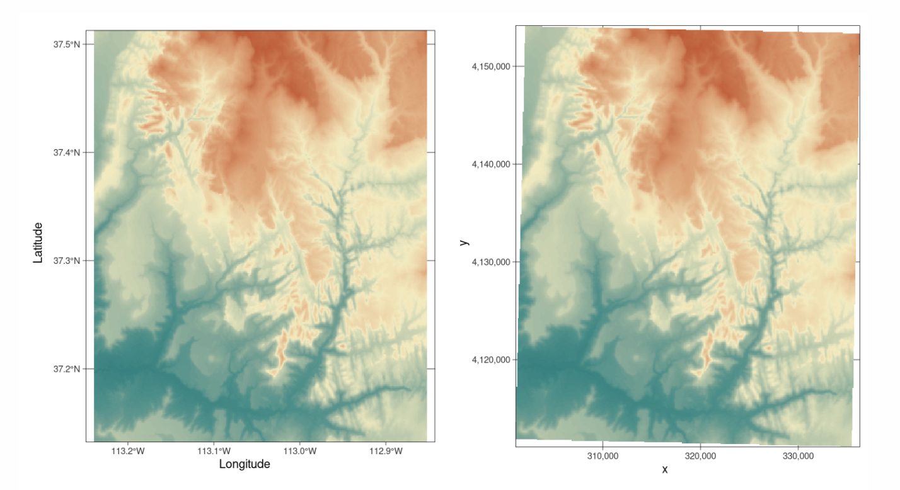
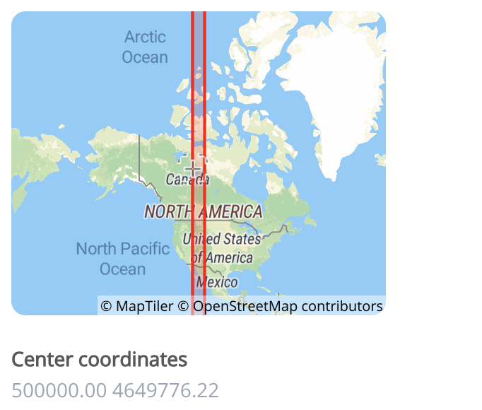
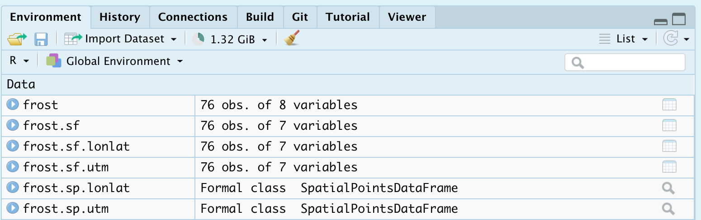

<style>
p.comment {
background-color: #DBDBDB;
padding: 10px;
border: 1px solid black;
margin-left: 0px;
border-radius: 5px;
font-style: normal;
}

h1.title {
  font-weight: bold;
  font-family: Arial;  
}

h2.title {
  font-family: Arial;  
}

</style>


<style type="text/css">
 TOC {
  font-size: 12px;
  font-family: Arial;
}
</style>

\
```{r setup, include=FALSE,echo=FALSE}
knitr::opts_chunk$set(echo = TRUE, warning=FALSE, message = FALSE,dpi = 300, dev = "svg")

# invisible data read
library(tidyverse)
library(sp)
library(sf)
library(readxl)
library(skimr)
library(tmap)
library(viridis)
library(usmap)
library(rnaturalearth)
library(ggpubr)
library(gridExtra)
library(ceramic)
library(leaflet)
library(leaflet.extras)
library(leaflet.providers)
library(raster)
library(ggmap)
library(dismo)
library(maps)


frost    <- readxl::read_excel("./Data/DataG364_frostday.xlsx")
frost.sf <- st_as_sf(frost,coords = c("Longitude", "Latitude"),crs=4326)
frost.sf.albers <- suppressWarnings(st_transform(frost.sf,crs=usmap_crs()))
frost.sf.albers$Avg_DOY_SpringFrostDate <- as.Date(paste("2000",frost.sf.albers$Avg_DOY_SpringFrost),format="%Y %j")

as.Date_origin <- function(x){
  format.Date(as.Date(x, origin = '1970-01-01'), format = '%b-%d')
}

Sys.setenv(MAPBOX_API_KEY="pk.eyJ1IjoiaGdyZWF0cmV4IiwiYSI6ImNrbmdpNDN6djBkZTQydXBhNDc1enJjZnkifQ.xQWYvOFK5BKQoNWoOacDgA")


```

## Tutorial 9: Spatial 101

JUST WANT A WORKED EXAMPLE?  SCROLL TO THE END

This tutorial is all about creating and manipulating spatial data

 - [**Tutorial 9A: Spatial basics**](#Tut9a_basics)
  <br>
      a. [Why treat spatial differently](#Tut9aa_whatisit)
       <br>
      b. [Map projections](#Tut9ab_proj)
      
   <br>
   
 - [**Tutorial 9B: Vector Data**](#Tut9b_vector)
  <br>
      a. [Marked data](#Tut9ba_mark)
       <br>
      c. [Converting existing data to "spatial"](#Tut9bb_convert)
       <br>
       
       
      d. [Reading in spatial vector data from file](#Tut9bc_read)
       <br>
      e. [Manipulating vector data](#Tut9bd_manip)
       <br>
      f. [Plotting vector data](#Tut9be_plot)
      
   <br>
   
 - [**Tutorial 9C: Raster data**](#Tut9c_raster)
      a. [To come!](#Tut9ca_basic)


<br>

<div style="margin-bottom:25px;">
</div>  
## Tutorial 9A: Spatial basics {#Tut9a_basics}
 
<br>

### Why treat spatial differently {#Tut9aa_whatisit}

Geographical data needs special treatment. As well as standard data analysis, we need to tell R that our data has a spatial location on the Earth's surface.  R needs to understand what units our spatial location is in (e.g. metres, degrees..) and how we want the data to appear on plots and maps.  R also needs to understand the different types of vector data (e.g. what we mean by a "polygon" or "point"). 

To achieve this there are some specialist "spatial" types of data we need to use and several spatial data packages.

We're going to split this tutorial by vector and raster (field) data


<br>

### Map Projections {#Tut9ab_proj}

See here for a great overview: https://source.opennews.org/articles/choosing-right-map-projection/

At its simplest, think of our map projections as the "units" of the x-y-z coordinates of geographic data. For example, here is the same map, but in two different projections.  

 - On the left, the figure is in latitiude/longitude in units of degrees.  


 - On the right the same map is in UTM.  In the UTM system, the Earth is divided into 60 zones. Northing values are given by the metres north, or south (in the southern hemisphere) of the equator. Easting values are established as the number of metres from the central meridian of a zone. 

```{r, Tut9Fig1, echo=FALSE, fig.align='center',out.width="80%",fig.cap="*Examples of geographic coordinate systems for raster data (WGS 84; left, in Lon/Lat degrees) and projected (NAD83 / UTM zone 12N; right, in metres), figure from https://geocompr.robinlovelace.net/spatial-class.html*"}

```

You can see the UTM zone here 
 
```{r, Tut9Fig2, echo=FALSE, fig.align='center',out.width="45%",fig.cap="Zone 12N: https://epsg.io/32612"}

```  

Each map projection has a unique numeric code called an EPSG code.  To find them, I tend to use these resources, but in this course I will try to provide the codes

- google & reading the dataset documentation
- https://epsg.io
- https://mangomap.com/robertyoung/maps/69585/what-utm-zone-am-i-in-

<p class="comment">**R is stupid.  It has no idea what units or projection your coordinates are in** </p>

**We need to tell R what units/projection/EPSG code your data is orginally in**

**THEN we need to convert it to the units/projection/EPSG we need for analysis**

We will go into how to do this in each tutorial.


<br>

<div style="margin-bottom:25px;">
</div>   
## Tutorial 9B: Vector Data {#Tut9b_vector}
 
As you know, vector data are "objects" you can "pick up and move around" on a map.  So points, lines, polygons, volumes etc.  

There are several families of commands available to manipulate vector spatial data.

 - **sp** : The original spatial package.
    + Find a detailed tutorial here: https://rspatial.org/raster/spatial/3-vectordata.html
    <br>
 - **terra** : Another new spatial package that we shall ignore.
     + Detailed tutorial here: https://rspatial.org/terra/spatial/3-vectordata.html
    <br>
 - **sf** : A newer spatial package that fits into the tidyverse family.
    + Detailed tutorial here: https://r-spatial.github.io/sf/articles/sf1.html
    <br>
 - **spatstat**: A specific package for point pattern analysis    

Spatial data packages are like competing mafia families.  Some commands will only work with one spatial data type, so normally I will store my spatial data as each type.  e.g. I will name my variables:

 - mydata    :  My raw data (R doesn't understand this is spatial)
 - mydata.sp :  The sp version of my data
 - mydata.sf :  The sf version of my data

<br>

### a. Marked data {#Tut9ba_mark}

It is very important to understand whether your spatial data is "marked".

**Un-marked** vector data means that we just know about the *location* of the spatial objects (points, polygons..).  For example, the location of crimes, the location of city boundaries etc.  We can assess if these objects are clustered together, spread out etc..

```{r,echo=FALSE}

mapborder <- plot_usmap(include = .south_region, 
                     exclude = c("TX","TN","LA","OK","MD","MS","AR","KY","DC","DE"), 
                     labels = FALSE)


mymap <- suppressMessages(mapborder +
  labs(title = "UNMARKED: Frost-day station locations") +
  theme(panel.background = element_rect(color = "blue"))+
  geom_sf(data=st_geometry(frost.sf.albers)))
suppressMessages(mymap)

```


**Marked** vector data has some attribute e.g. we know some *information* about each point/polygon. For example, with our weather station data, we know marks such as the Elevation at each location, the distance to the ocean and the average last frost date:

```{r,echo=FALSE}

p1 <- suppressMessages(mapborder +
  labs(title = "MARK: Station Elevation") +
  geom_sf(data=frost.sf.albers,aes(color = Elevation))+
  scale_color_viridis_c("metres",option = "A")+
  theme(legend.position='right'))  

p2 <- suppressMessages(mapborder +
  labs(title = "MARK: Distance to Ocean") +
  geom_sf(data=frost.sf.albers,aes(color = Dist_to_Coast))+
  scale_color_viridis_c("miles",option = "mako")+
  theme(legend.position='right'))    

p3 <- suppressMessages(mapborder +
  labs(title = "MARK:US State") +
  geom_sf(data=frost.sf.albers,aes(color = State))+
  scale_colour_brewer(palette = "Set1")+
# + scale_color_viridis("",option = "turbo",discrete=TRUE)+
  theme(legend.position='right'))  

p4 <- suppressMessages(mapborder +
  labs(title = "MARK:Mean final frost date",subtitle = '(1954-2000)') +
  geom_sf(data=frost.sf.albers,aes(color = Avg_DOY_SpringFrost))+
  scale_color_viridis_c("Date",option = "D",labels=as.Date_origin,direction=-1)+ 
  theme(legend.position='right'))  

grid.arrange(p1,p2,p3,p4, nrow = 2)

```


<br>

<div style="margin-bottom:25px;">
</div>   
### b. Converting a data.frame in R to spatial sf{#Tut9bb_convert}

This is only one route, but it's the one I use


#### **Step 1: Check what columns your x and y coordinates are stored in.**

Look at your data! View your data table and note what the column names your x and y data is stored in. Note, these don't have to be fancy spatial names, they can be "elephanT" and "popcorn".  

```{r}
head(frost)
```

Here, we can see that the data coordinates are in columns called "Longitude" and "Latitude".

<br> 

#### **Step 2: Check what map projections your x and y coordinates are stored in.**

Look at the data inside your x and y columns.  Is it longitude/latitude in degrees?  A large number (likely metres in UTM), something else?  Look at the documentation of your data for clues.  If you can find the map projection your data is in then you can google the CRS code.

If your data is in long/lat degrees,  then the CRS code 4326 should work.  (I got that from this pdf: https://www.nceas.ucsb.edu/sites/default/files/2020-04/OverviewCoordinateReferenceSystems.pdf)

<br> 

#### **Step 3 Convert to sf using the st_as_sf command**

`st_as_sf (tablename, coords=c(XColumnName,YColumnName),crs=MapProjection)`

For example for our frost data, here is how I turned it into a sf spatial data format.  From step 2, I know this is in long/lat coordinates and the crs is 4326.

```{r}
frost.sf <- st_as_sf(frost,coords=c("Longitude","Latitude"),crs=4326)
```

Now I can check I did it correctly.  Here is my attempt at plotting the long/lat data directly.  It doesn't look much like the USA!

```{r}
plot(frost$Longitude,frost$Latitude)
```

But here you can see the shapes of the USA.  R has also tried to plot the marks.  All the spatial commands will now work. 

```{r}
plot(frost.sf)
```

<br>

#### **Step 4. Check your map projection **

There are a LOAD of ways to check the map projection of your data.  Perhaps the easiest are the `st_crs` and `crs` commands:

```{r}
st_crs(frost.sf)
```
<br>

```{r}
# written like this to force the projection command specifically from the raster package
raster::projection(frost.sf)
```


Here we can see that we assigned our data to be in Lat/Long, with a datum (the shape of the world) of WGS 84 and EPSG/CRS code 4326.

You can use this command on any sf data to check.

<br>

#### **Step 5. Assign a new map projection **

When we do our plots and analyses, we will often need many layers of data - for example, our points, state borders, city locations, a raster map of temperatures..

Chances are each of these layers is stored using different map projections and units. This means that they won't plot correctly!  

So it's good practice to make sure all your layers have the same map projection.  We do this using the st_transform command:

`yoursfvariable <- st_transform (yoursfvariable, crs=NEWNUMBER)`

E.g apply the st_transform command to your sf data with the new crs, then assign the output to a variable of the same name to overwrite, or a new name to create a new version with our new projection.

<br>

For example, to transform our data to the UTM (the map projection in meters):

1. Go here: https://mangomap.com/robertyoung/maps/69585/what-utm-zone-am-i-in- and choose the zone you want. 
    + *I chose a generic US East Coast zone:  UTM Zone: 18N.*
    
3. You can also choose a "datum" (the shape of the earth's spheroid).
    + *For us, let's always choose __WGS 84__*
    
4. Search for the CRS code of that zone here: https://epsg.io . E.g search `UTM Zone XX WGS 84`
    + *For example for me:  https://epsg.io/?q=UTM+zone+18N+WGS+84*
    + *This brought up code 32618: https://epsg.io/32618*

5. Apply the command.  Here I made three versions, one with lat/long, one with UTM and one with a  polar stereographic projection.  I often add the projection to the end of the variable name to keep things neat.

```{r}
frost.sf.lonlat <- st_transform(frost.sf, 4326)
frost.sf.utm <- st_transform(frost.sf, 32618)
frost.sf.polar <- st_transform(frost.sf, 3995)
```

<br>

Let's see what we did

```{r}
raster::projection(frost.sf.lonlat)
```

```{r}
# YOU CAN SEE THE MAP UNITS ARE IN METRES!
crs(frost.sf.utm)
```

```{r}
crs(frost.sf.polar)
```

```{r,echo=FALSE}
states            <- map_data("state")
states.sf         <- st_as_sf(states,coords=c("long","lat"),crs=4326)
states.sf.latlon  <- st_transform(states.sf, st_crs(frost.sf.lonlat))
states.sf.utm     <- st_transform(states.sf, st_crs(frost.sf.utm))
states.sf.polar   <- st_transform(states.sf, st_crs(frost.sf.polar))

map.latlon <- ggplot(states.sf.latlon) + 
  geom_sf(size=.25,color="dark grey") +
  geom_sf(data=frost.sf.lonlat,color="blue") +
  labs(title = "Frost data",subtitle = 'Lat Lon degrees: EPSG:4326') 


map.utm <- ggplot(states.sf.utm) + 
  geom_sf(size=.25,color="dark grey") +
  geom_sf(data=frost.sf.utm,color="blue") + 
  coord_sf(datum = st_crs(32618))+
  labs(title = "Frost data",subtitle = 'UTM-18N metres: EPSG:32618') 


map.polar <- ggplot(states.sf.polar) + 
  geom_sf(size=.25,color="dark grey") +
  geom_sf(data=frost.sf.polar,color="blue")  +
  labs(title = "Frost data",subtitle = 'Stereographic degrees: EPSG:3995') 

map.latlon
map.utm
map.polar
rm(frost.sf.albers)

```

<br>

#### **Step 6. Make a sp version **

Now we have the data in the projection we want, let's store an sp version just in case we need it.

To do this we use the "as" command.  change the sf format to "Spatial" (sp) format.  

```{r}
# NOTE, I have changed the variable name from sf to sp!
frost.sp.lonlat <- as(frost.sf.lonlat, "Spatial")
frost.sp.utm <- as(frost.sf.utm, "Spatial")
frost.sp.polar <- as(frost.sf.polar, "Spatial")

```

For some commands, you might get an error using the sf version, so now you also have a convenient sp version

#### **Step 7. ALL COMMANDS **

Here are all the commands in one place for future labs.  See how i'm using code comments to keep things neat.

```{r,echo=FALSE}
#-------------------------------------------------------
# check column names of my frost table
#-------------------------------------------------------
 names(frost)

#-------------------------------------------------------
# convert my table to sf, 
# using the appropriate column names & original projection
#-------------------------------------------------------
 frost.sf <- st_as_sf(frost,coords=c("Longitude","Latitude"),crs=4326)

#-------------------------------------------------------
# change the map projection, choosing the EPSG code that works for you
#-------------------------------------------------------
# lon lat
 frost.sf.lonlat <- st_transform(frost.sf, 4326)
# utm over florida
 frost.sf.utm     <- st_transform(frost.sf, 32618)

#-------------------------------------------------------
# Make an sp version
#-------------------------------------------------------
 frost.sp.lonlat <- as(frost.sf.lonlat, "Spatial")
 frost.sp.utm    <- as(frost.sf.utm,     "Spatial")

```

The advantage of naming them this way is that it's now really easy to find stuff in your environment tab.  For example I can immediately see that if I want the latlon sf version of the frost dataset, I would go to frost.sf.lonlat

```{r, Tut9Fig3, echo=FALSE, fig.align='center',out.width="80%"}

```  


<br>

<div style="margin-bottom:25px;">
</div>   


### c. Using RNaturalEarth built-in vector datasets{#Tut9bc_read}

Let's now also include some vector-line data on top of our points, but adding in some regional administrative boundaries. In later labs, we will learn how to read in vector data from a file, but this time we are going to use data that is already built into R.  

This is part of the `rnaturalearth` package, which links automatically with the "Natural Earth" dataset, found here: https://www.naturalearthdata.com/features/

First, download the high-resolution data in rnaturalearth by running this command in the CONSOLE:

```{r,eval=FALSE}
remotes::install_github("ropenscilabs/rnaturalearthhires")
```

For administrative border data, we can use the `ne_countries` or the `ne_states`commands. 

For example, ne_countries will load the entire world borders and assign it to a variable called worldborder.

```{r}
# You can choose if you want the output to be sf or sp data
worldborder.sf <- ne_countries(scale = "medium", returnclass = "sf")

# st_geometry just means plot the borders
plot(st_geometry(worldborder.sf))
```
```{r}
# You can choose if you want the output to be sf or sp data
UK.country.sf <- ne_countries(country="united kingdom",returnclass = "sf",scale = "medium")

plot(st_geometry(UK.country.sf))
```

If you want states/regions for your country, you can use the command `ne_states()`.

```{r}
# You can choose if you want the output to be sf or sp data
UK.regions.sf <- ne_states(country="united kingdom",returnclass = "sf")

plot(st_geometry(UK.regions.sf))
```

Let's improve our frost plot

```{r}
US.states.sf <-  ne_states(country="united states of america",returnclass = "sf")
# Transform to UTM
US.states.sf.utm <- st_transform(US.states.sf,crs=32618)

plot(st_geometry(frost.sf.utm),col="red",pch=16)
plot(st_geometry(US.states.sf.utm),add=TRUE)

```


<br>

<div style="margin-bottom:25px;">
</div> 
### d. Manipulating sf data{#Tut9bd_manip}

Manipulating your spatial data is actually exactly the same as manipulating your dataframes.  You can access columns, filter, select etc in exactly the same way. You might simply see some additional messages saying that the data comes from a "spatial" data frame.

For example, to print the first 10 rows:

```{r}
head(frost.sf.lonlat)
```

To filter for just Florida and Alabama stations below 500feet and save to a new variable

```{r}
frost.FL.sf.lonlat <- dplyr::filter(frost.sf.lonlat, State %in% c("FL","AL"))
frost.FL.sf.lonlat <- dplyr::filter(frost.sf.lonlat, Elevation < 500)

```

To make a table of stations in each state in our new dataset

```{r}
table(frost.FL.sf.lonlat$State,frost.FL.sf.lonlat$Type_Fake)
```

Or check the maximum elevation in our new dataset

```{r}
max(frost.FL.sf.lonlat$Elevation)
```


<br>

<div style="margin-bottom:25px;">
</div> 


***
